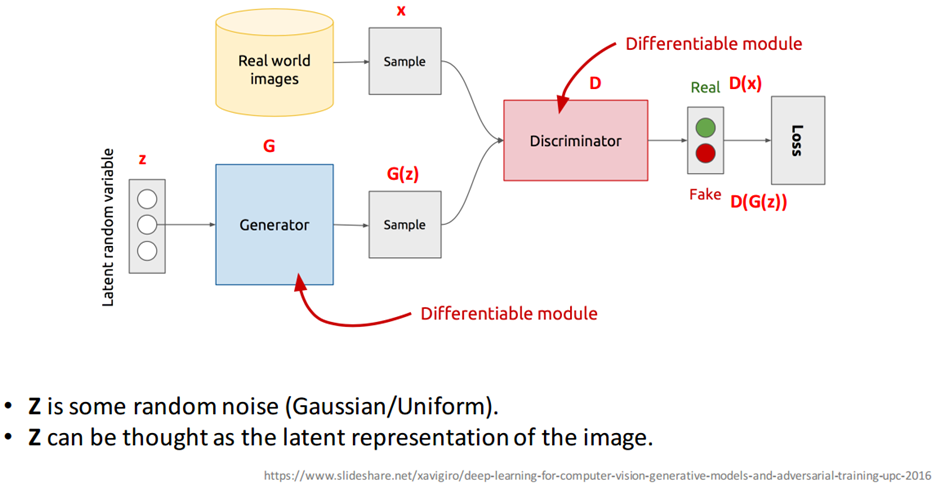

## 概要

逻辑->专家系统->深度学习

## 基础

- SVM
- Softmax
- 反向传播


## CNN

- 卷积
- 池化
- 感受野，小conv layers的叠加
- resnet跨级连接

## RNN

考虑时序信息


## Autoencoders


自编码器通过重建的方式训练一个编码器

### Stacked Autoencoder

encoder变成多层结构

### Variational autoencoder

在编码过程中增加限制，使得生成的隐向量分布大致符合标准正态分布

```python
class VAE(nn.Module):
    def __init__(self):
        super(VAE, self).__init__()

        self.fc1 = nn.Linear(784, 400)
        self.fc21 = nn.Linear(400, 20)
        self.fc22 = nn.Linear(400, 20)
        self.fc3 = nn.Linear(20, 400)
        self.fc4 = nn.Linear(400, 784)

    def encode(self, x):
        h1 = F.relu(self.fc1(x))
        return self.fc21(h1), self.fc22(h1)

    def reparametrize(self, mu, logvar):
        std = logvar.mul(0.5).exp_()
        if torch.cuda.is_available():
            eps = torch.cuda.FloatTensor(std.size()).normal_()
        else:
            eps = torch.FloatTensor(std.size()).normal_()
        eps = Variable(eps)
        return eps.mul(std).add_(mu)

    def decode(self, z):
        h3 = F.relu(self.fc3(z))
        return F.sigmoid(self.fc4(h3))

    def forward(self, x):
        mu, logvar = self.encode(x)
        z = self.reparametrize(mu, logvar)
        return self.decode(z), mu, logvar
```


### Sparse Autoencoder

利用KL散度（相对熵）施加稀疏性约束


## Generative Adversarial Network

Generator从随机噪声中生成图片，Discriminator负责判别传来的图片是否真实



生成网络G的目标就是尽量生成真实的图片，判别网络D的目的就是尽可能把生成图片和真实图片区分开

## Imitation Learning

三种方法

- Behavioral Cloning
- Inverse RL
- Direct Policy Learning