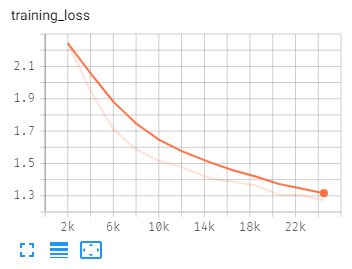
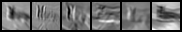
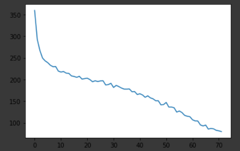

## cifar10_origin

代码见`cifar10_origin.ipynb`

使用原始代码运行，loss变化如图



准确率如下

```
Accuracy of the network on the 10000 test images: 53 %
Accuracy of plane : 33 %
Accuracy of   car : 79 %
Accuracy of  bird : 32 %
Accuracy of   cat : 59 %
Accuracy of  deer : 56 %
Accuracy of   dog : 27 %
Accuracy of  frog : 63 %
Accuracy of horse : 54 %
Accuracy of  ship : 80 %
Accuracy of truck : 51 %
```

将训练的epoch翻倍，loss基本稳定在1.1，训练所得的loss曲线和准确率如下


```
Accuracy of the network on the 50000 train images: 61 %
Accuracy of the network on the 10000 test images: 57 %
Accuracy of plane : 55 %
Accuracy of   car : 76 %
Accuracy of  bird : 52 %
Accuracy of   cat : 32 %
Accuracy of  deer : 65 %
Accuracy of   dog : 52 %
Accuracy of  frog : 52 %
Accuracy of horse : 67 %
Accuracy of  ship : 81 %
Accuracy of truck : 39 %
```

第一层卷积之后的特征图如下



第二层卷积之后的特征图如下


## 更换网络为Resnet9

代码见`cifar10_resnet9.ipynb`

网络结构如下

```
ResNet(
  (conv1): Conv2d(3, 64, kernel_size=(3, 3), stride=(1, 1), padding=(1, 1), bias=False)
  (bn1): BatchNorm2d(64, eps=1e-05, momentum=0.1, affine=True, track_running_stats=True)
  (relu): ReLU(inplace=True)
  (maxpool): MaxPool2d(kernel_size=3, stride=2, padding=1, dilation=1, ceil_mode=False)
  (layer1): Sequential(
    (0): BasicBlock(
      (conv1): Conv2d(64, 64, kernel_size=(3, 3), stride=(1, 1), padding=(1, 1), bias=False)
      (bn1): BatchNorm2d(64, eps=1e-05, momentum=0.1, affine=True, track_running_stats=True)
      (relu): ReLU(inplace=True)
      (conv2): Conv2d(64, 64, kernel_size=(3, 3), stride=(1, 1), padding=(1, 1), bias=False)
      (bn2): BatchNorm2d(64, eps=1e-05, momentum=0.1, affine=True, track_running_stats=True)
    )
  )
  (layer2): Sequential(
    (0): BasicBlock(
      (conv1): Conv2d(64, 128, kernel_size=(3, 3), stride=(2, 2), padding=(1, 1), bias=False)
      (bn1): BatchNorm2d(128, eps=1e-05, momentum=0.1, affine=True, track_running_stats=True)
      (relu): ReLU(inplace=True)
      (conv2): Conv2d(128, 128, kernel_size=(3, 3), stride=(1, 1), padding=(1, 1), bias=False)
      (bn2): BatchNorm2d(128, eps=1e-05, momentum=0.1, affine=True, track_running_stats=True)
      (downsample): Sequential(
        (0): Conv2d(64, 128, kernel_size=(1, 1), stride=(2, 2), bias=False)
        (1): BatchNorm2d(128, eps=1e-05, momentum=0.1, affine=True, track_running_stats=True)
      )
    )
  )
  (layer3): Sequential(
    (0): BasicBlock(
      (conv1): Conv2d(128, 256, kernel_size=(3, 3), stride=(2, 2), padding=(1, 1), bias=False)
      (bn1): BatchNorm2d(256, eps=1e-05, momentum=0.1, affine=True, track_running_stats=True)
      (relu): ReLU(inplace=True)
      (conv2): Conv2d(256, 256, kernel_size=(3, 3), stride=(1, 1), padding=(1, 1), bias=False)
      (bn2): BatchNorm2d(256, eps=1e-05, momentum=0.1, affine=True, track_running_stats=True)
      (downsample): Sequential(
        (0): Conv2d(128, 256, kernel_size=(1, 1), stride=(2, 2), bias=False)
        (1): BatchNorm2d(256, eps=1e-05, momentum=0.1, affine=True, track_running_stats=True)
      )
    )
  )
  (layer4): Sequential(
    (0): BasicBlock(
      (conv1): Conv2d(256, 512, kernel_size=(3, 3), stride=(2, 2), padding=(1, 1), bias=False)
      (bn1): BatchNorm2d(512, eps=1e-05, momentum=0.1, affine=True, track_running_stats=True)
      (relu): ReLU(inplace=True)
      (conv2): Conv2d(512, 512, kernel_size=(3, 3), stride=(1, 1), padding=(1, 1), bias=False)
      (bn2): BatchNorm2d(512, eps=1e-05, momentum=0.1, affine=True, track_running_stats=True)
      (downsample): Sequential(
        (0): Conv2d(256, 512, kernel_size=(1, 1), stride=(2, 2), bias=False)
        (1): BatchNorm2d(512, eps=1e-05, momentum=0.1, affine=True, track_running_stats=True)
      )
    )
  )
  (avgpool): AdaptiveAvgPool2d(output_size=(1, 1))
  (fc): Linear(in_features=512, out_features=10, bias=True)
)
```

## 学习率的选取

根据[Cyclical Learning Rates for Training Neural Networks](https://arxiv.org/abs/1506.01186)中的方法，指数上升学习率，并记录loss的变化，绘制`loss-lr`图，找到其中loss曲线下降最快的区域作为初始学习率，代码如下

```python
from torch.optim.lr_scheduler import _LRScheduler

class ExponentialLR(_LRScheduler):
    def __init__(self, optimizer, end_lr, num_iter, last_epoch=-1):
        self.end_lr = end_lr
        self.num_iter = num_iter
        super(ExponentialLR, self).__init__(optimizer, last_epoch)

    def get_lr(self):
        curr_iter = self.last_epoch + 1
        r = curr_iter / self.num_iter
        return [base_lr * (self.end_lr / base_lr) ** r for base_lr in self.base_lrs]


class LRFinder():
    def __init__(self, model, optimizer, criterion, device):
        self.model = model
        self.optimizer = optimizer
        self.criterion = criterion
        self.history = {"lr": [], "loss": []}
        self.best_loss = None
        self.device = device
        
    def find_lr(self, trainloader, end_lr, num_iter, step_mode="exp", smooth_f=0.05):
        self.history = {"lr": [], "loss": []}
        self.best_loss = None
        if step_mode == "exp":
            lr_scheduler = ExponentialLR(self.optimizer, end_lr, num_iter)
        elif step_mode == "linear":
            # todo
            pass
        
        self.model = self.model.to(device)
        
        iterator = iter(trainloader)
        for iteration in range(num_iter):
            try:
                inputs, labels = next(iterator)
            except StopIteration:
                iterator = iter(trainloader)
                inputs, labels = next(iterator)
            inputs, labels = inputs.to(device), labels.to(device)
            self.optimizer.zero_grad()
            
            outputs = self.model(inputs)
            
            loss = self.criterion(outputs, labels)
            loss.backward()
            
            self.optimizer.step()
            lr_scheduler.step()
            
            self.history["lr"].append(lr_scheduler.get_lr()[0])
            self.history["loss"].append(loss)
            
            if iteration == 0:
                self.best_loss = loss
            else:
                if smooth_f > 0:
                    loss = smooth_f * loss + (1 - smooth_f) * self.history["loss"][-1]
                if loss < self.best_loss:
                    self.best_loss = loss
                    
        print("finish")
        
    def plot(self):
        lrs = self.history["lr"]
        losses = self.history["loss"]

        plt.plot(lrs, losses)
        plt.xscale("log")
        plt.xlabel("Learning rate(log scale)")
        plt.ylabel("Loss")
        plt.show()

lr_finder = LRFinder(net, optimizer, criterion, torch.device("cuda"))
lr_finder.find_lr(trainloader, 1, 300)
lr_finder.plot()
```


绘制的`loss-lr`图如上，因此选择`5e-3`作为初始学习率

## 训练

将`batch_size`调大为64，优化器选用带`weight_decay`的SGD+Momentum，参数设置如下

```
optimizer = optim.SGD(net.parameters(), lr=5e-3, momentum=0.9, weight_decay= 5e-4 * BATCH_SIZE)
```

使用余弦退火的方式设定学习率，训练24个`epochs`得到的准确率如下，此时模型已经出现了过拟合的情况

```
Accuracy of the network on the 50000 train images: 99 %
Accuracy of the network on the 10000 test images: 82 %
Accuracy of plane : 87 %
Accuracy of   car : 88 %
Accuracy of  bird : 77 %
Accuracy of   cat : 61 %
Accuracy of  deer : 83 %
Accuracy of   dog : 79 %
Accuracy of  frog : 91 %
Accuracy of horse : 85 %
Accuracy of  ship : 94 %
Accuracy of truck : 85 %
```

### 数据预处理

为了避免模型过拟合，加入随机裁剪和随机左右翻转

```python
train_transform = transforms.Compose(
    [transforms.Pad(4),
     transforms.RandomCrop(32),
     transforms.RandomHorizontalFlip(p=0.5),
     transforms.ToTensor(),
     transforms.Normalize((0.5, 0.5, 0.5), (0.5, 0.5, 0.5))])
```

准确率如下：

```
Accuracy of the network on the 50000 train images: 91 %
Accuracy of the network on the 10000 test images: 88 %
Accuracy of plane : 87 %
Accuracy of   car : 98 %
Accuracy of  bird : 77 %
Accuracy of   cat : 80 %
Accuracy of  deer : 90 %
Accuracy of   dog : 79 %
Accuracy of  frog : 89 %
Accuracy of horse : 92 %
Accuracy of  ship : 96 %
Accuracy of truck : 93 %
```

loss的变化曲线如下：




