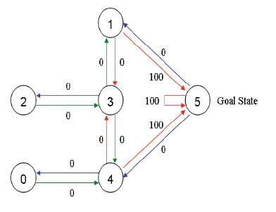

## 马尔科夫决策过程

- S：state
- A：action
- R：reward
- P：transition probability，转移概率
- $\gamma$：discount factor

给定agent初始状态，agent根据算法选择动作a，环境根据动作返回reward和next state

## Q-learning

经典的房间问题定义如下，每个房间对应一个`state`，目标是走到5

  

用图表示如下

  

其reward矩阵如下

  

`Q-learnning`初始化一个Q表，记录状态-动作对的值，agent从所有可能行为中选取一个行为，每一步由如下公式更新Q表，直到达到终点（最优状态）
$$
Q(S,A)=Q(S,A)+\alpha[R_{t+1}+\gamma maxQ(S_{t+1},A)-Q(S_t,A_t)]
$$
$\alpha$为学习率，$\gamma$为衰减因子，设$\alpha$为1，公式化简为
$$
Q(S,A)=R_{t+1}+\gamma maxQ(S_{t+1},A)
$$

## DQN

实际使用中，state空间会很大，用Q表去记录并不现实，所以提出了用函数的方法计算Q，DQN实际上就是用Q-Network代替了Q表，即$Q(S,A)=f(S,A,w)$

**Loss function**

Q-Network的目标实际上就是让其输出的Q值趋近于目标Q值，所以用均方误差定义Loss函数如下
$$
L=\frac12[r+\gamma maxQ(S',A',w)-Q(S,A,w)]^2
$$

### Train

- 每一步都有可能随机选择一个Action，避免网络固化
- 加入Experience Replay，先将样本存起来，然后再随机取样进行学习

