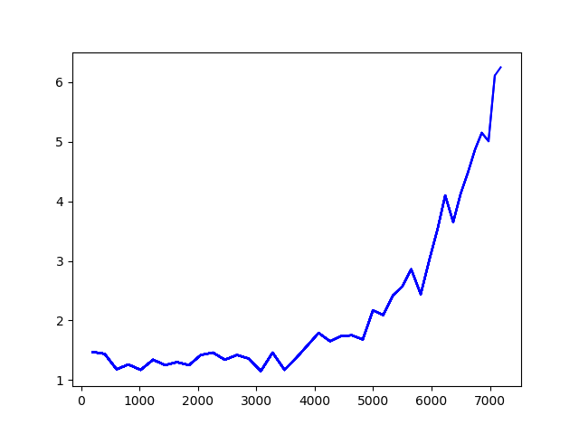

## DQN

代码参考了http://slazebni.cs.illinois.edu/fall18/assignment5.html中提供的初始代码

模型定义如下,除了基础的`DQN`外，还实现了`Dueling_DQN`

```python
import torch
import torch.nn as nn
import torch.nn.functional as F

class DQN(nn.Module):
    def __init__(self, action_size):
        super(DQN, self).__init__()
        self.conv1 = nn.Conv2d(4, 32, kernel_size=8, stride=4)
        self.conv2 = nn.Conv2d(32, 64, kernel_size=4, stride=2)
        self.conv3 = nn.Conv2d(64, 64, kernel_size=3, stride=1)
        self.fc = nn.Linear(3136, 512)
        self.head = nn.Linear(512, action_size)

        for m in self.modules():
            if isinstance(m, nn.Conv2d) or isinstance(m, nn.Linear):
                nn.init.kaiming_normal_(m.weight, mode='fan_out', nonlinearity='relu')

    def forward(self, x):
        x = F.relu(self.conv1(x))
        x = F.relu(self.conv2(x))
        x = F.relu(self.conv3(x))
        x = F.relu(self.fc(x.view(x.size(0), -1)))
        return self.head(x)

class Dueling_DQN(nn.Module):
    def __init__(self, action_size):
        super(Dueling_DQN, self).__init__()
        self.action_size = action_size

        self.conv1 = nn.Conv2d(4, 32, kernel_size=8, stride=4)
        self.conv2 = nn.Conv2d(32, 64, kernel_size=4, stride=2)
        self.conv3 = nn.Conv2d(64, 64, kernel_size=3, stride=1)
        self.fc1_adv = nn.Linear(3136, 512)
        self.fc1_val = nn.Linear(3136, 512)
        self.fc2_adv = nn.Linear(512, action_size)
        self.fc2_val = nn.Linear(512, 1)

        for m in self.modules():
            if isinstance(m, nn.Conv2d) or isinstance(m, nn.Linear):
                nn.init.kaiming_normal_(m.weight, mode='fan_out', nonlinearity='relu')

    def forward(self, x):
        x = F.relu(self.conv1(x))
        x = F.relu(self.conv2(x))
        x = F.relu(self.conv3(x))
        x = x.view(x.size(0), -1)
        
        adv = F.relu(self.fc1_adv(x))
        val = F.relu(self.fc1_val(x))

        adv = self.fc2_adv(adv)
        val = self.fc2_val(val).expand(x.size(0), self.action_size)

        x = val + adv - adv.mean(1).unsqueeze(1).expand(x.size(0), self.action_size)

        return x
```


## DDQN

代码如下

```python
# Compute Q(s_t, a) - Q of the current state
state_q = self.policy_net(states).gather(1, actions.unsqueeze(1)).squeeze(1)

# ddqn
if self.use_ddqn:
    # Compute Q function of next state
    next_state_q = self.policy_net(next_states)
    _, arg_q = next_state_q.data.cpu().max(1)
    arg_q = arg_q.to(device)

    double_q = self.target_net(next_states).gather(1, arg_q.unsqueeze(1)).squeeze(1)

    expected_q = rewards + double_q * self.discount_factor * (1 - dones)
# dqn
else:
    # Compute Q function of next state
    next_state_q = self.target_net(next_states).detach().max(1)[0]

    # Find maximum Q-value of action at next state from target net
    expected_q = rewards + next_state_q * self.discount_factor * (1 - dones)
```


## Exploration-exploitation trade-off

按照下图对选取随机动作的概率进行递减

 

每次调用`train_policy_net`时会对`epsilon`进行更新，前50000帧不进行训练

 ```python
self.epsilon = 1.0  
self.epsilon_middle = 0.1
self.epsilon_min = 0.01
self.explore_step = 1000000 / 4
self.epsilon_first_decay = (self.epsilon - self.epsilon_middle) / self.explore_step
self.epsilon_last_decay = (self.epsilon_middle - self.epsilon_min) / self.explore_step
if self.epsilon > self.epsilon_middle:
    self.epsilon -= self.epsilon_first_decay
elif self.epsilon > self.epsilon_min:
    self.epsilon -= self.epsilon_last_decay
 ```


## 超参

```python
# Hyperparameters for DQN agent, memory and training
EPISODES = 500000
HEIGHT = 84
WIDTH = 84
HISTORY_SIZE = 4
learning_rate = 0.0001
evaluation_reward_length = 100
Memory_capacity = 1000000
render_breakout = True
batch_size = 32
Update_policy_network_frequency = 4
Update_target_network_frequency = 10000
train_frame = 50000
```

关于学习率：论文中使用RMSProp优化器，学习率为 0.00025，但有人指出论文中使用的RMSProp为变体，在tf或pytorch上使用的学习率应该偏低为0.00005，而我使用了Adam优化器，参照别人的代码，学习率其实应该设为`1e-5`，但实际测试时发现虽然`1e-5`时可以学习，但是学习时间偏长，参考别人的报告说明，大概需要3天的时间训练，因此将学习率调为`1e-4`（也是初始代码中设定的学习率），实际训练在`1070ti`下大概花费半天时间就可以跑到网络在45分波动

## 图像预处理

转为灰度图然后缩放为84*84大小的图像

```python
def get_frame(X):
    x = np.uint8(resize(rgb2gray(X), (HEIGHT, WIDTH), mode='reflect') * 255)
    return x
```


## 训练结果

最后`ddqn+dueling dqn`训练的结果在45分上下波动，将学习率调至`1e-5`或许可以继续提升性能，但服务器老是杀我进程我也跑不了= =


单纯使用`dqn`的训练结果如下


由于服务器上的训练任务经常被打断，所以没有做后续的对比实验，但是总结下来对网络性能有关大致有以下几点：

- 在每次失去生命时，传入`ReplayMemory`的`dones`设为`True`，且在更新网络时，根据`dones`调整`expected_q`的计算，因为`Breakout`没有负的`reward`，通过这样的方法其实加入了惩罚，使网络知道丢失生命是不好的

```python
expected_q = rewards + next_state_q * self.discount_factor * (1 - dones)
```

- 在每次开始游戏前随机执行一定数量的`no-op`，这样可以保证每次开始前`agent`看到的画面是不同的，防止过拟合，论文中是1\~30个随机动作，我的代码中改成了1\~10个，要不然一开始就可能掉一条命，而且实际执行的动作是`fire`，不过在游戏中这和`no-op`一样

```python
for _ in range(random.randint(1, 10)):
    state, _, _, _ = env.step(1)
```

- 每4帧才更新一次网络，而不是初始代码中每一帧更新，应该也是起到防止过拟合的效果
- 采用合适的初始化方法，论文中使用的是`tf.variance_scaling_initializer(scale=2)`，翻看了一下tf和pytorch的源码，pytorch中的`nn.init.kaiming_normal_`默认参数和其起到的效果应该一样，另外，在实验中发现，BN和该方法同用会使得网络表现急剧下降，原因未知

```python
for m in self.modules():
    if isinstance(m, nn.Conv2d) or isinstance(m, nn.Linear):
        nn.init.kaiming_normal_(m.weight, mode='fan_out', nonlinearity='relu')
```

下图为BN和初始化共用时的训练分数曲线



- 对梯度和`reward`作裁剪并使用`Huber Loss`，保证网络不会出现梯度爆炸的问题

```python
for param in self.policy_net.parameters():
    param.grad.data.clamp_(-1, 1)
```

```python
r = np.clip(reward, -1, 1)
```


