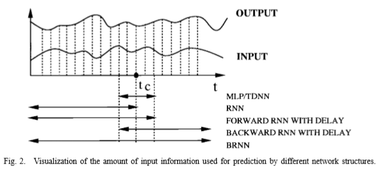
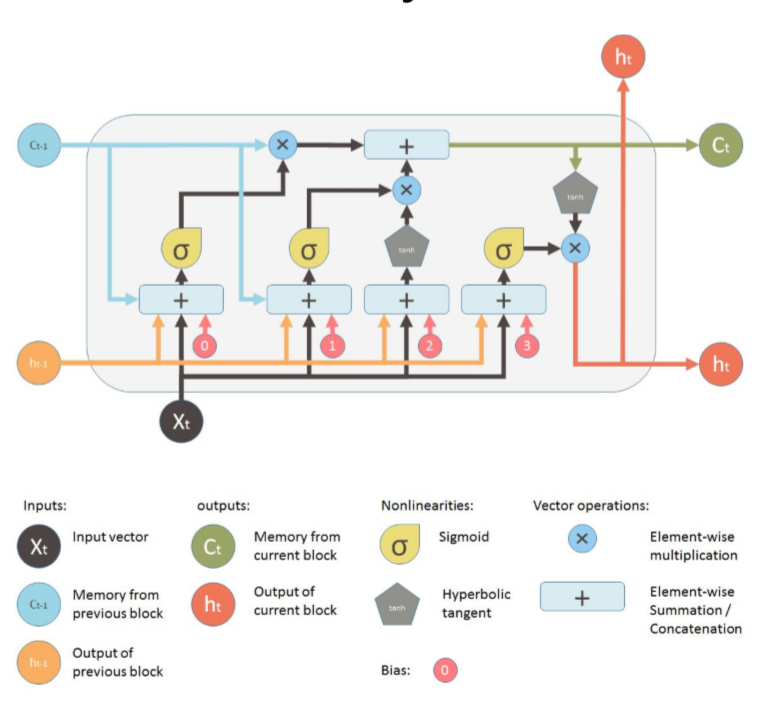
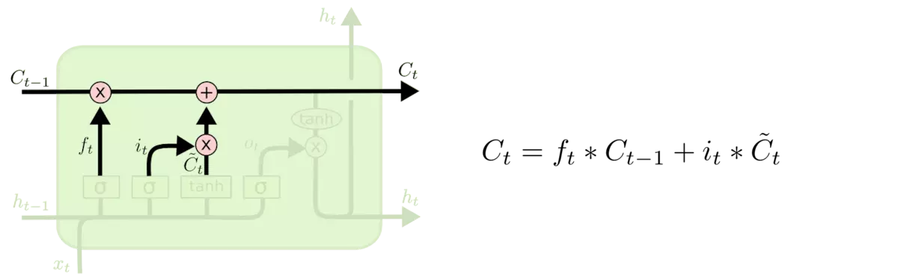
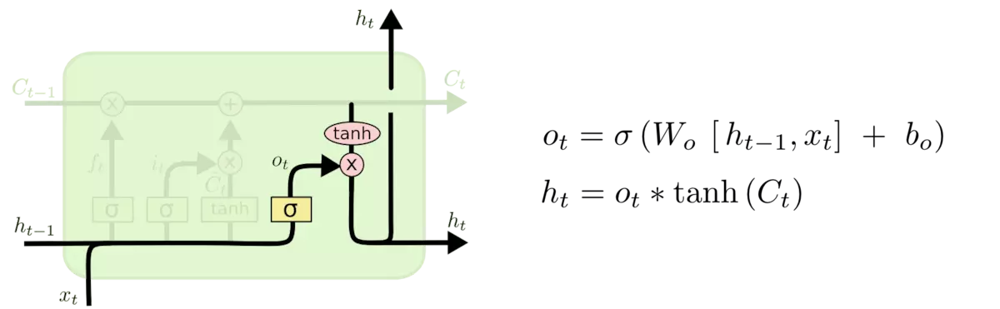
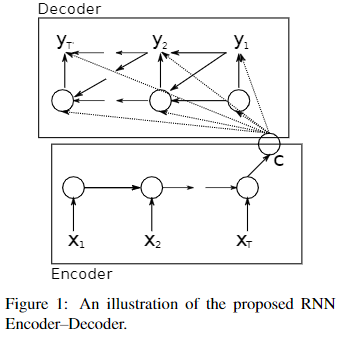

## BiRNN

### contribution

在这篇论文之前，对于处理不定长的时间序列的数据使用的方法主要有TDNN和RNN，作者在各种问题上的实验表明RNN在处理这些数据上有着更大的优势，但传统的单向RNN只能获取到`left-to-right`的单向信息，作者通过加入反向的RNN，使得网络可以同时获取到双向的信息，进而提高模型的准确度。

如下图，传统的MLP只适用于固定长度的数据，TDNN通过设定一个窗口，截取一定长度的数据，一定程度上解决了不定长数据的问题，但网络获取的信息受限于窗口的大小，RNN则通过`state`的传递，理论上可以获取到整个序列的信息，但实际上RNN对于长序列的处理并不好，通过加入`delay`一定程度上可以改善模型，但这一问题依然存在，因此作者通过结果双向的RNN尝试解决这一问题



### method

传统的RNN如下图所示


通过加入反向的RNN，模型如下图所示


`t`时段的输入由`Forward States`和`Backward States`的权重处理后得到两个结果，两个结果经过线性变化（可通过训练得出相应的权重）得到`t`时段的输出，前向与反向的`state`是单向传递的，相互之间没有连接

训练时，先后正反向计算RNN State，然后根据线性变化得到output

反向传播则先对output求导，然后先后对正反向求导，最后更新权重

### advantages and disadvantages

由于RNN在梯度传播中的梯度消失/爆炸，RNN只能获取到短的时间关系，BiRNN通过加入反向RNN的方法虽然让网络得以利用反向的信息，但并没有解决RNN无法获取长序列信息的问题

而且在用双向RNN的时候，需要完整的序列，不能一边接收序列一边处理

## LSTM

### contribution

针对RNN无法获取长序列信息的问题，LSTM通过改进RNN基础单元的结构，通过增加几种门结构，使得LSTM可以控制信息的记忆与遗忘

### method

以下参考[Understanding LSTM Networks](https://colah.github.io/posts/2015-08-Understanding-LSTMs/)，部分图也来源于此

LSTM由几种门结构组合而成，整体的结构如下图



最上方的为细胞状态，LSTM通过门结构来去除或添加信息到细胞状态

 

#### Forget Gate

用于决定从细胞状态中丢弃什么信息，公式如下，`Forget Gate`以$h_{t-1}$和$x_t$为输入，经过线性变换后，用$\sigma$决定信息保留的程度，1表示完全保留，0表示完全舍弃

  

#### Input Gate

用于决定向细胞状态中增加什么信息，公式如下，同样以$h_{t-1}$和$x_t$为输入，$\tilde{C}_t$代表新的信息，$i_t$则用于控制新信息添加的程度

  

#### Memory Update

在通过`Forget Gate`和`Input Gate`得到需要丢弃和增加的信息之后，细胞状态更新的公式如下所示

 

#### Output Gate

 用于决定输出的`hidden state`，公式如下，首先通过$\sigma$控制输出的部分，然后再将新的细胞状态进过`tanh`处理与$\sigma$门的输出相乘 

### advantages and disadvantages

优点：

- 门结构可以有效的使网络学习到长时序的依赖关系

缺点：

- 运算速度较GRU慢

## GRU

### contribution

与LSTM类似，都是为了解决RNN无法获取长序列信息的问题，另外这篇文章还提出了`Encoder-Decoder`模型，用于处理机器翻译等问题

### method

#### Encoder-Decoder

`Encoder-Decoder`模型由两个RNN组成，`Encoder`部分就是正常的RNN模型，在读取完整个句子后输出一个C，作为`Decoder`的输入，`Decoder`的`hidden state`计算公式如下，y就是输出的序列
$$
h_{<t>}=f(h_{<t-1>},y_{t-1},c)
$$




#### GRU

GRU有两个门结构`Reset Gate`和`Update Gate`，总体结构如下

  

##### Reset Gate

`Reset Gate`公式如下，通过$h_{t-1}$和$x_t$决定要将多少过去的信息遗忘
$$
r_t=\sigma(W_r \cdot [h_{t-1},x_t])
$$


##### Update Gate

`Update Gate`公式如下，通过$h_{t-1}$和$x_t$决定要将多少过去的信息传递下去
$$
z_t=\sigma(W_z \cdot [h_{t-1},x_t])
$$

##### Output

最后的`Output`公式如下，通过$r_t$控制记忆的内容，然后再通过$z_t$得到最终输出的状态，类似LSTM的`Memory Update`，但GRU将`cell state`和`hidden state`合并了起来
$$
h_t =(1-z_t)*h_{t-1}+z_t*\tilde{h}_t \\
\tilde{h}_t=tanh(W \cdot [r_t*h_{t-1},x_t])
$$

### advantages and disadvantages

简化了LSTM中复杂的结构，而且性能与LSTM接近

## seq2seq

### contribution

使用将两个RNN组合起来的方法（类似于`Encoder-Decoder`），很好的解决了传统深度神经网络无法处理输入输出都不定长的`seq2seq`问题

### method

类似于`Encoder-Decoder`，本文使用的网络也有类似的结构，通过两段LSTM的组合，完成`seq2seq`的任务，模型的左边（直到输入`<EOS>`）相当于`Encoder`，右侧则相当于`Decoder`，模型输入ABC和结束符`<EOS>`，然后解码出WXYZ直到模型输出结束符


#### 一些细节

- 深层网络比浅层网络好（文中用了4层LSTM）
- LSTM虽然没有梯度消失的问题，但是还会有梯度爆炸，这个模型对大梯度进行了缩放
- 将输入倒序会提升表现（或许是因为两个语言翻译的时候，被译句前面几个单词经常对应译句的后几个单词）
- 搜索时采用`beam search`，但`beam size`对模型准确度影响不大，当`beam size`等于2时，模型基本达到最优准确度

### advantages and disadvantages

优点：

- 实现了端到端的`seq2seq`网络

缺点：

- 多层LSTM的组合使得网络的参数很多，运行效率低，且RNN也不能进行并行计算

## Transformer

### contribution

完全抛弃了传统的RNN和CNN结构

### method

之前有看过该论文而且留下了[笔记](https://nonexistent.tech/2019/01/22/Attention Is All You Need/)，所以下面的内容都是之前笔记的内容

大多数NLP任务都是`Encoder-decoder`的结构，比如机器翻译，input通过几层`Encoder`后再经过`Decoder`输出


一个标准的`Encoder-decoder`结构代码如下：

```python
class EncoderDecoder(nn.Module):
    """
    A standard Encoder-Decoder architecture. Base for this and many 
    other models.
    """
    def __init__(self, encoder, decoder, src_embed, tgt_embed, generator):
        super(EncoderDecoder, self).__init__()
        self.encoder = encoder
        self.decoder = decoder
        self.src_embed = src_embed
        self.tgt_embed = tgt_embed
        self.generator = generator
        
    def forward(self, src, tgt, src_mask, tgt_mask):
        "Take in and process masked src and target sequences."
        return self.decode(self.encode(src, src_mask), src_mask,
                            tgt, tgt_mask)
    
    def encode(self, src, src_mask):
        return self.encoder(self.src_embed(src), src_mask)
    
    def decode(self, memory, src_mask, tgt, tgt_mask):
        return self.decoder(self.tgt_embed(tgt), memory, src_mask, tgt_mask)
    
    
class Generator(nn.Module):
    "Define standard linear + softmax generation step."
    def __init__(self, d_model, vocab):
        super(Generator, self).__init__()
        self.proj = nn.Linear(d_model, vocab)

    def forward(self, x):
        return F.log_softmax(self.proj(x), dim=-1)
```


在Attention模型中，每层`Encoder`都有两部分，输入首先经过`Attention`层，第二层则是一个简单的全连接层，每层`Encoder`都会有类似残差网络的跨层连接，`Norm`是 `Layer Normalization` ，所以每层的`Output`就是$LayerNorm(x+Sublayer(x))$

`Decoder`结构类似`Encoder`，不过在中间多加了一层`Attention`用于处理`Encoder`的`Output`

#### Encoder和Decoder的代码

##### Encoder

```python
def clones(module, N):
    "Produce N identical layers."
    return nn.ModuleList([copy.deepcopy(module) for _ in range(N)])

class Encoder(nn.Module):
    "Core encoder is a stack of N layers"
    def __init__(self, layer, N):
        super(Encoder, self).__init__()
        self.layers = clones(layer, N)
        self.norm = LayerNorm(layer.size)
        
    def forward(self, x, mask):
        "Pass the input (and mask) through each layer in turn."
        for layer in self.layers:
            x = layer(x, mask)
        return self.norm(x)
    
class LayerNorm(nn.Module):
    "Construct a layernorm module (See citation for details)."
    def __init__(self, features, eps=1e-6):
        super(LayerNorm, self).__init__()
        self.a_2 = nn.Parameter(torch.ones(features))
        self.b_2 = nn.Parameter(torch.zeros(features))
        self.eps = eps

    def forward(self, x):
        mean = x.mean(-1, keepdim=True)
        std = x.std(-1, keepdim=True)
        return self.a_2 * (x - mean) / (std + self.eps) + self.b_2
    
    
class SublayerConnection(nn.Module):
    """
    A residual connection followed by a layer norm.
    Note for code simplicity the norm is first as opposed to last.
    """
    def __init__(self, size, dropout):
        super(SublayerConnection, self).__init__()
        self.norm = LayerNorm(size)
        self.dropout = nn.Dropout(dropout)

    def forward(self, x, sublayer):
        "Apply residual connection to any sublayer with the same size."
        return x + self.dropout(sublayer(self.norm(x)))
    
    
class EncoderLayer(nn.Module):
    "Encoder is made up of self-attn and feed forward (defined below)"
    def __init__(self, size, self_attn, feed_forward, dropout):
        super(EncoderLayer, self).__init__()
        self.self_attn = self_attn
        self.feed_forward = feed_forward
        self.sublayer = clones(SublayerConnection(size, dropout), 2)
        self.size = size

    def forward(self, x, mask):
        "Follow Figure 1 (left) for connections."
        x = self.sublayer[0](x, lambda x: self.self_attn(x, x, x, mask))
        return self.sublayer[1](x, self.feed_forward)
```

##### Decoder

```python
class Decoder(nn.Module):
    "Generic N layer decoder with masking."
    def __init__(self, layer, N):
        super(Decoder, self).__init__()
        self.layers = clones(layer, N)
        self.norm = LayerNorm(layer.size)
        
    def forward(self, x, memory, src_mask, tgt_mask):
        for layer in self.layers:
            x = layer(x, memory, src_mask, tgt_mask)
        return self.norm(x)
    
    
class DecoderLayer(nn.Module):
    "Decoder is made of self-attn, src-attn, and feed forward (defined below)"
    def __init__(self, size, self_attn, src_attn, feed_forward, dropout):
        super(DecoderLayer, self).__init__()
        self.size = size
        self.self_attn = self_attn
        self.src_attn = src_attn
        self.feed_forward = feed_forward
        self.sublayer = clones(SublayerConnection(size, dropout), 3)
 
    def forward(self, x, memory, src_mask, tgt_mask):
        "Follow Figure 1 (right) for connections."
        m = memory
        x = self.sublayer[0](x, lambda x: self.self_attn(x, x, x, tgt_mask))
        x = self.sublayer[1](x, lambda x: self.src_attn(x, m, m, src_mask))
        return self.sublayer[2](x, self.feed_forward)
```

#### Scaled Dot-Product Attention

既然要`Attention`，那必然会有一个权重，这个权值的计算公式为
$$
{Attention}(Q, K, V) = \mathrm{softmax}(\frac{QK^T}{\sqrt{d_k}})V
$$
Q,K,V都是从词向量中经过线性变换得来的，如下图


计算过程就是得到Q,K,V后，Q和K做一个点积得到一个分数，再将这个分数开方（为了让梯度更稳定），然后`Softmax`得到一个分数，这个分数再乘以V得到加权后的值，最后求和得到`Output`


代码如下：

```python
def attention(query, key, value, mask=None, dropout=None):
    "Compute 'Scaled Dot Product Attention'"
    d_k = query.size(-1)
    scores = torch.matmul(query, key.transpose(-2, -1)) \
             / math.sqrt(d_k)
    if mask is not None:
        scores = scores.masked_fill(mask == 0, -1e9)
    p_attn = F.softmax(scores, dim = -1)
    if dropout is not None:
        p_attn = dropout(p_attn)
    return torch.matmul(p_attn, value), p_attn
```


#### Multi-Head Attention

$$
MultiHead(Q,K,V)=Concat(head_1,...,head_h)W^O\\
	where\ head_i=Attention(QW_i^Q,KW_i^Q,VW_i^V)
$$

简而言之就是把`Scaled Dot-Product Attention`做`h`次，把所有结果拼起来再做一次卷积压缩，如下图


公式里的$W_i^Q$起的是压缩维数的作用，比如h=8的话，维数就会被压缩为原来的八分之一，这样计算量和`single-head attention`就差不多了

`Multi-Head Attention`在网络中有三处，其中两个是`Encoder`和`Decoder`的`self-attention`，还有一个是`Encoder-Decoder Attention`，其中`Encoder`的`self-attention`作为`key`和`value`，`Decoder`的`self-attention`作为`query`


代码如下：

```python
class MultiHeadedAttention(nn.Module):
    def __init__(self, h, d_model, dropout=0.1):
        "Take in model size and number of heads."
        super(MultiHeadedAttention, self).__init__()
        assert d_model % h == 0
        # We assume d_v always equals d_k
        self.d_k = d_model // h
        self.h = h
        self.linears = clones(nn.Linear(d_model, d_model), 4)
        self.attn = None
        self.dropout = nn.Dropout(p=dropout)
        
    def forward(self, query, key, value, mask=None):
        "Implements Figure 2"
        if mask is not None:
            # Same mask applied to all h heads.
            mask = mask.unsqueeze(1)
        nbatches = query.size(0)
        
        # 1) Do all the linear projections in batch from d_model => h x d_k 
        query, key, value = \
            [l(x).view(nbatches, -1, self.h, self.d_k).transpose(1, 2)
             for l, x in zip(self.linears, (query, key, value))]
        
        # 2) Apply attention on all the projected vectors in batch. 
        x, self.attn = attention(query, key, value, mask=mask, 
                                 dropout=self.dropout)
        
        # 3) "Concat" using a view and apply a final linear. 
        x = x.transpose(1, 2).contiguous() \
             .view(nbatches, -1, self.h * self.d_k)
        return self.linears[-1](x)
```

#### Position-wise Feed-Forward Networks

`Encoder`和`Decoder`的`Feed Forward`是一个全连接层，包含两次线性变换和一次`ReLu`，公式如下
$$
{FFN}(x)=\max(0, xW_1 + b_1) W_2 + b_2
$$

代码如下：

```python
class PositionwiseFeedForward(nn.Module):
    "Implements FFN equation."
    def __init__(self, d_model, d_ff, dropout=0.1):
        super(PositionwiseFeedForward, self).__init__()
        self.w_1 = nn.Linear(d_model, d_ff)
        self.w_2 = nn.Linear(d_ff, d_model)
        self.dropout = nn.Dropout(dropout)

    def forward(self, x):
        return self.w_2(self.dropout(F.relu(self.w_1(x))))
```


####   Embeddings and Softmax

词嵌入，唯一特别的是词嵌入的时候也会乘以$\sqrt{d_{model}}$

```python
class Embeddings(nn.Module):
    def __init__(self, d_model, vocab):
        super(Embeddings, self).__init__()
        self.lut = nn.Embedding(vocab, d_model)
        self.d_model = d_model

    def forward(self, x):
        return self.lut(x) * math.sqrt(self.d_model)
```


#### Positional Encoding

这个东西是为了让模型可以了解到单词的顺序，方法就是在词嵌入的时候加上一个有规律的特征，让模型去学习，这个特征和单词的位置有关系，这样模型就应该可以学习到单词的位置信息


论文里写的公式是
$$
PE_{(pos,2i)} = sin(pos / 10000^{2i/d_{\text{model}}})\\
PE_{(pos,2i+1)} = cos(pos / 10000^{2i/d_{\text{model}}})
$$
这样做的目的是，让模型关注句子中词语的相对位置，而且这样也可以让模型遇到长句时更加稳定（直觉来看）

代码如下：

```python
class PositionalEncoding(nn.Module):
    "Implement the PE function."
    def __init__(self, d_model, dropout, max_len=5000):
        super(PositionalEncoding, self).__init__()
        self.dropout = nn.Dropout(p=dropout)
        
        # Compute the positional encodings once in log space.
        pe = torch.zeros(max_len, d_model)
        position = torch.arange(0, max_len).unsqueeze(1)
        div_term = torch.exp(torch.arange(0, d_model, 2) *
                             -(math.log(10000.0) / d_model))
        pe[:, 0::2] = torch.sin(position * div_term)
        pe[:, 1::2] = torch.cos(position * div_term)
        pe = pe.unsqueeze(0)
        self.register_buffer('pe', pe)
        
    def forward(self, x):
        x = x + Variable(self.pe[:, :x.size(1)], 
                         requires_grad=False)
        return self.dropout(x)
```

#### Full Model

``` python
def make_model(src_vocab, tgt_vocab, N=6, 
               d_model=512, d_ff=2048, h=8, dropout=0.1):
    "Helper: Construct a model from hyperparameters."
    c = copy.deepcopy
    attn = MultiHeadedAttention(h, d_model)
    ff = PositionwiseFeedForward(d_model, d_ff, dropout)
    position = PositionalEncoding(d_model, dropout)
    model = EncoderDecoder(
        Encoder(EncoderLayer(d_model, c(attn), c(ff), dropout), N),
        Decoder(DecoderLayer(d_model, c(attn), c(attn), 
                             c(ff), dropout), N),
        nn.Sequential(Embeddings(d_model, src_vocab), c(position)),
        nn.Sequential(Embeddings(d_model, tgt_vocab), c(position)),
        Generator(d_model, tgt_vocab))
    
    # This was important from their code. 
    # Initialize parameters with Glorot / fan_avg.
    for p in model.parameters():
        if p.dim() > 1:
            nn.init.xavier_uniform(p)
    return model
```

### advantages and disadvantages

优点：

- 由于没有用到RNN，可以很轻松的做到并行化

缺点：

- 

## Attention

### contribution

### method

### advantages and disadvantages

## Soft Attention

### contribution

### method

### advantages and disadvantages

