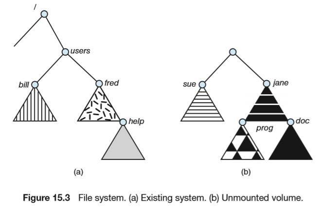

# File-System Internals

## File Systems

## File-System Mounting

文件系统在访问前必须挂载。一个为挂载的文件系统会在挂载点mount point挂载。图右是未安装的卷，左图的users为挂载点。

## Partitions and Mounting

- Raw disk：未分区的（没有文件系统）硬盘
- boot分区可以用于启动系统
- root partittion：具有操作系统的分区

## File Sharing

## Virtual File Systems

VFS提供面向对象的方法实现文件系统。允许将相同的系统调用接口（API）用于不同类型的文件系统

## Remote File Systems

## Consistency Semantics

描述多用户同时访问共享文件时的语义，规定了一个用户修改的数据什么时候对另一个用户可见。

- UNIX Semantics：用户对已经打开的文件进行写操作会立刻被其它同时打开这一文件的用户可见，还有一种共享模式会共享文件指针的位置，一个文件移动了文件指针会影响其他用户，文件有一个映像，这个映像允许来自不同用户的交替访问（映像是互斥资源）。
- Session Semantics(AFS 文件系统)：用户对打开文件的写操作不会立刻被其他用户可见，一旦文件关闭，对文件的修改只能被以后打开的会话所见，已经打开文件的用户无法看到这些修改。一个文件会有多个物理映像，用户允许对自己的映像进行不受限制的读写操作（没有互斥）。
- Immutable-Shared-Files Semantics(不可修改共享文件语义)：文件不可修改，即只读（文件名不能重用、文件内容不可修改）。

## NFS

