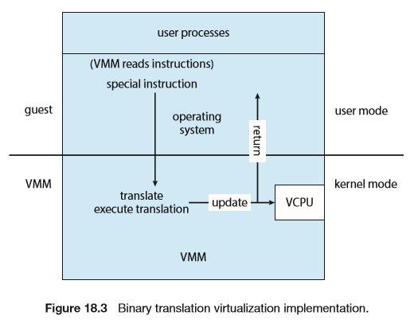

# Virtual Machines

## Overview

虚拟机的几种实现方式

- Type 0 Hypervisors：硬件层提供VMM，一般见于大型机和服务器.
- Type 1 Hypervisors：专用VMM操作系统，如VMWare ESX，Xen.
- 通用的操作系统，但其一部分提供VMM支持，一般也归为Type 1.
- VMM做为host OS的普通应用，如VMWare WorkStation和Virtual Box.
- 参数化VM，需要修改Guest OS以配合VMM.
- 编程语言运行环境，如JVM.
- 仿真，运行非本平台构建的程序.
- 应用容器，提供应用间隔离和方便运维，如Docker.

## Building Blocks

### Trap-and-Emulate

针对只只支持内核和用户态的cpu，VMM运行在用户态，当Guest执行特权指令时，
会产生一个error以及Trap到VMM，后者代理（模拟）完成后，再返回Guest继续执行

一些CPU开始直接支持guest mode，因此Trap-and-Emuate和VCPU相对弱化了

###  Binary Translation 

一些平台的特权指令界限不清晰，如x86的popf在内核态和用户态都能执行，但行为不同，因此无法产生Trap进而使用Trap-and-Emulate.

针对这类特殊指令VMM在虚拟内核态执行时会预先检查Guest接下来的指令，如果是特殊指令则由

VMM翻译执行. VMWare通过缓存加速判断过程.

近来硬件发展的支持也已经基本不需要二进制翻译了.

### Hardware Assistance 

## Types of VMs and Their Implementations

### Type-0 Hypervisor

在固件级别提供虚拟化管理功能，硬件划分给每个系统专用，一般跑的系统数量不多.

cpu和内存可以简单隔离划分，IO资源方面需要一定的共享和路由机制.一些高级虚拟机提供动态分

配cpu和内存等资源，需要guest做相应修改配合.

Type-0虚拟机上的Guest可以是本地操作系统也可以是其他Type-1 VMM.

### Type-1 Hypervisor

Type-1虚拟机多见于数据中心，是一类专门管理Guest的OS，直接控制硬件.

一般提供多cpu模式供Guest自行控制和运行以提升性能.

另一类是提供相关功能的通用操作系统，如RedHat Linux with KVM.这类系统中Guest一般作为普通

进程对待，但额外提供特权指令执行的相关机制.

### Type-2 Hypervisor

VMM作为应用程序执行，host OS不知道虚拟化的存在.

由于权限等问题，硬件特性的使用限制较多，总体性能相比前2者差一些.

好处是灵活支持的guest种类很多.

### Paravirtualization

抽象出来的虚拟硬件不完全和host相同，guest系统需要相应的修改.

好处是更高的资源利用率和相对较轻的虚拟化层.

如Xen不使用嵌套页表，guest要修改页表时通过hypercall通知VMM.

Type-0中也使用了参数虚拟化技术.

### Programming-Environment Virtualization

如JVM

### Emulation

通过指令翻译的方式运行其他架构下的程序

### Application Containment

有些需求场景仅仅是希望隔离同一平台的各个应用，使得部署、迁移、性能等管理方便.

这类情况下虚拟化的对象不是硬件，而是操作系统，使用系统提供的应用容器即可满足.

如Solaris的zone和Linux下的Docker应用.

## Virtualization and Operating-System Components

### CPU调度

当物理cpu足够时，每个guest可以简单地独占cpu.

当虚拟cpu比物理cpu多时，VMM需要进行调度并保证一定的公平性.但guest本身的调度可能受到影响如进程时间片实际被拉长了.

因此可能影响到guest内程序的响应时间，需要一个应用安装在guest里，用于不断调整系统时间和其他虚拟设备方面的管理.

### 内存管理

虚拟机分配的内存可能超出实际内存，VMM需要相应的优化：

1. 利用嵌套页表来二次映射guest的内存位置，如磁盘，而对guest透明.该措施可能会影响到guest的页表优化策略，因而有其他方法时尽量不使用.

2. 为每个guest安装虚拟驱动内核模块，用于和VMM通信.当为guest分配内存时，该模块将一定量的内存锁定，guest看到内存紧张会触发页回收以维护一定量的空闲内存，而锁定的内存可被VMM用于其他guest.这样就同时做到了内存分配和利用guest自身的页表分配策略，效果较好.当系统总体空闲内存恢复时，将这部分内存归还并解锁给原guest使用.

3. guest间共享页表内存，由VMM发现并管理.

### I/O

在IO方面一般虚拟机抽象出来的资源概念要比cpu和内存弱.

不同guest利用IO的方式多种多样，一般会采用驱动模块来虚拟出设备.

guest可直接与IO设备通信，也可利用抽象驱动通过VMM与实际驱动交互.直接访问设备的好处是性能高，如Type-0虚拟机.

对Type-1和Type-2虚拟机，直接访问要求硬件支持DMA、中断等虚拟化特性.

网卡方面需要为每个guest分配IP，guest和host关系可以是桥接和NAT两种.

- 桥接：为guest分配的IP和host在同一网络，对外界对等.
- NAT：host为guest提供NAT路由服务，NAT地址与host在统一网络.

### 热迁移

虚拟机能做到在不断网络下的热迁移，对登录用户基本无影响：

