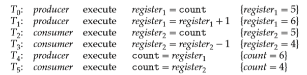
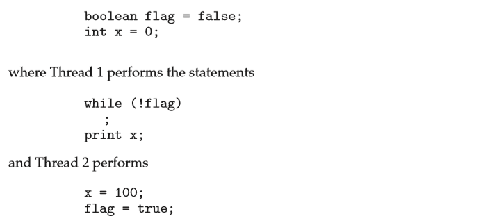
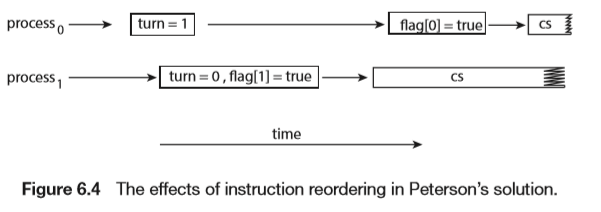
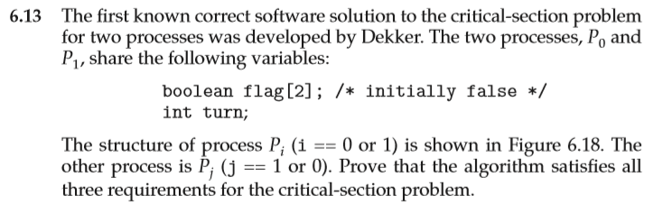

# Synchronization Tools

## Background

- 程序有可能在任意位置被中断
- 并发执行时，对相同变量的访问结果是不可预测的

### Example


count++（count--）的操作不是原子的，实际上的执行操作为

> register1 = count 
>
> register1 = register1 +1 
>
> count = register1

由于时序问题，多线程操作同一个全局变量`count`会导致数据的异常



## The Critcal-Section Problem

Critcal-Section（临界区）：多个进程共享数据，每个进程对共享数据的访问，更新的地方称为临界区。

### Three requirements

- 互斥(mutual exclusion)
  - 只有一个进程进入临界区
- 空闲让进(progress)
  - 临界区空闲时，只有需要进行临界区操作的进程可以进入临界区
- 有限等待(bounded wait)

### Solutions

- raise a flag
- maintain a global flag(turn)
- turn+flag

## Peterson's Solution

进程共享两个变量`turn`和`flag`

`turn`决定哪个进程进入临界区，`flag`代表每个进程是否需要进入临界区

```
int turn; 
boolean flag[2];
while (true) { 
    flag[i] = true; 
    turn = j; 
    while (flag[j] && turn == j) 
        ;
        /* critical section */
    flag[i] = false;
    	/*remainder section */
}
```

- mutual exclusion
  - 两个进程进入临界区时，flag和turn变量的值不同，不存在两个进程同时进入临界区的情况
- progress
  - 一个进程退出临界区时，flag会被改变，保证了空闲让进
- bounded wait
  - 同上

但在现代操作系统上这一方法并不一定正确，因为不能保证操作都是顺序执行的，下图进程2中的`flag=true`的执行时间可能早于`x=100`，从而导致进程1输出的为0





## Hardware Support for Synchronization

### Memory Barriers

- Thread1

```c
while (!flag) 
	memory_barrier(); 
print x;
```

- Thread2

```c
x = 100; 
memory_barrier(); 
flag = true;
```

### Hardware Instructions

保证为原子操作

两种方法：

- `test_and_set()`

```C
boolean test_and_set(boolean *target) { 
    boolean rv = *target; 
    *target = true;
    return rv;
}
```

```c
do {
	while (test_and_set(&lock)) 
        ; /* do nothing */
		/* critical section */
	lock = false;
		/* remainder section */ 
} while (true);

```

- `compare_and_swap() `

```c
int compare_and_swap(int *value, int expected, int new value) { 
    int temp = *value;
	if (*value == expected) 
        *value = new value;
	return temp;
}
```

```c
while (true) { 
    while (compare_and_swap(&lock, 0, 1) != 0) 
        ; /* do nothing */
		/* critical section */
	lock = 0;
		/* remainder section */
}
```

### Atomic Variables

通过硬件实现原子操作，保证在原子操作时不会被打断

```c
void increment(atomic int *v) { 
    int temp; 
    do {
        temp = *v; 
    } while (temp != compare and swap(v, temp, temp+1)); 
}
```

## Mutex Locks

互斥锁，一个进程进入临界区时必须上锁，在退出时再把锁解开

```c
while(true){
    acquire();
        // critical section
    release();
    	// remainder section
}

acquire() { 
    while (!available) 
        ; /* busy wait */ 
    available = false; 
} 

release() {
    available = true;
} 
```

`acquire()`和`release()`都必须是原子操作（可以用CAS实现）

## Semaphores

当信号量只有0和1时，和互斥锁类似

两个原子操作

- `wait()`

```c
wait(S) { 
    while (S <= 0) ; // busy wait 
    S--; 
} 
```

- `signal()`

```c
signal(S) { 
	S++;
}
```

### Usage

```
P1:
	S1;
	signal(synch);
P2：
	wait(synch)
	S2;
```

### Semaphore Implementation

```c
typedef struct{
    int value;
    struct process *list;
}semaphore;

wait(semaphore *S) { 
    S->value--; 
    if (S->value < 0) {
        add this process to S->list;
        sleep();
    } 
}

signal(semaphore *S) {
    S->value++;
    if (S->value <= 0) { 
        remove a process P from S->list;
        wakeup(P);
    } 
}
```

缺点：不够安全，使用不当会产生死锁

## Monitors

编译器添加

-SU.png)

## Liveness

### Deadlock

###  Priority Inversion

## Evalution

## Assignment

### 6.13

题目如下：



`Dekker`算法的思路和`Peterson`算法的思路类似，通过`flag`和`turn`两个变量实现互斥，`Dekker`算法的算法结构如下

```c
#define true 1
#define false 0

int flag[2] = {0};
int turn;

while (true) {
    flag[i] = true; // Pi想进入临界区
    
    while (flag[j]) { // 检查Pj是否想进入临界区
        if (turn == j){ // 如果Pj想进入临界区且turn为j
            flag[i] = false; // 放弃举手
            while (turn == j) // 忙等待直至Pj完成
                ;  /* do nothing */ 
            flag[i] = true; // 重新举手
        } 
    } 
    
        /* critical section */

    turn = j;
    flag[i] = false;

        /* remainder section */
}
```

- mutual exclusion
  - flag的设定在判断另一个进程的举手状况前，只存在一个举手时，while直接被跳过，两个举手的时候，有一个肯定会被卡在while循环，保证了互斥
- progress
  - 卡在第一层while的话，turn不等于当前进程的会放弃举手，不存在两个同时卡在第一层while的情况；一个进程退出临界区时，turn会改变，所以也不会卡在第二层while
- bounded wait
  - 同上

### 6.33

```c
#include <stdio.h>
#define MAX_RESOURCES 5

/* decrease available_resources by count resources */ 
/* return 0 if sufficient resources available, */ 
/* otherwise return -1 */ 
int decrease_count(int count) { 
    if (available_resources < count) 
        return -1; 
    else { 
        available_resources -= count;
        return 0;
    }
}

/* increase available resources by count */ 
int increase_count(int count) {
    available_resources += count;
    return 0;
}
```

#### a. Identify the data involved in the race condition.

`available_resources`

#### b. Identify the location (or locations) in the code where the race condition occurs. 

对`available_resources`的占用

#### c. Using a semaphore or mutex lock, fix the race condition. It is permissible to modify the decrease_count() function so that the calling process is blocked until sufficient resources are available.

把`resources`看作`semaphore`

