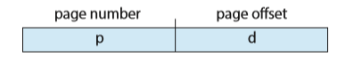
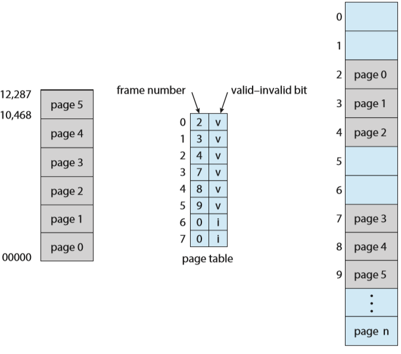
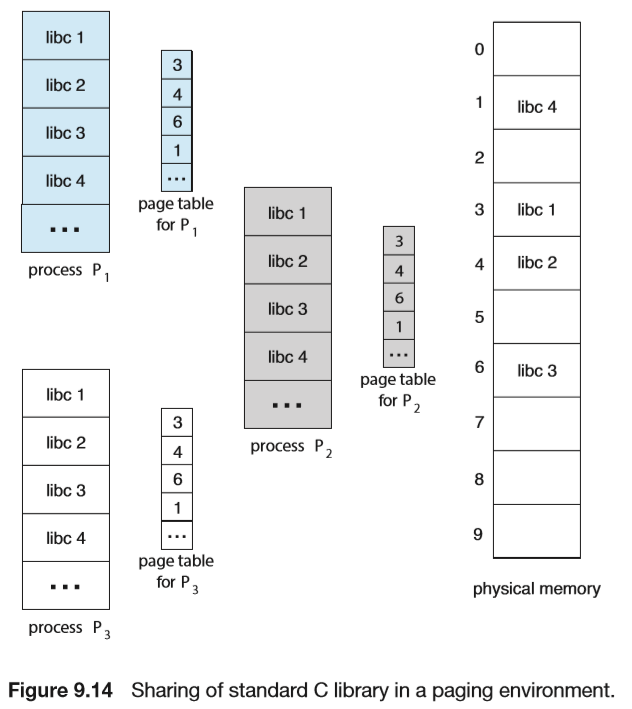
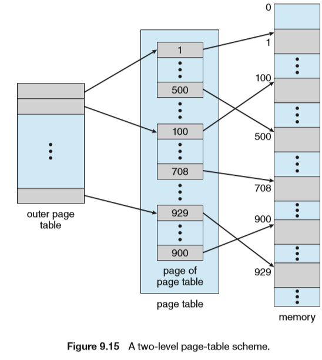
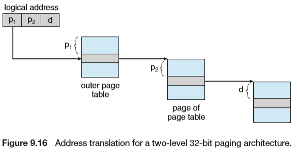
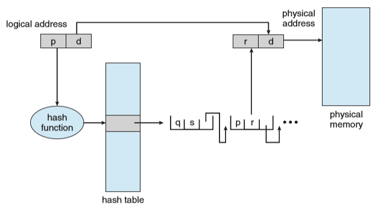
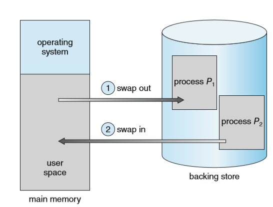

# Main Memory

## Background

### Basic Hardware

- 每个进程使用的内存空间通过两个寄存器`base`和`limit`限定（`base`~`base+limit`）

### Address Binding

- 编译时间：如果编译时就知道进程在内存中的地址，那么就可以生成绝对代码absolute code。
- 装载时间：编译时不知道在哪，那么编译器生成可重定位代码relocatable code。
- 执行时间：如果进程在执行时可以移动到另一个内存段，需要硬件支持(base and limit)。目前绝大多数都是采用这种。

###  Logical Versus Physical Address Space 

- 逻辑地址：由CPU生成，从0开始
- 物理地址：实际内存地址

## Contiguous Memory Allocation

### Memory Protection

`base and limit`

### Memory Allocation 

- 分配第一个足够大的
- 分配最小的足够大的
- 分配最大的
- First和best在时间和空间利用率都比worst好。
- next-fit是每次都从上次查找结束的位置开始找，找到第一个足够大的。

### fragmentation

first和best都存在外部碎片的问题。外碎片指所有的总可用内存可以满足请求，但是并不连续。外碎片可以通过紧凑（compaction）拼接（defragmentation）减少。重定向是动态并且在执行时间完成可以进行紧凑操作 重新排列内存来将碎片拼成一个大块，但是拼接的开销很大。

内碎片是进程内部无法使用的内存，这是由于零头和块大小造成的，比如块大小8B，进程有9B，那么不得不给他16B的内存，就出现了7B的内碎片。

## Paging

将物理内存分成固定大小的块，称为`frames`

每个地址分为两部分，`page number`和`page offset`，操作系统需要维护页表以进行LA到PA的转换

分页技术没有外碎片，只有内碎片，浪费的空间数量大概等于$\frac12frame\_size*number\ of\ process$

### Hardware Support

- Page-Table Base Register (PTBR)：指向页表
- Page-Table Length Register(PTLR)：说明页表长度

这样每次访问都需要访问两次内存，一次查页表，一次查数据/指令

### Translation Look-aside Buffer (TLB)

为了加速页表查询过程可以利用Translation Look-aside Buffer (TLB)

`TLB`可以缓存一部分页表数据，在`TLB Miss`的会利用PTBR和PTLR进行转换，并把该页表数据放入TLB中

有些TLB会存储Address-Space Identifier (ASIDs) ，用于标识进程

### Protecion

- Valid-invalid bit：用于标识可用的空间，保证程序不会访问到不属于自己的内存（但由于内碎片的存在，这并不能完全避免）

### Shared Pages

如果代码是可重入代码（[rentrant code]( [https://zh.wikipedia.org/wiki/%E5%8F%AF%E9%87%8D%E5%85%A5](https://zh.wikipedia.org/wiki/可重入) )），可以共享，共享代码在各个进程中的逻辑地址空间相同。然后每个进程再花较小的空间保存私有代码和数据即可。

## Structure of Page Table

### Hierarchical Paging（分级页表）

### Hashed Page Tables（哈希页表）

超过32位的LA，一般使用哈希页表，将虚页号的哈希值存到哈希表里，哈希表的每一项都是链表，链着哈希值相同的页号。然后在查表时用虚页号与链表中的每个元素进行比较从而查物理表号

### Inverted Page Tables（反向页表）

- 只有每个真正的内存帧才会有一个条目
- 每个条目包含真正内存位置的页的地址及拥有该页的进程信息。
- 可以和哈希表和TLB结合
- 会使Shared Pages失效

## Swappiing

- 进程可以将内存中的数据放入`Backing store`中，使得可使用的内存大于实际内存大小
- 交换的过程需要时间，只有在内存不够时才进行交换

## Example

### Intel 32 and 64 bits Architectures

咕