## 创建地板，砖块，小球

最后的成果如图

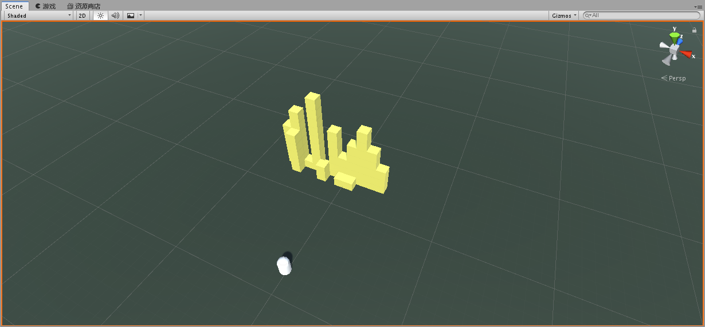

地板用3D对象->平面建出

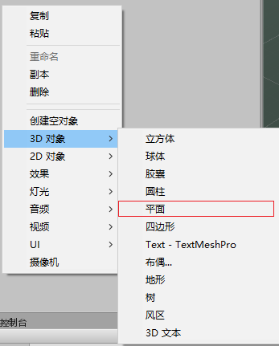

方块使用3D对象->立方体建出，然后为方块添加刚体属性

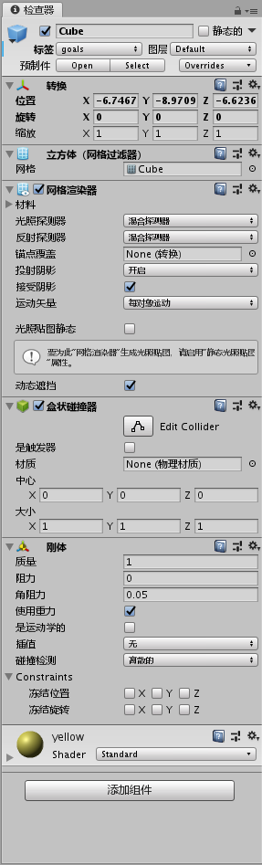

胶囊用于表示玩家，采用第一人称的视角，所以摄像头作为胶囊的子对象

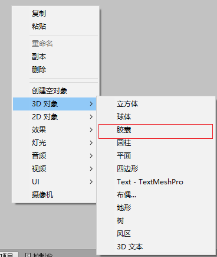

射出的子弹用球体创建，然后保存为预制体

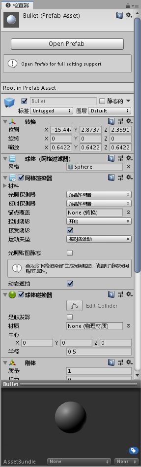


给物体赋予颜色，创建一个材质，然后选择想要的颜色，最后将材质拖动到物体上即可

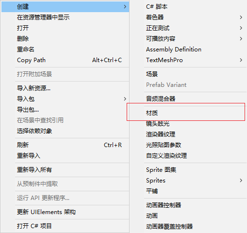


## 创建射击动作

```c#
public float fireRate = 0.3f;

private float nextFire = 0.0f;

void Fire(){
    if(Input.GetButton("Fire1") && Time.time > nextFire){
        GameObject b = GameObject.Instantiate(bullet, transform.position + transform.TransformDirection(new Vector3(0f,0f,1.5f)), transform.rotation);
        Rigidbody rgd = b.GetComponent<Rigidbody>();
        rgd.velocity = transform.forward * bulletSpeed;
        nextFire = Time.time + fireRate;
    }
}
```

在player中添加相应函数，然后在Update()方法里调用就行

在unity界面中需要将创建的bullet预制体拖入进来

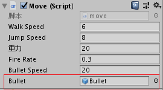

## 创建移动动作

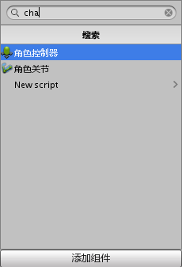

在Player中添加一个角色控制器，并编写相应代码（参照unity文档）如下

```c#
void Move(){
    if (characterController.isGrounded)
    {
        // We are grounded, so recalculate
        // move direction directly from axes

        moveDirection = new Vector3(Input.GetAxis("Horizontal"), 0.0f, Input.GetAxis("Vertical"));
        moveDirection = transform.TransformDirection(moveDirection);
        moveDirection *= walkSpeed;

        if (Input.GetButton("Jump"))
        {
            moveDirection.y = jumpSpeed;
        }
    }

    // Apply gravity. Gravity is multiplied by deltaTime twice (once here, and once below
    // when the moveDirection is multiplied by deltaTime). This is because gravity should be applied
    // as an acceleration (ms^-2)
    moveDirection.y -= gravity * Time.deltaTime;

    // Move the controller
    characterController.Move(moveDirection * Time.deltaTime);
}
```


## 让鼠标可以控制摄像头转动

摄像头添加一个脚本，代码如下

```c#
using System.Collections;
using System.Collections.Generic;
using UnityEngine;

public class mouseMove : MonoBehaviour
{
    public GameObject player;    
    Vector3 rot = new Vector3(0, 0, 0);   
    public float speed; 
    // Start is called before the first frame update
    void Start()
    {

    }

    // Update is called once per frame
    void LateUpdate()
    {
        float MouseX = Input.GetAxis("Mouse X")*speed;       
        float MouseY = Input.GetAxis("Mouse Y")*speed;
        rot.x = rot.x - MouseY;
        rot.y = rot.y + MouseX;  
        rot.z = 0;    
        //限制上下角度
        if (rot.x<=-70) {
            transform.eulerAngles = new Vector3(-70, rot.y, 0);
        }
        else if (rot.x >= 11) {
            transform.eulerAngles = new Vector3(11, rot.y, 0);
        }
        else{
            transform.eulerAngles = new Vector3(rot.x, rot.y, 0);
        }
        player.transform.eulerAngles = new Vector3(rot.x, rot.y, 0);
    }
}

```

摄像头应该作为player的子对象，如下图


同时需要将player对象拖进来

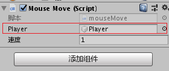

## 子弹定时消除及破坏效果

给子弹添加一个脚本组件，代码如下

```c#
using System.Collections;
using System.Collections.Generic;
using UnityEngine;

public class Destroy : MonoBehaviour
{
    // Start is called before the first frame update
    void Start()
    {

    }

    // Update is called once per frame
    void Update()
    {
        Destroy (gameObject,5);
    }

    void OnCollisionEnter(Collision other) 
    {
        if (other.gameObject.CompareTag ("goals"))
        {
            other.gameObject.SetActive (false);
            Destroy(gameObject);
        }
    }
}
```

为了使得子弹击中砖块时，砖块会消失，给砖块加上goals的标签，在添加标签处添加goals标签然后选中即可

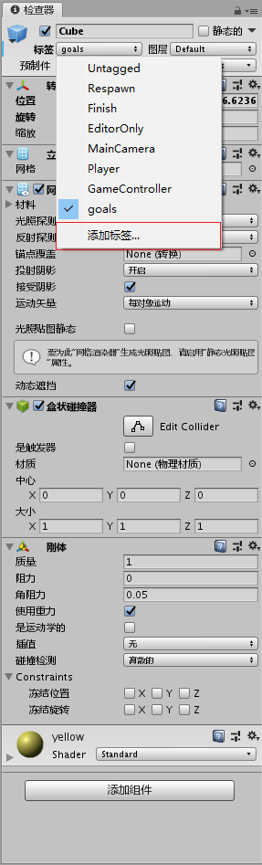

效果示意图：

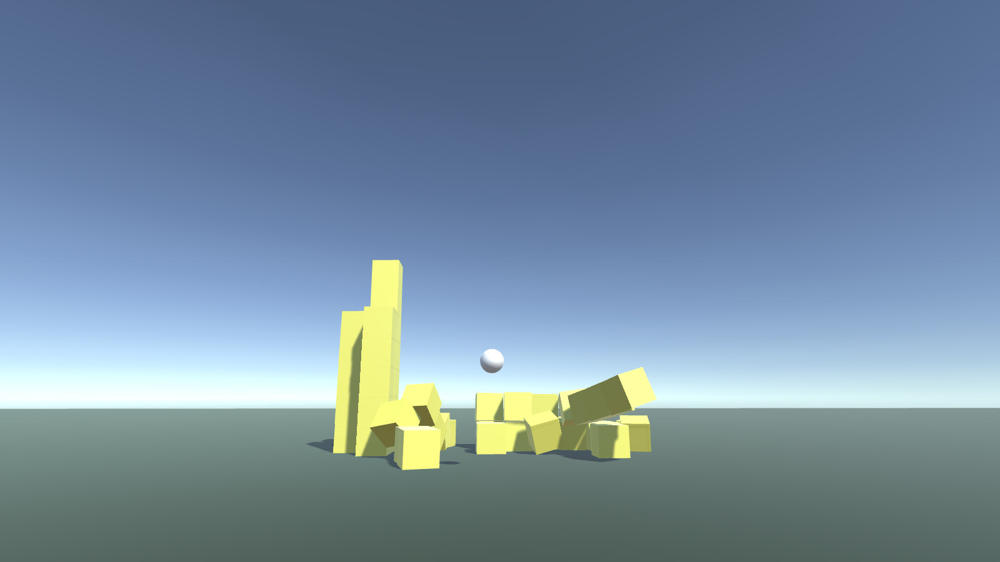