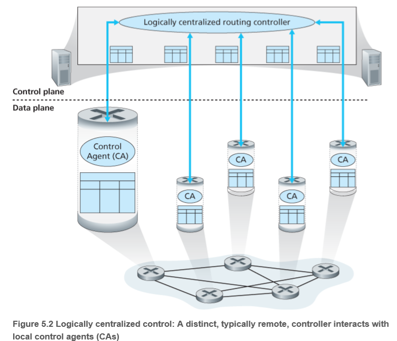
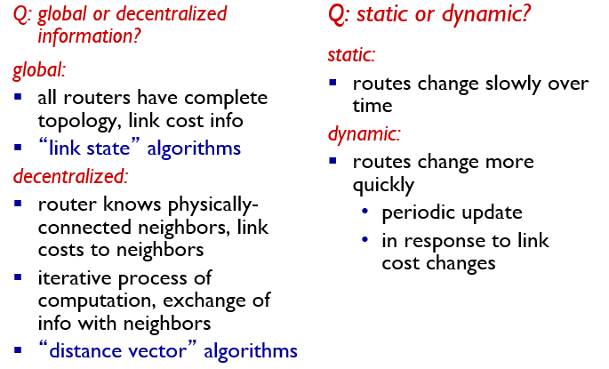
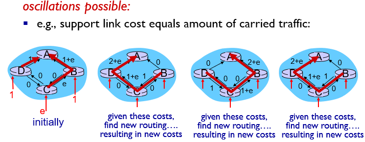
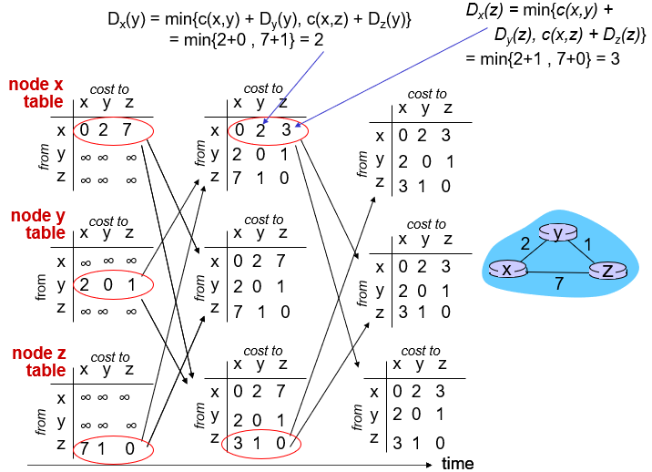

# Network Layer: The Control Plane

## introduction

### Per-roouer control plane

### Logically centralized control

## Routing Algorithms

将网络用图表示出来

###  The Link-State (LS) Routing Algorithm

如果可以得知网络的全部信息，即交换机的信息通过广播发送，使得每个交换机都知道网络中所有交换机的信息，那就可以使用LS算法，典型算法如`Dijkstra`

`Dijkstra`算法步骤如下：

设`visit`和`unvisit`集，用于记录结点的访问状态，设`distance`和`previous vertex`集用于保存结点的最短路径长度和上一个节点的信息

1. 将所有点设为`unvisit`，`distance`为`inf`，`previous vertex`为`None`
2. 将初始节点距离设为0
3. 从`unvisit`集中选取具有最短路径的点并设为当前点
4. 寻找当前点的邻居并改写`distance`和`previous vertex`（如果计算距离小于表中记录的距离）
5. 将当前点从`unvisit`改为`visit`
6. 当目标节点已经被访问(找两点的指定路径)或者当所有节点都被访问到时，停止循环

可能导致的问题，算法导致网络的状态在不断的改变

###  The Distance-Vector (DV) Routing Algorithm

`Bellman-Ford`算法

1. 创建源顶点 v 到图中所有顶点的距离的集合 distSet，为图中的所有顶点指定一个距离值，初始均为 Infinite，源顶点距离为 0；
2. 计算最短路径，执行 V - 1 次遍历；
   - 对于图中的每条边：如果起点 u 的距离 d 加上边的权值 w 小于终点 v 的距离 d，则更新终点 v 的距离值 d；
3. 检测图中是否有负权边形成了环，遍历图中的所有边，计算 u 至 v 的距离，如果对于 v 存在更小的距离，则说明存在环；

每个节点把自己的`distance-vector`发给邻居，当节点收到信息时就根据这些信息更新自己的DV

可能的问题：

`link cost`变大时，需要很久才会收敛，通过`poisoned reverse`可以解决这个问题  

## Intra-AS Routing in the Internet: OSPF

intra-AS routing：

- routing among hosts, routers in same AS (“network”)
- all routers in AS must run *same* intra-domain protocol
- routers in *different* AS can run *different* intra-domain routing protocol
- gateway router: at “edge” of its own AS, has link(s) to router(s) in other AS’es