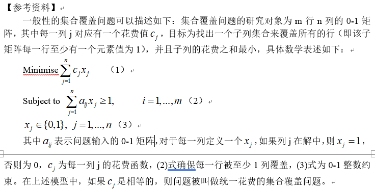

1. 利用CPLEX求解线性规划问题，必须以数据和程序分离的方式实现（即程序中不涉及任何数据，所有数据放在.dat文件中）。

（1）    书上P53的连续投资的例题，例2-13

（2）    习题2.11

**要求提供最优解，最优目标，Engine Log记录的信息。**

 

 

2. （一种特殊的集合覆盖问题求解）考虑这样一个特殊问题，给定一个集合{1,2,3,4,5},这是一个包含5个元素的集合，其中{1,2,3}为其中的一个3元子集，这个集合可以覆盖3个2元子集，分别是{1,2}，{2,3}，{1,3}问题是最少可以用多少个3元子集来覆盖所有的2元子集。这里由于集合的元素只有5个，很容易用列举法得到答案。首先遍历所有的3元子集，共有10个，分别是s1={1,2,3}， s2={1,2,4}， s3={1,2,5}， s4= {1,3,4}， s5= {1,3,5}， s6={1,4,5}， s7={2,3,4}， s8={2,3,5}， s9= {2,4,5}， s10={3,4,5}。然后遍历所有的2元子集，同理也为10个，分别是x1={1,2}，x2={1,3}， x3={1,4}，x4={1,5}，x5={2,3}，x6={2,4}，x7={2,5}，x8={3,4}，x9={3,5}，x10={4,5}很容易可以看出最少取4个3元子集便可覆盖所有的2元子集，而且选取的3元子集并不唯一，比如可以选s1，s6，s9，s10亦可以选s2，s5，s8，s10。

现在将此问题推广到更一般化的形式，对任意一个自然数k，给出集合{1,2…,k,k+1,…2k+1}，求此集合中最少的k+1元子集的个数，使其覆盖所有k元子集。利用CPLEX求解k=3,k=4,k=5时的结果。对于k=5情况，求解耗时较大，尝试利用.ops文件调节PPT46页中选项卡的内容，尽量在有限时间内求得次优解。（观察Engine Log中的 Gap值变化，Gap越小，表示当前解越接近最优解）

报告内容必须包含最优解或次优解的值，对应目标值，一段Engine Log信息，给出次优解Gap值。同时报告中需要简述建模思路，即此类集合覆盖问题系数矩阵构建思路，有关参考资料及相应提示如下：

