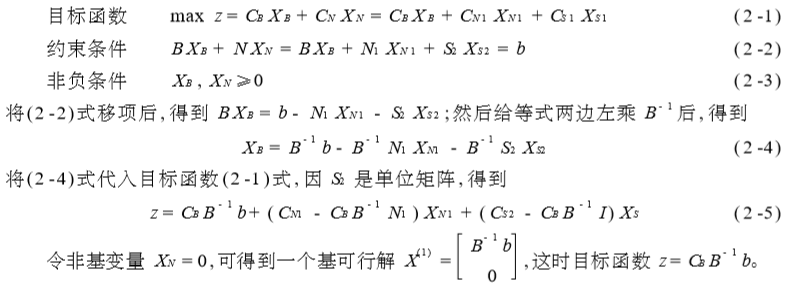
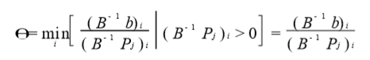
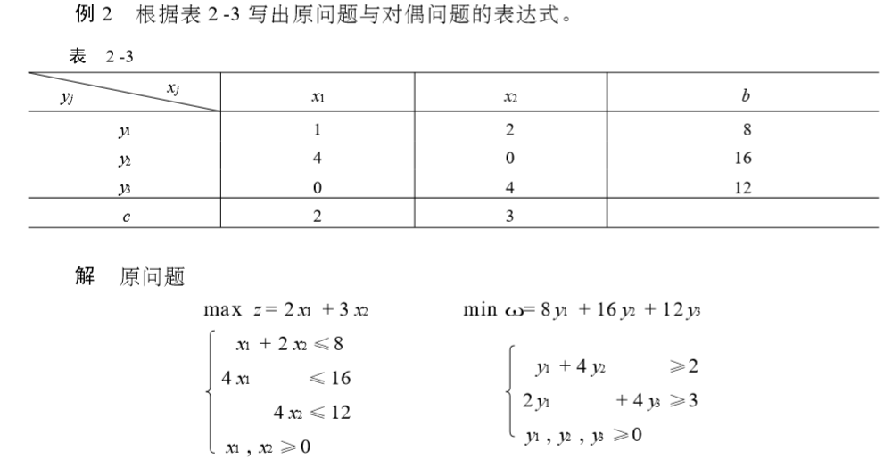
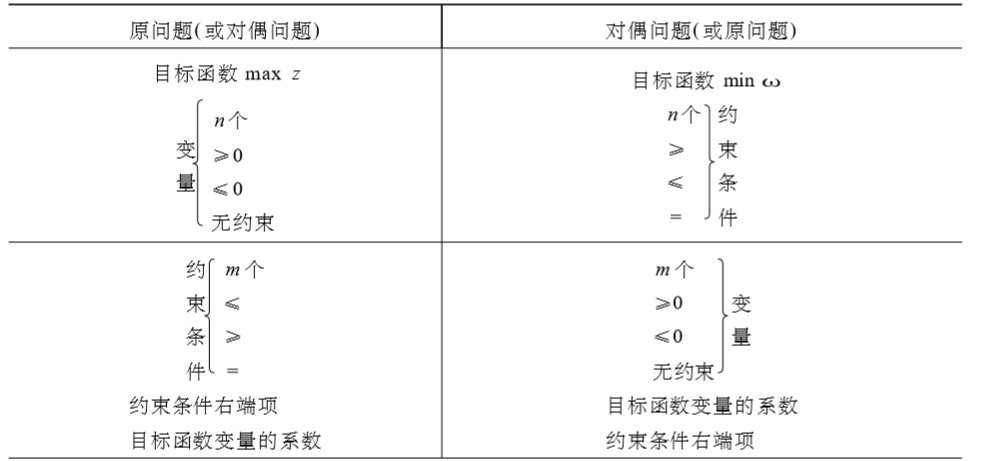
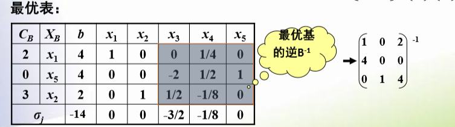
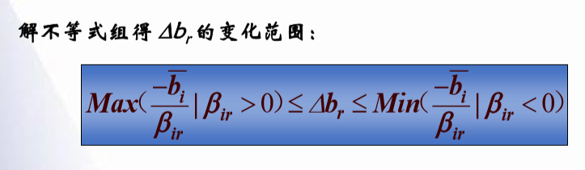
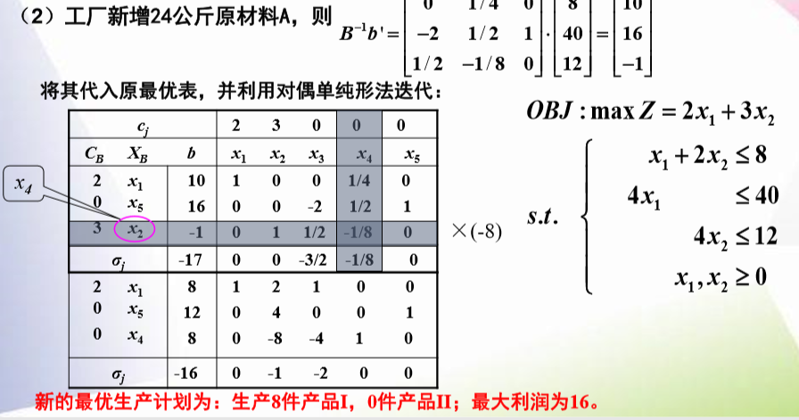
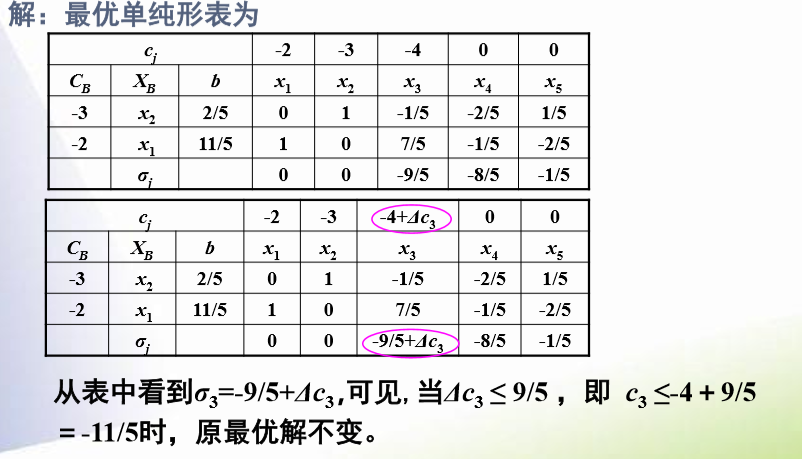
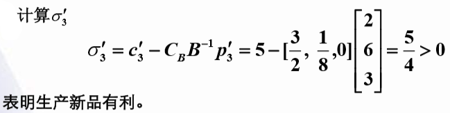
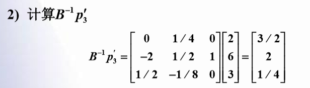

# 对偶理论和灵敏度分析

## 单纯形法的矩阵描述

- B：基变量对应的系数矩阵
- N：非基变量对应的系数矩阵
- S：松弛变量对应的系数矩阵

决策变量分为$X_B$和$X_N$，目标函数的系数分为$C_B$和$C_N$

- 2-5中非基变量的系数就是检验数
- θ规则的表达式为

- 单纯形表与矩阵表示的关系

## 改进单纯形法

- 确定初始基和初始基变量
- 计算非基变量的检验数，确定换入变量

$$
\sigma_N = C_N - C_BB^{-1}N
$$

- 确定换出变量
- 基变换
- 计算非基变量的系数矩阵

## 线性规划的对偶问题

### 对偶问题的基本性质

- 对称性：对偶问题的对偶是原问题
- 弱对偶性：若X是原问题的可行解, Y是对偶问题的可行解。则存在 CX≤Yb
- 无界性：若原问题(对偶问题)为无界解, 则其对偶问题(原问题)无可行解
  - 若原问题(对偶问题)无可行解, 则其对偶问题(原问题)无可行解或为无界解
- 可行解是最优解时的性质：设X是原问题的可行解, Y是对偶问题的可行解, 当CX= Yb 时, X , Y是最优解
- 对偶定理：若原问题有最优解, 那么对偶问题也有最优解;且目标函数值相等
- 互补松弛性：若 X, Y分别是原问题和对偶问题的可行解。那么 $YX_S = 0$ 和$Y_SX = 0$ ,当且仅当X, Y为最优解

## 对偶单纯形法

- 当b列的数字都为正数，检验数都为负数，则已得到最优解
- 换出变量为b列最小的变量
- 换入变量的确定方法如下

$$
\theta=min_j(\frac{c_j-z_j}{a_{ij}}|a_{ij}<0)
$$

- 进行迭代运算

## 灵敏度分析

### B变

- 求最优表对应的基的逆

**求b变化的范围使得最优基不变**

**求b变化后最优解的变化**

- 用$B^{-1}$乘以变化后的b，将其代入原最优表后进行迭代

### C变

两种情况

- 非基变量的价值系数cj变化，不影响其它检验数

由于非基变量的价值系数cj变化，不影响其它检验数，所以只要保证其检验数依旧小于0，则最优解不变

- 基变量的价值系数$C_B$变化，影响所有非基变量检验数

依旧是保证检验数小于0

### A变

- 增加变量

若所增加变量的检验数≤0，则原最优解不变，否则，用单纯形法迭代求最优解。 

- $P_j$的变化
  - $P_j$为非基变量的技术系数时，对检验数有影响，只需保证对应非基变量的检验数非负
  - $P_j$为基变量的技术系数时,需继续进行初等行变换，将对应基变量技术系数列变为单位列向量。

- 计算新产品的检验数

- 计算经过变换后的A

- 将其加入（替换）最优表进行迭代

