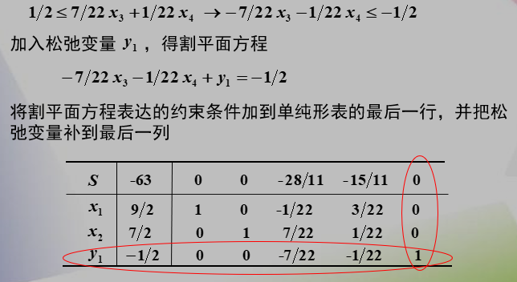
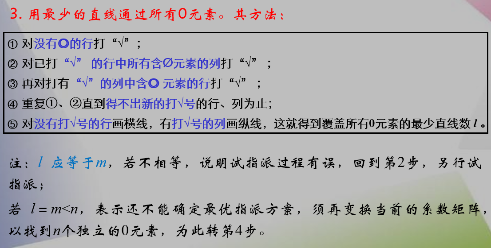

# 整数规划

在线性规划的基础上引入整数的限制

## 分支定界解法

- 求最优解确定上届
- 对问题进行分支，更新上下界
- 不在上下届范围内的分支剪掉，继续分支直到求出所有可能的分支

## 割平面解法

## 0-1型整数规划

### 过滤隐枚举法

- 先求得一可行解然后增加一约束条件 $z>=可行的z值$ 
- 枚举所有可能，利用增加的约束条件进行过滤，只要一个条件不满足，则不再检查下面的条件
- 若找到的可行解 z 值变大，则修改约束条件

### 分枝隐枚举法

## 指派问题

