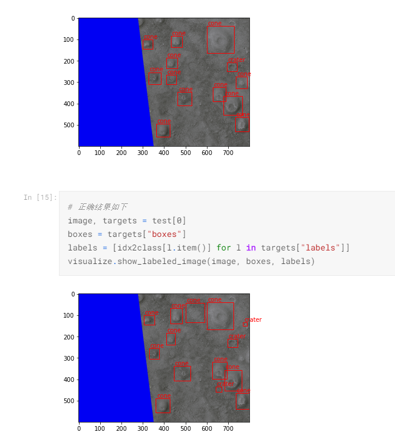
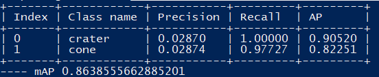
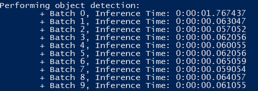
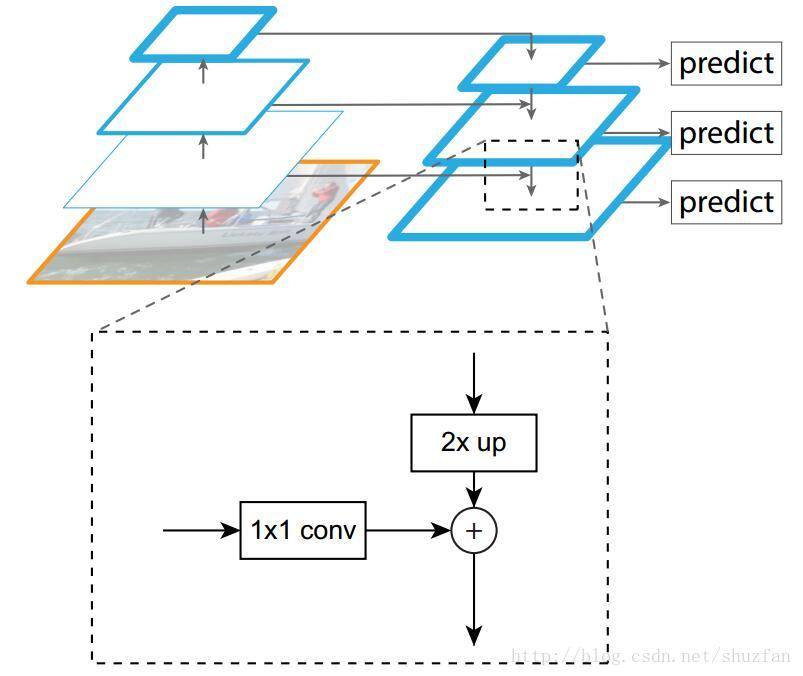
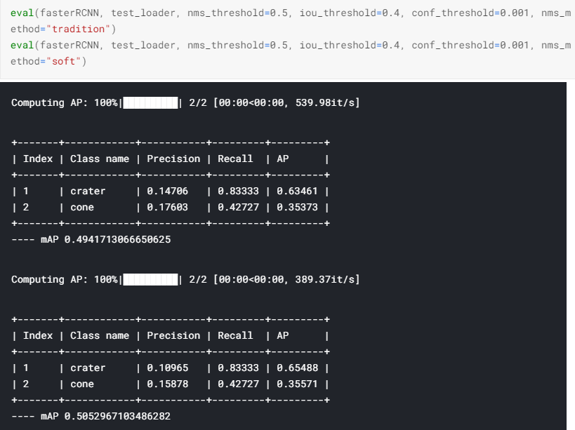

# 人工神经网络原理期末大作业

姓名：叶茂青

学号：17363092

---

## a

以下预测时间仅供参考，运行的设备不一样没有比较的意义

### Faster RCNN实现及其结果

运行过程可见https://www.kaggle.com/clicker3/faster-rcnn

模型评测结果：

```
 Average Precision  (AP) @[ IoU=0.50:0.95 | area=   all | maxDets=100 ] = 0.404
 Average Precision  (AP) @[ IoU=0.50      | area=   all | maxDets=100 ] = 0.728
 Average Precision  (AP) @[ IoU=0.75      | area=   all | maxDets=100 ] = 0.389
 Average Precision  (AP) @[ IoU=0.50:0.95 | area= small | maxDets=100 ] = 0.067
 Average Precision  (AP) @[ IoU=0.50:0.95 | area=medium | maxDets=100 ] = 0.417
 Average Precision  (AP) @[ IoU=0.50:0.95 | area= large | maxDets=100 ] = 0.575
 Average Recall     (AR) @[ IoU=0.50:0.95 | area=   all | maxDets=  1 ] = 0.132
 Average Recall     (AR) @[ IoU=0.50:0.95 | area=   all | maxDets= 10 ] = 0.504
 Average Recall     (AR) @[ IoU=0.50:0.95 | area=   all | maxDets=100 ] = 0.535
 Average Recall     (AR) @[ IoU=0.50:0.95 | area= small | maxDets=100 ] = 0.067
 Average Recall     (AR) @[ IoU=0.50:0.95 | area=medium | maxDets=100 ] = 0.564
 Average Recall     (AR) @[ IoU=0.50:0.95 | area= large | maxDets=100 ] = 0.675
```



模型预测时间（在CPU上）：

```
CPU times: user 7.09 s, sys: 957 ms, total: 8.05 s
Wall time: 8.06 s
```

### YOLO实现及其结果

实现参考https://github.com/eriklindernoren/PyTorch-YOLOv3，修改了部分代码以抛弃对tensorflow的依赖，另外修改了评测时期的代码

运行过程可见https://www.kaggle.com/clicker3/pytorch-yolov3

模型评测结果：



模型预测时间：



## b

### 网络加入FPN

参考论文：[Feature Pyramid Networks for Object Detection](https://arxiv.org/abs/1612.03144)

引入FPN的目的是为了提高模型对于不同大小物体的分辨能力，如果只用最后一层feature做预测，由于感受野很大，模型不容易捕捉到小物体。在FPN前提出的方法还有`Featurized image pyramid`，`pyramidal feature hierarchy`等，`Featurized image pyramid`需要resize图片进行多次预测，耗时高，`pyramidal feature hierarchy`直接使用每一层的feature做预测，表现不佳。FPN的想法如下，通过上采样的方法将多层特征融合，再将这些特征用于预测。




#### 实验

在将Faster RCNN的backbone改为带有FPN的resnet50后，结果如下 

```
 Average Precision  (AP) @[ IoU=0.50:0.95 | area=   all | maxDets=100 ] = 0.557
 Average Precision  (AP) @[ IoU=0.50      | area=   all | maxDets=100 ] = 0.894
 Average Precision  (AP) @[ IoU=0.75      | area=   all | maxDets=100 ] = 0.602
 Average Precision  (AP) @[ IoU=0.50:0.95 | area= small | maxDets=100 ] = 0.383
 Average Precision  (AP) @[ IoU=0.50:0.95 | area=medium | maxDets=100 ] = 0.558
 Average Precision  (AP) @[ IoU=0.50:0.95 | area= large | maxDets=100 ] = 0.692
 Average Recall     (AR) @[ IoU=0.50:0.95 | area=   all | maxDets=  1 ] = 0.157
 Average Recall     (AR) @[ IoU=0.50:0.95 | area=   all | maxDets= 10 ] = 0.622
 Average Recall     (AR) @[ IoU=0.50:0.95 | area=   all | maxDets=100 ] = 0.633
 Average Recall     (AR) @[ IoU=0.50:0.95 | area= small | maxDets=100 ] = 0.383
 Average Recall     (AR) @[ IoU=0.50:0.95 | area=medium | maxDets=100 ] = 0.641
 Average Recall     (AR) @[ IoU=0.50:0.95 | area= large | maxDets=100 ] = 0.730
```

对比之前的结果，对于小物体的召回率和精度都有很大的提升

 ```
 Average Precision  (AP) @[ IoU=0.50:0.95 | area=   all | maxDets=100 ] = 0.404
 Average Precision  (AP) @[ IoU=0.50      | area=   all | maxDets=100 ] = 0.728
 Average Precision  (AP) @[ IoU=0.75      | area=   all | maxDets=100 ] = 0.389
 Average Precision  (AP) @[ IoU=0.50:0.95 | area= small | maxDets=100 ] = 0.067
 Average Precision  (AP) @[ IoU=0.50:0.95 | area=medium | maxDets=100 ] = 0.417
 Average Precision  (AP) @[ IoU=0.50:0.95 | area= large | maxDets=100 ] = 0.575
 Average Recall     (AR) @[ IoU=0.50:0.95 | area=   all | maxDets=  1 ] = 0.132
 Average Recall     (AR) @[ IoU=0.50:0.95 | area=   all | maxDets= 10 ] = 0.504
 Average Recall     (AR) @[ IoU=0.50:0.95 | area=   all | maxDets=100 ] = 0.535
 Average Recall     (AR) @[ IoU=0.50:0.95 | area= small | maxDets=100 ] = 0.067
 Average Recall     (AR) @[ IoU=0.50:0.95 | area=medium | maxDets=100 ] = 0.564
 Average Recall     (AR) @[ IoU=0.50:0.95 | area= large | maxDets=100 ] = 0.675
 ```


### 改进nms

参考文献：[Soft-NMS -- Improving Object Detection With One Line of Code](https://arxiv.org/abs/1704.04503)

代码可见https://www.kaggle.com/clicker3/nms-method

相比传统nms直接对重叠区域高于阈值的框进行剔除，soft-nms通过iou对得分进行惩罚（线性惩罚或高斯惩罚），再通过得分阈值选取框，数学表述如下

线性惩罚
$$
s_{i}=\left\{\begin{array}{ll}
s_{i}, & \text { iou }\left(\mathcal{M}, b_{i}\right)<N_{t} \\
s_{i}\left(1-\operatorname{iou}\left(\mathcal{M}, b_{i}\right)\right), & \text { iou }\left(\mathcal{M}, b_{i}\right) \geq N_{t}
\end{array}\right.
$$
高斯惩罚
$$
s_{i}=s_{i} e^{-\frac{\text { iou }\left({M}, b_{i}\right)^{2}}{\sigma}}, \forall b_{i} \in \mathcal{D}
$$


结果如下

