## 满足能耗约束下，最小化时延

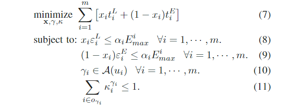

论文给出的公式如上，$x_i$为0-1变量，代表计算卸载的决策，决定任务是在本地执行还是边缘端执行

约束条件(8)，约束本地计算的耗能要小于电池余量

约束条件(9)，约束传输边缘计算任务的耗能要小于电池余量

约束条件(10)，约束执行计算任务的边缘节点是提供服务的节点

约束条件(11)，约束所有计算资源的分配不能超过该节点的计算资源总和

## 满足计算任务时延需求前提下，最小化能耗

### 变量解释

$X_{m,i}$代表第m个计算任务的第i个子任务，$F T_{m, i}$表示本地执行完成的结束时间

$T_{m,i,k}$是第m个计算任务的第i个子任务在第k个核心的耗时，其耗能为$E_{m,i,k}$

$RT_{m,i}$为第m个计算任务的第i个子任务的就绪时间

$F T_{m, i}^{\operatorname{send}}, F T_{m, i}^{e x e}, F T_{m, i}^{r c v}$分别代表边缘计算时，发送数据，执行任务，接受数据结束时的时间

耗能为传输和接受时的耗电，用$E_{m,i}^c$表示

优化目标及约束条件如下

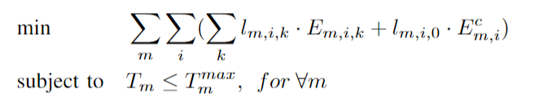

$T_m$的计算过程如下，对子任务$X_{m,i}$来说，如果其在本地执行，其就绪时间为前置任务完成的时间

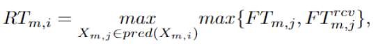

子任务$X_{m,i}$的运行时间为，$AT_{m,i,k}$为处理器空闲的时间

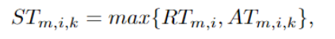

所以子任务$X_{m,i}$的结束时间为

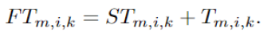

在云端执行时，同理可得其结束时间如下

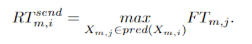

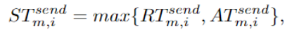

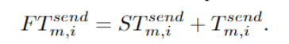

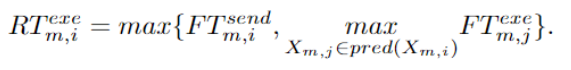

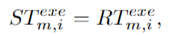

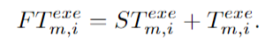

所以最终$T_m$为

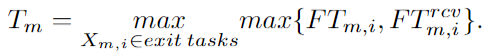

$l_{m,i,k}$用于表示对任务的指派

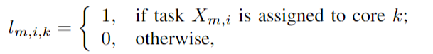

因为一个任务只能分配给一个核，所以有约束

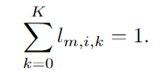

对于子任务的先后顺序要求，设定0-1变量$o_{i,j}$

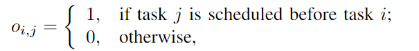

并建立如下约束保证前置任务的完成

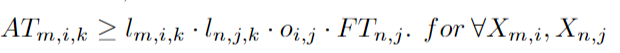

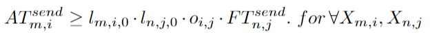

## 权衡能耗和时延

优化目标及约束条件如下

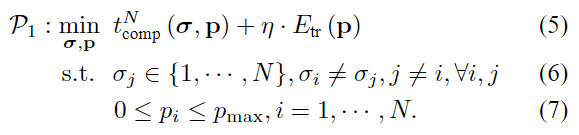

$\sigma$代表计算卸载的决策，p代表不同任务的发送功率，d表示任务的数据量，c表示任务的工作负载

传送速率的公式可以由下式获得

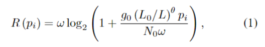

则数据传输完成的时间为

数据处理的时间为

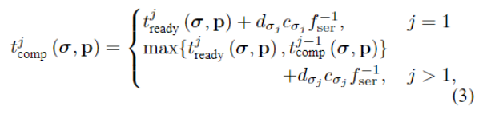

其能耗为

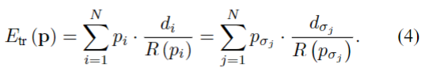