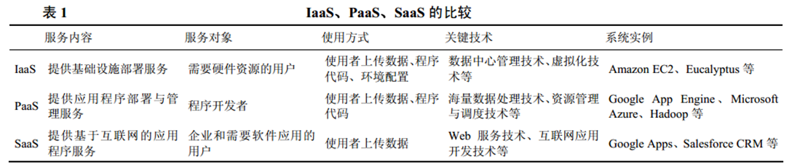
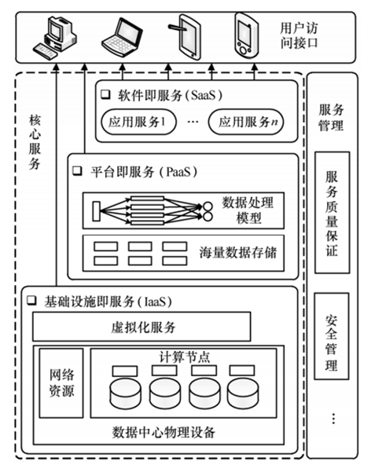
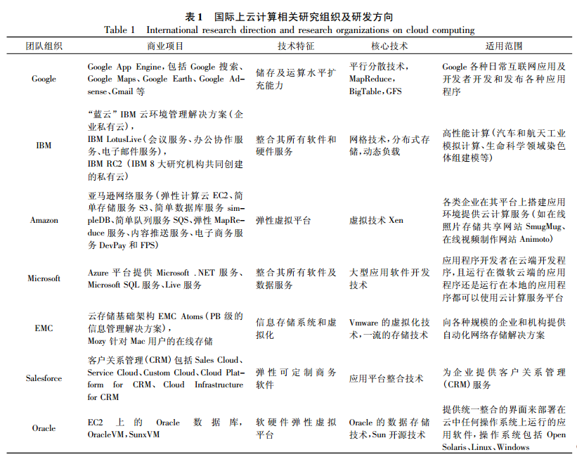
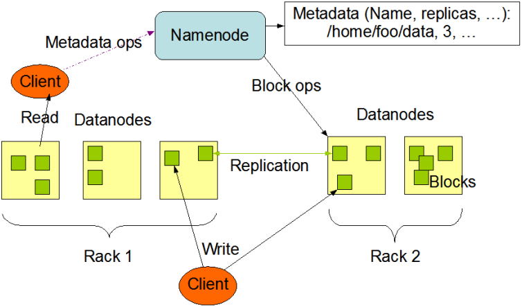

## 云计算概述

### 定义

云计算模型能以按需方式，通过网络，方便的访问云系统的可配置计算资源共享池(比如：网络，服务器，存储，应用程序和服务) 。同时它以最少的管理开销及最少的与供应商的交互，迅速配置提供或释放资源。

### 3种交互模式

#### 以软件作为服务（SaaS）

提供运行在云计算基础设施上的应用程序，用户可以自己定制软件的各个模块

典型代表：Salesforce公司提供的在线客户关系管理CRM（Client Relationship Management）服务

#### 将平台作为服务（PaaS）

提供给客户的是将客户用供应商提供的开发语言和工具（例如：Java、Python、.Net）创建的应用程序部署到云计算基础设施上去。其核心技术是分布式并行计算。

典型代表：GAE

#### 将基础设施作为服务（IaaS）

硬件即服务，将最基本的计算资源、存贮资源、网络资源，用虚拟化的方法以租用方式提供给客户。

典型代表：AWS

### 3种部署模式

#### 公有云

- 面向外部用户需求，通过开放网络提供云计算服务
- IDC，GoogleApp，Saleforce在线CRM

#### 私有云

- 大型企业按照云计算的架构搭建平台，面向企业内部需求提供云计算服务
- 企业内部数据中心等

#### 混合云

- 兼顾以上两种情况的云计算服务
- Amazon Web Server等既为企业内部又为外部用户提供云计算服务

### 云计算的特征

- 按需自助式服务
- 广泛的网络访问
- 共享的资源池
- 快速弹性使用
- 可度量的服务

## 云计算架构

### 核心服务层

云计算核心服务通常可以分为3个子层：

- 基础设施即服务层（IaaS, infrastructure as a service）
- 平台即服务层（PaaS, platform as a service）
-  软件即服务层（SaaS, software as a service）

### 服务提供层

为了满足客户的个性化需求，云计算服务提供商需要和用户进行协商，并制定服务水平协议（SLA，service level agreement），使得双方对服务质量的需求达成一致。

### 用户访问接口层

- 命令行
- Web

## 云计算关键技术

- 虚拟化技术
  - 裂分
  - 聚合
- 海量分布式存储技术
  - 冗余存储
  - GFS/HDFS存储技术
- 并行编程模式
  - Google GFS/MapReduce
  - Hadoop HDFS/MapReduce  
- 数据管理技术
- 分布式资源管理技术
- 云计算平台管理技术

## 云计算应用现状

## Hadoop

Hadoop实现一个分布式文件系统（Hadoop Distributed File System），简称HDFS。HDFS 分布式系统是一种典型的主从式 (Master/Slave) 体系架构,由一个名称节点服务器(NameNode)和多个数据节点(DataNode)组成的。

