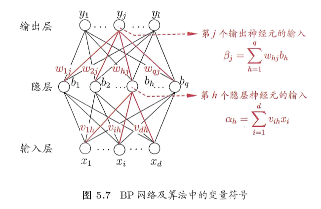

设对于$(x,y)$，神经网络的输出为$y'$，$x$为$d$维向量$（d×1）$，$y$和$y'$为$l$维向量$（l×1）$，神经网络的中间层为$q$维

从输入到输出的函数为，其中$f(x)$为sigmoid函数
$$
\alpha_h=\sum_{i=1}^dv_{ih}x_i\\
b_h=f(\alpha_h-\gamma_h)\\
\beta_j=\sum_{h=1}^qw_{hj}b_h\\
y'=f(\beta_j-\theta_j)\\
$$
定义误差函数为
$$
J=\frac12(y'-y)^2
$$
设学习率为$\alpha$，基于梯度下降法，神经网络权重的更新公式为
$$
v = v-\alpha\frac{\partial J}{\partial v}\\
w = w-\alpha\frac{\partial J}{\partial w}\\
$$

$$
\frac{\partial J}{\partial v}=\frac{\partial J}{\partial y'}\frac{\partial y'}{\partial \beta}\frac{\partial \beta}{\partial b_h}\frac{\partial b_h}{\partial \alpha_h}\frac{\partial \alpha_h}{\partial v_{ih}}\\
\frac{\partial J}{\partial y'}=y'-y\\
\frac{\partial y'}{\partial \beta}=f'(\beta_j-\theta_j)=f(\beta_j-\theta_j)(1-f(\beta_j-\theta_j))=y'(1-y')\\
\frac{\partial \beta}{\partial b_h}=\sum_{j=1}^lw_{hj}\\
\frac{\partial b_h}{\partial \alpha_h}=f'(\alpha_h-\gamma_h)=f(\alpha_h-\gamma_h)(1-f(\alpha_h-\gamma_h))=b_h(1-b_h)\\
\frac{\partial \alpha_h}{\partial v_{ih}}=x_i
$$

所以
$$
v= v-\alpha ((y'-y)y'(1-y')\sum_{j=1}^l(w_{hj})b_h(1-b_h)x_i)
$$

