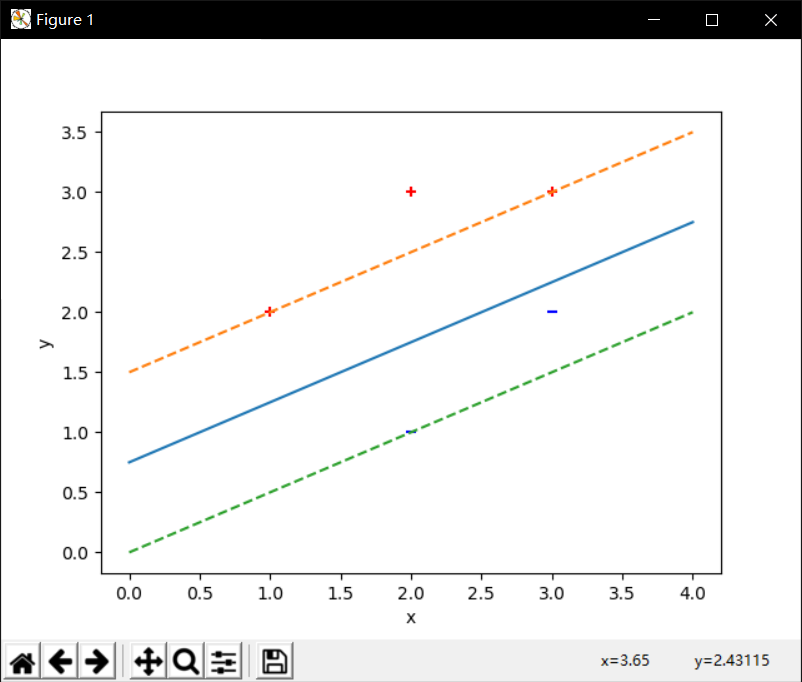
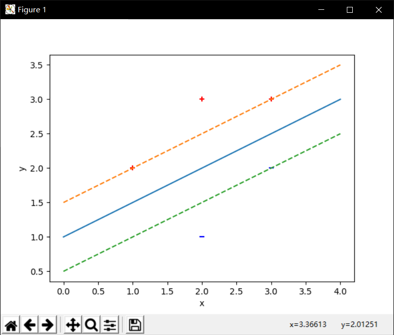

## 源码

算法流程参考http://cs229.stanford.edu/materials/smo.pdf，使用了简化版的SMO

```python
# 试求最大间隔分离超平面和分类决策函数，并在图上画出分离超平面，间隔边界以及支持向量。 

import numpy as np
import matplotlib.pyplot as plt
import random

class SVM:
    def __init__(self, C):
        self.w = None
        self.b = None
        self.C = C

    def fit(self, x, y):   
        self.x = np.matrix(x)
        self.y = np.matrix(y).T
        m, n = np.shape(x)
        self.alpha = np.matrix(np.zeros((m,1))) # 拉格朗日乘子
        self.simplified_smo()
        self.w = self.computeW()
        print("w = ", self.w)
        print("b = ", self.b)

    def predict(self, x):
        return np.sign(np.dot(self.w, np.array(x)) + self.b)

    def visualize(self):
        m, n = np.shape(self.x)
        for i in range(m):
            if self.y[i] == 1:
                plt.scatter(self.x[i,0], self.x[i,1], marker="+", c="r")
            else:
                plt.scatter(self.x[i,0], self.x[i,1], marker="_", c="b")

        # 分离超平面
        x1 = min(self.x[:,0])-1
        x2 = max(self.x[:,1])+1
        x1, x2 = x1[0,0], x2[0,0]
        a1, a2 = self.w
        a1, a2 = a1[0], a2[0]
        b = self.b
        y1, y2 = (-b-a1*x1)/a2,(-b-a1*x2)/a2
        y1, y2 = y1[0,0], y2[0,0]
        plt.plot([x1,x2], [y1,y2])

        # 间隔边界
        plt.plot([x1,x2], [y1+1/a2,y2+1/a2], '--')
        plt.plot([x1,x2], [y1-1/a2,y2-1/a2], '--')

        plt.xlabel('x')
        plt.ylabel('y')
        plt.show()


    def selectJ(self, i, m):
        # 选定alpha_i后随机选定另外一个alpha_j
        j = i
        while j==i:
            j = random.randint(0,m-1)
        return j

    def findBounds(self,i,j):
        if self.y[i] != self.y[j]:
            L = max(0,self.alpha[j]-self.alpha[i])
            H = min(self.C, self.C+self.alpha[j]-self.alpha[i])
        else:
            L = max(0,self.alpha[i]+self.alpha[j]-self.C)
            H = min(self.C,self.alpha[i]+self.alpha[j])
        return L,H

    def clipAlpha(self, j, L, H):
        if self.alpha[j] > H:
            self.alpha[j] = H
        elif self.alpha[j] < L:
            self.alpha[j] = L

    def kernel(self, i, j):
        return self.x[i,:] * self.x[j,:].T

    def simplified_smo(self):
        iters = 0
        max_iter = 100
        b = 0
        m, n = np.shape(self.x)
        tol = 1e-3
        while iters < max_iter:
            num_changed_alphas = 0
            for i in range(m):
                ei = self.computeEi(i, b)
                if (self.y[i] * ei < -tol and self.alpha[i] < self.C) or (self.y[i] * ei > tol and self.alpha[i]> 0 ):
                    j = self.selectJ(i, m)
                    ej = self.computeEi(j, b)
                    old_alphai = self.alpha[i].copy()
                    old_alphaj = self.alpha[j].copy()
                    L, H = self.findBounds(i, j)
                    if L == H:
                        continue
                    eta = 2 * self.kernel(i,j) - self.kernel(i,i) - self.kernel(j,j)
                    if eta >= 0:
                        continue
                    self.alpha[j] = self.alpha[j] - (self.y[j] * (ei - ej)) / eta
                    self.clipAlpha(j, L, H)
                    if abs(self.alpha[j] - old_alphaj) < 1e-5:
                        continue
                    self.alpha[i] = self.alpha[i] + self.y[i] * self.y[j] * (old_alphaj - self.alpha[j])
                    b1 = b - ei - self.y[i] * (self.alpha[i] - old_alphai) * self.kernel(i,i) - self.y[j] * (self.alpha[j] - old_alphaj) * self.kernel(j,j)
                    b2 = b - ej - self.y[i] * (self.alpha[i] - old_alphai) * self.kernel(i,j) - self.y[j] * (self.alpha[j] - old_alphaj) * self.kernel(j,j)
                    if 0 < self.alpha[i] < self.C:
                        b = b1
                    elif 0 < self.alpha[j] < self.C:
                        b = b2
                    else:
                        b = (b1+b2)/2
                    num_changed_alphas += 1
            if num_changed_alphas == 0:
                iters += 1
            else:
                iters = 0
        self.b = b

    def computeEi(self, i, b):
        fxi = np.multiply(self.alpha, self.y).T * (self.x*self.x[i,:].T) + b
        ei = fxi - self.y[i]
        return ei

    def computeW(self):
        m,n = np.shape(self.x)
        w = np.zeros((n,1))
        for i in range(m):
            w += np.multiply(self.alpha[i]*self.y[i], self.x[i,:].T)
        return w


X = np.array([[1,2], [2,3], [3,3], [2,1], [3,2]])
Y = np.array([1, 1, 1, -1, -1])

svm = SVM(C=1)
svm.fit(X,Y)
svm.visualize()
```


## 结果

实线为分离超平面

虚线为间隔边界

间隔边界内的即为支持向量

计算出来的w和b由于算法误差，每次运算会略有不同，仅供参考

### C=1



此时

```
w =  [[-0.6666114]
 [ 1.3333886]]
b =  [[-1.]]
```


### C=2


此时

```
w =  [[-0.8]
 [ 1.6]]
b =  [[-1.58]]
```

### C=10



此时

```
w =  [[-1.00001324]
 [ 2.        ]]
b =  [[-1.99998522]]
```

