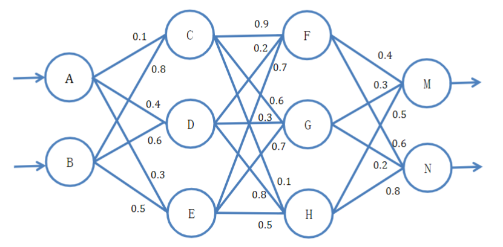
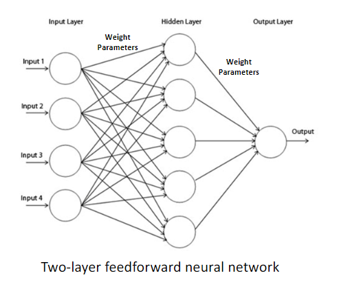
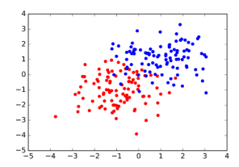
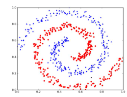
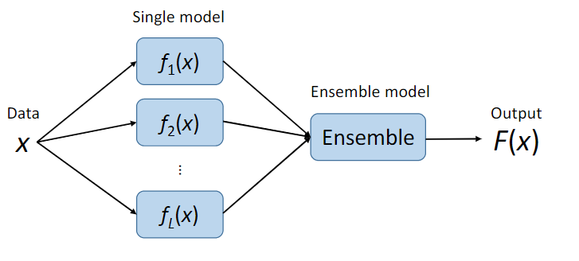
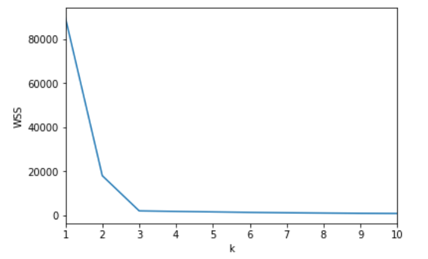
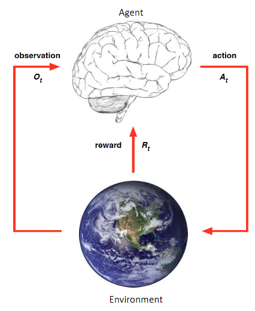
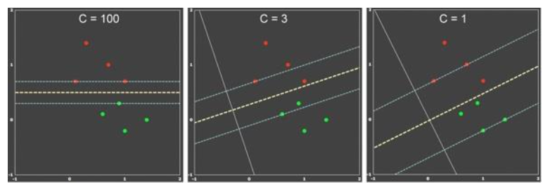
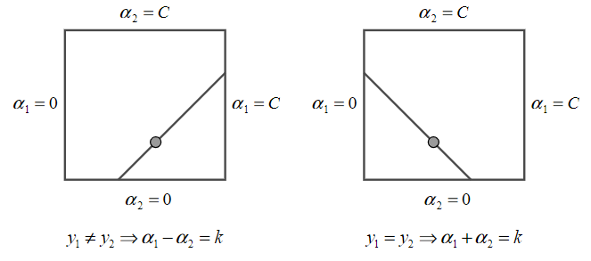

# 机器学习期末大作业

姓名：叶茂青

学号：17363092

---

## 1

$$
x=\left(x_{1}, x_{2}\right)=\left(\frac{0.17+0.92}{2}, \frac{0.36+0.92}{2}\right)^{T}=\left(0.545,0.640\right)^{T}
$$

$$
y=\left(y_{1}, y_{2}\right)=\left(\frac{0.30+0.92}{2}, 0.78\right)^{T}=\left(0.61,0.92\right)^{T}
$$

$$
\eta=0.9
$$

### 1.1

$$
A=0.545
$$

$$
B=0.640
$$

$$
C=sigmoid(0.1*A+0.8*B)=0.63796
$$

$$
D=sigmoid(0.4*A+0.6*B)=0.64611
$$

$$
E=sigmoid(0.3*A+0.5*B)=0.61857
$$

$$
F=sigmoid(0.9*C+0.2*D+0.7*E)=0.75702
$$

$$
G=sigmoid(0.6*C+0.3*D+0.7*E)=0.73294
$$

$$
H=sigmoid(0.1*C+0.8*D+0.5*E)=0.70888
$$

$$
M=sigmoid(0.4*F+0.3*G+0.5*H)=0.70623
$$

$$
N=sigmoid(0.6*F+0.2*G+0.8*H)=0.76277
$$

### 1.2

$$
\delta_M=M*(1-M)*(M-y1)=0.019964\\
\delta_N=N*(1-N)*(N-y2)=-0.028452
$$

$$
W_{FM}=W_{FM}-\eta\delta_MF=0.38640\\
W_{GM}=W_{GM}-\eta\delta_MG=0.28683\\
W_{HM}=W_{HM}-\eta\delta_MH=0.48726\\
W_{FN}=W_{FN}-\eta\delta_NF=0.58117\\
W_{GN}=W_{GN}-\eta\delta_NG=0.18176\\
W_{HN}=W_{HN}-\eta\delta_NH=0.78236
$$

$$
\delta_F=F*(1-F)*(\delta_M*W_{FM}+\delta_N*W_{FN})=-0.0016712\\
\delta_G=G*(1-G)*(\delta_M*W_{GM}+\delta_N*W_{GN})=0.000058503\\
\delta_H=H*(1-H)*(\delta_M*W_{HM}+\delta_N*W_{HN})=-0.0026373
$$

$$
W_{CF}=W_{CF}-\eta\delta_FC=0.90096\\
W_{CG}=W_{CG}-\eta\delta_GC=0.5997\\
W_{CH}=W_{CH}-\eta\delta_HC=0.10151\\
W_{DF}=W_{DF}-\eta\delta_FD=0.20097\\
W_{DG}=W_{DG}-\eta\delta_GD=0.29997\\
W_{DH}=W_{DH}-\eta\delta_HD=0.80153\\
W_{EF}=W_{EF}-\eta\delta_FE=0.70093\\
W_{EG}=W_{EG}-\eta\delta_GE=0.69997\\
W_{EH}=W_{EH}-\eta\delta_HE=0.50147
$$

$$
\delta_C=C*(1-C)*(\delta_F*W_{CF}+\delta_G*W_{CG}+\delta_H*W_{CH})=-0.00040020\\
\delta_D=D*(1-D)*(\delta_F*W_{DF}+\delta_G*W_{DG}+\delta_H*W_{DH})=-0.00055482\\
\delta_E=E*(1-E)*(\delta_F*W_{EF}+\delta_G*W_{EG}+\delta_H*W_{EH})=-0.00057747
$$

$$
W_{AC}=W_{AC}-\eta\delta_CA=0.10020\\
W_{AD}=W_{AD}=\eta\delta_DA=0.40027\\
W_{AE}=W_{AE}=\eta\delta_EA=0.30028\\
W_{BC}=W_{BC}=\eta\delta_CB=0.80023\\
W_{BD}=W_{BD}=\eta\delta_DB=0.60032\\
W_{BE}=W_{BE}=\eta\delta_EB=0.50033
$$

## 2

如果没有特意提到，图及数学公式均来源于课程PPT

### 2.1

|      分类      |                            方法                             |
| :------------: | :---------------------------------------------------------: |
|  **监督学习**  | **线性模型+BP，SVM，决策树，集成学习（Bagging，Boosting）** |
| **无监督学习** |              **线性模型+BP，聚类，GMM，降维**               |
|  **强化学习**  |                      **马尔可夫决策**                       |

### 2.2

#### 线性模型+BP

线性模型可用于解决分类或回归问题，给定一组具有n个feature的数据$(x_1,x_2,...,x_n)$

线性模型试图学得一组参数$(w_1,w_2,...,w_b,b)$使得目标函数达到最优，对于不同的问题，需要构建不同的目标函数，一般可通过梯度下降法求解

将多个线性模型组合起来，并添加激活函数等结构，就成为了神经网络

神经网络同样使用梯度更新参数，经过前向计算出误差，再反向根据误差计算出梯度，为了减少重复计算，同时也是为了编程的方便，神经网络使用了BP算法，通过链式法则求出神经网络中的梯度信息

神经网络每一层之间一般会有激活函数，常见的激活函数有`Sigmoid`，`Tanh`，`ReLu`等

#### SVM

SVM算法用于解决二分类问题（通过构造多个SVM分类器也可以解决多分类问题）

SVM最后可归结为求解下面的问题，通过SMO算法可快速的求解该问题
$$
\begin{array}{ll}
\max _{\alpha} & W(\alpha)=\sum_{i=1}^{N} \alpha_{i}-\frac{1}{2} \sum_{i=1}^{N} \sum_{j=1}^{N} \alpha_{i} \alpha_{j} y^{i} y^{j} x^{j^{\top}} x^{i} \\
\text {s.t.} & \alpha_{i} \geq 0, i=1, \ldots, N\\
&\sum_{i=1}^{N} \alpha_{i} y^{i}=0
\end{array}
$$
然后再通过下面两个公式求出SVM模型的参数
$$
w^*=\sum_{i=1}^{N} \alpha_{i} y^{i} x^{i}\\
b^{*}=-\frac{\max _{i: y^{(i)}=-1} w^{* \top} x^{(i)}+\min _{i: y^{(i)}=1} w^{* \top} x^{(i)}}{2}
$$

##### 软间隔

对于部分线性不可分的数据集，如下图

可以加入hinge loss，允许一部分数据落入间隔之中
$$
\begin{array}{l}
\min _{\boldsymbol{w}, b, \xi_{i}} \frac{1}{2}\|\boldsymbol{w}\|^{2}+C \sum_{i=1}^{m} \xi_{i} \\
\quad y_{i}\left(\boldsymbol{w} \cdot \boldsymbol{x}_{i}+b\right) \geq 1-\xi_{i} \\
\quad \xi_{i} \geq 0, i=1,2, \ldots, N
\end{array}\\
其中\xi_{i}=\max \left(0,1-y_{i}\left(\boldsymbol{w} \cdot \boldsymbol{x}_{i}+b\right)\right)
$$

此时的对偶问题变为
$$
\begin{array}{ll}
\max _{\alpha} & W(\alpha)=\sum_{i=1}^{N} \alpha_{i}-\frac{1}{2} \sum_{i=1}^{N} \sum_{j=1}^{N} \alpha_{i} \alpha_{j} y^{i} y^{j} x^{j^{\top}} x^{i} \\
\text {s.t.} & 0\leq \alpha_{i} \leq C, i=1, \ldots, N\\
&\sum_{i=1}^{N} \alpha_{i} y^{i}=0
\end{array}
$$
依旧可以采用SMO算法求解

##### 引入核函数

对于更极端的线性不可分的数据集，如下图

可以引入核函数，将数据映射到高维进行分类，但核函数无须知道映射关系，只需要定义好核函数$K(x^i,x^j)$即可
$$
\begin{array}{ll}
\max _{\alpha} & W(\alpha)=\sum_{i=1}^{N} \alpha_{i}-\frac{1}{2} \sum_{i=1}^{N} \sum_{j=1}^{N} \alpha_{i} \alpha_{j} y^{i} y^{j} K(x^{i},x^{j}) \\
\text {s.t.} & 0\leq \alpha_{i} \leq C, i=1, \ldots, N\\
&\sum_{i=1}^{N} \alpha_{i} y^{i}=0
\end{array}
$$
常见的核函数有：

- Gaussian kernel（RBF kernel）

$$
K(x, z)=\exp \left(-\frac{\|x-z\|^{2}}{2 \sigma^{2}}\right)
$$

- Simple polynomial kernel

$$
K(x, z)=\left(x^{\top} z\right)^{d}
$$

- Cosine similarity kernel

$$
K(x, z)=\frac{x^{\top} z}{\|x\| \cdot\|z\|}
$$

- Sigmoid kernel

$$
K(x, z)=\tanh \left(\alpha x^{\top} z+c\right)
$$

#### 决策树

决策树通过树形结构对数据进行分类，其中根节点包含所有的样本，内部节点通过样本的特征对数据进行划分，叶节点代表最后分类的结果

常见的决策树有三种：

- ID3
- C4.5
- CART

##### ID3

使用信息增益进行树的划分

从根节点开始，计算所有特征的信息增益，选择信息增益最大的特征进行划分，直至信息增益为0或没有特征可以选择

缺点：

- 只适用于离散数据
- 用信息增益划分，会倾向于选择取值较多的属性，效果不好

##### C4.5

使用信息增益率进行树的划分，过程和ID3类似

##### CART

使用基尼系数进行树的划分，同一个feature可以出现多次

##### 剪枝

为了保证决策树的泛化效果，会使用剪枝的方法避免决策树的过拟合

剪枝分为在训练过程中的预剪枝和训练完成后的后剪枝

##### 回归树

- 输入：训练数据D
- 输出：回归树f(x)

回归树的生成原理如下：

选定`ferture` $j$和`threshold` $s$，可以将样本划分为两个区域
$$
R_{1}(j, s)=\left\{x \mid x^{(j)} \leq s\right\} \quad R_{2}(j, s)=\left\{x \mid x^{(j)}>s\right\}
$$
通过最小化均方误差的方法（其中c是区域内所有点的平均），可以得出最佳的阀值
$$
\begin{array}{c}
\min _{j, s}\left[\min _{c_{1}} \sum_{x \in R_{1}(j, s)}\left(y_{i}-c_{1}\right)^{2}+\min _{c_{2}} \sum_{x \in R_{2}(j, s)}\left(y_{i}-c_{2}\right)^{2}\right] \\
\hat{c}_{m}=\operatorname{avg}\left(y_{i} \mid x_{i} \in R_{m}\right)
\end{array}
$$
该阀值就是回归树输出的值

#### 集成学习

建立多个模型来解决问题

对于多个模型输出的结果，最后结果的选取有以下方法

- 投票
- 加权投票
- 将结果（+原输入）stack起来丢进新的模型

集成学习主要分两类：

- Bagging
- Boosting

##### Bagging(Bootstrap Aggregating)

算法步骤：采用Bootstrap replication方法进行k轮取样，得到k个数据集，然后用k个数据集训练得出k个模型

###### Bootstrap replication 

对数据集进行有放回的取样，每次大约取63.2%的数据

###### Random Forest

随机森林算法将Bagging和决策树结合起来

相比Bagging中只对样本进行划分，随机森林还会随机的对样本特征进行划分，只选取一部分特征计算其信息增益等信息，并选择一个作为划分依据。

##### Boosting

Boosting算法的基本思路是根据先前模型的表现修改样本的分布，从而训练出更好的分类器

###### 算法步骤

1. 构造一系列弱分类器，通过加法模型进行组合
2. 测试模型表现，提高错误率小的模型权重，减小错误率高的模型权重
3. 改变训练数据的权重，提高被错误分类样本的权重，减少被正确分类样本的权重

常见的Boosting算法有：

- Adaboost
- Gradient boosting

#### 聚类

聚类属于无监督学习中的算法，可以将一组没有标签的数据自动分到不同的簇中，从而对数据的特性进行分析，聚类算法也可以用于图像分割领域

##### K-means

算法步骤：

1. 初始k个聚类中心
2. 按与聚类中心的距离分成k类
3. 计算蔟内中心点，更新聚类中心
4. 重复23直至中心变化小于阀值

k值的选取有以下几种方法：

- elbow method
- silhouette method

###### elbow method

计算簇内平方误差和，选择簇内平方误差和不再随着k的增大而迅速减小的k，如在下图中应该选择k=3

###### silhouette method

计算样本与同蔟内其他样本的平均距离（蔟内不相似度）和样本与其他蔟内其他样本的平均距离的最小值（蔟间不相似度），通过蔟内不相似度和蔟间不相似度可计算出其轮廓系数（对于只有一个点的蔟，其轮廓系数为0），公式如下

$$
a(i)=\frac{1}{\left|C_{k}\right|-1} \sum_{j \neq C_{k}, i \neq j} d(i, j) \quad蔟内不相似度\\
b(i)=\min _{l \neq k} \frac{1}{\left|C_{l}\right|} \sum_{j \in C_{l}} d(i, j)\quad蔟间不相似度\\
s(i)=\frac{b(i)-a(i)}{\max\{a(i),b(i)\}}\quad轮廓系数
$$
轮廓系数越接近1，样本聚类越合理，越接近-1，样本聚类越不合理，silhouette score为每个样本轮廓系数的均值

最后选择silhouette score高的k值

###### 选择初始聚类中心

随机选一个点作为聚类中心，之后选择的中心离现有的点越远概率越高，概率与最近聚类中心距离的平方成正比

###### 性质

k-means必然会收敛但不一定保证收敛到全局最优解

#### GMM

GMM可以用于聚类，也可以用于生成，GMM模型通过对多个高斯模型进行叠加得出

对于单维变量，给定均值$\mu$和方差$\sigma$，高斯分布的概率密度函数为
$$
f\left(x | \mu, \sigma^{2}\right)=\frac{1}{\sqrt{2 \pi \sigma^{2}}} e^{-\frac{(x-\mu)^{2}}{2 \sigma^{2}}}
$$
对于多维变量，$\mu$为均值，$\Sigma$为协方差，$d$为维数
$$
\mathcal{N}(x | \mu, \Sigma)=\frac{\exp \left(-\frac{1}{2}(x-\mu)^{\top} \Sigma^{-1}(x-\mu)\right)}{\sqrt{(2 \pi)^{d}|\Sigma|}}
$$
高斯混合模型就是k个单一高斯模型的加权求和，即，其中$w_j$为权重，权重之和为1
$$
p(x)=\sum_{j=1}^{K}w_{j} \cdot \mathcal{N}\left(x | \mu_{j}, \Sigma_{j}\right)
$$

##### 训练过程

GMM使用EM算法进行训练，EM算法分为`E-step`和`M-step`

###### E-step

根据参数的假设值，给出未知变量的期望估计，应用于缺失值

###### M-step

根据未知变量的估计值，给出当前的参数的极大似然估计

#### 降维

降维算法就是将高维的数据降到低维，从而达到可视化数据，降低数据量，提高模型速度等目的

降维算法会尽可能保证信息的留存，在设定合适的参数下，降维算法可将数据中线性相关的特征清除

##### PCA

PCA是一种常见的降维算法

PCA算法的思路为：选取方差大的方向为基，将原来的数据放入这些基构成的新坐标系中，得到数据在新坐标系上的坐标，从而完成降维

###### 数学过程

首先中心化所有的数据，设中心化后的数据为$X$，则协方差矩阵为$XX^T$

计算协方差矩阵$XX^T$的特征值和特征向量，根据降维的维数选择n个最大的特征值，得到其对应的特征向量

根据得到的特征向量$P$将$X$投影到新的坐标系中，即
$$
X^{'} =PX
$$

#### 强化学习

按照`Agent`对`environment`的了解程度，强化学习可分为：

- Model-based Reinforcement Learning
- Model-free Reinforcement Learning

有模型的强化学习要求`Agent`能提前获知出现的情况，而无模型的则不需要

强化学习不需要大量的数据，但需要构建合适的`Environment`对`Agent`进行反馈，`Agent`通过对`Environment`的观察（结合之前的信息）做出`Action`，并根据`Environment`返还的`Reward`对策略做出改变

Model-based Reinforcement Learning其中一种算法是马尔科夫决策

##### Markov Property

马尔科夫过程具有无后向性，即下一状态的转移概率只由当前状态决定，一些相关变量定义如下

- $S$：状态
- $A$：动作
- $P_{SA}$：在状态$S$下执行动作$A$的状态转移概率
- $\gamma$：衰减系数
- $R$：奖励

其目的为找出一个策略$\pi$使得获得的奖励最大，衰减系数用于控制`Agent`对于未来奖励的敏感度
$$
V^{\pi}(s)=\mathbb{E}\left[R\left(s_{0}\right)+\gamma R\left(s_{1}\right)+\gamma^{2} R\left(s_{2}\right)+\cdots \mid s_{0}=s, \pi\right]
$$
求解这一策略有两种方法：

- Value Iteration
- Policy Iteration

算法步骤如下

图源[1]

### 2.3

#### SVM

基本想法：找出一个决策边界，使得数据点离决策边界足够远

##### SVM数学推导

首先需要定义什么数据点离决策边界的距离，对于给定的点$(x_i,y_i)$和对应的决策边界$w^Tx+b=0$，其函数间隔为
$$
\gamma=y_i(w^Tx_i+b)
$$
但函数间隔有个问题，如果等比例增大w和b，决策边界不会改变，但是函数间隔却增大了，所以在函数间隔上加上范数的限制，称为几何间隔（一般规范$||w||=1$）
$$
\gamma=\frac{w^Tx+b}{||w||}
$$
对于一系列的点$(x_1,y_1),(x_2,y_2),...,(x_N,y_N)$，其距离决策边界的最小值定义为
$$
\gamma=\min _{i=1, \ldots, n} \gamma^{i}
$$
根据以上定义，SVM模型可表示为
$$
\begin{aligned}
&\max _{\gamma, w, b} \gamma\\
&\text { s.t. } \quad y^{i}\left(w^{\top} x^{i}+b\right) \geq \gamma, \quad i=1, \ldots, N\\
&\quad\quad||w||=1
\end{aligned}
$$
令$\gamma=1$，则模型等价于
$$
\begin{aligned}
&\max _{w, b} \frac{1}{||w||}\\
&\text { s.t. } \quad y^{i}\left(w^{\top} x^{i}+b\right) \geq 1, \quad i=1, \ldots, N\\
\end{aligned}
$$
也就等价于
$$
\begin{aligned}
&\min _{w, b} \frac12||w||^2\\
&\text { s.t. } \quad y^{i}\left(w^{\top} x^{i}+b\right) \geq 1, \quad i=1, \ldots, N\\
\end{aligned}
$$
于是我们顺利的得到了一个带有不等式约束的凸优化问题

我们可以构建拉格朗日函数，将不等式约束去掉
$$
L(w, b, \alpha)=\frac{1}{2}\|w\|^{2}+\sum_{i=1}^{N} \alpha_{i}\left[1-y^{i}\left(w^{\top} x^{i}+b\right)\right]
$$
令
$$
\theta_D(\alpha)=\max_{\alpha \geq 0} L(w,b,\alpha)
$$
再对该函数求最小
$$
\min_{w,b}\theta_D(\alpha)=\min_{w,b}\max_{\alpha \geq 0} L(w,b,\alpha)
$$
这个函数不太好解，所以利用拉格朗日函数对偶性，将问题转化成
$$
\max_{\alpha \geq 0}\theta_D(\alpha)=\max_{\alpha \geq 0}\min_{w,b} L(w,b,\alpha)
$$
由最优点偏导为0可得
$$
\begin{array}{l}
\frac{\partial L(w, b ; \alpha)}{\partial w}=w-\sum_{i=1}^{N} \alpha_{i} y^{i} x^{i}=0 \\
\frac{\partial L(w, b ; \alpha)}{\partial b}=-\sum_{i=1}^{N} \alpha_{i} y^{i}=0
\end{array}
$$
代入拉格朗日函数消去w和b
$$
\begin{array}{rl}
\min _{w, b} & L(w, b, \alpha) \\
& =\frac{1}{2}\left\|\sum_{i=1}^{N} \alpha_{i} y^{i} x^{i}\right\|_{N}^{2}+\sum_{i=1}^{N} \alpha_{i}-\sum_{i=1}^{N} \alpha_{i} y^{i}\left(\sum_{j=1}^{N} \alpha_{j} y^{j} x^{j}\right)^{\top} x^{i}+b \sum_{i=1}^{N} \alpha_{i} y^{i} \\
& =\sum_{i=1}^{N} \alpha_{i}-\frac{1}{2} \sum_{i=1}^{N} \sum_{j=1}^{N} \alpha_{i} \alpha_{j} y^{i} y^{j} x^{j} x^{i}
\end{array}
$$
接着再最大化这个函数
$$
\begin{array}{ll}
\max _{\alpha} & W(\alpha)=\sum_{i=1}^{N} \alpha_{i}-\frac{1}{2} \sum_{i=1}^{N} \sum_{j=1}^{N} \alpha_{i} \alpha_{j} y^{i} y^{j} x^{j^{\top}} x^{i} \\
\text {s.t.} & \alpha_{i} \geq 0, i=1, \ldots, N\\
&\sum_{i=1}^{N} \alpha_{i} y^{i}=0
\end{array}
$$
通过SMO算法可快速的解出$\alpha^*$的值

求出$\alpha^*$的值后，我们可以由此得出w和b的值
$$
w^*=\sum_{i=1}^{N} \alpha_{i} y^{i} x^{i}\\
b^{*}=-\frac{\max _{i: y^{(i)}=-1} w^{* \top} x^{(i)}+\min _{i: y^{(i)}=1} w^{* \top} x^{(i)}}{2}
$$

##### 软间隔

对于部分线性不可分的数据集，如下图

可以加入hinge loss，允许一部分数据落入间隔之中
$$
\begin{array}{l}
\min _{\boldsymbol{w}, b, \xi_{i}} \frac{1}{2}\|\boldsymbol{w}\|^{2}+C \sum_{i=1}^{m} \xi_{i} \\
\quad y_{i}\left(\boldsymbol{w} \cdot \boldsymbol{x}_{i}+b\right) \geq 1-\xi_{i} \\
\quad \xi_{i} \geq 0, i=1,2, \ldots, N
\end{array}\\
其中\xi_{i}=\max \left(0,1-y_{i}\left(\boldsymbol{w} \cdot \boldsymbol{x}_{i}+b\right)\right)
$$

此时的对偶问题变为
$$
\begin{array}{ll}
\max _{\alpha} & W(\alpha)=\sum_{i=1}^{N} \alpha_{i}-\frac{1}{2} \sum_{i=1}^{N} \sum_{j=1}^{N} \alpha_{i} \alpha_{j} y^{i} y^{j} x^{j^{\top}} x^{i} \\
\text {s.t.} & 0\leq \alpha_{i} \leq C, i=1, \ldots, N\\
&\sum_{i=1}^{N} \alpha_{i} y^{i}=0
\end{array}
$$
依旧可以采用SMO算法求解

其中C可以控制允许数据落入间隔的程度，当C很大时，其分类效果类似于硬间隔

##### 引入核函数

对于更极端的线性不可分的数据集，如下图

可以引入核函数，将数据映射到高维进行分类，但核函数无须知道映射关系，只需要定义好核函数$K(x^i,x^j)$即可
$$
\begin{array}{ll}
\max _{\alpha} & W(\alpha)=\sum_{i=1}^{N} \alpha_{i}-\frac{1}{2} \sum_{i=1}^{N} \sum_{j=1}^{N} \alpha_{i} \alpha_{j} y^{i} y^{j} K(x^{i},x^{j}) \\
\text {s.t.} & 0\leq \alpha_{i} \leq C, i=1, \ldots, N\\
&\sum_{i=1}^{N} \alpha_{i} y^{i}=0
\end{array}
$$
常见的核函数有：

- Gaussian kernel（RBF kernel）

$$
K(x, z)=\exp \left(-\frac{\|x-z\|^{2}}{2 \sigma^{2}}\right)
$$

- Simple polynomial kernel

$$
K(x, z)=\left(x^{\top} z\right)^{d}
$$

- Cosine similarity kernel

$$
K(x, z)=\frac{x^{\top} z}{\|x\| \cdot\|z\|}
$$

- Sigmoid kernel

$$
K(x, z)=\tanh \left(\alpha x^{\top} z+c\right)
$$

##### SMO算法

SMO算法的思路是：每次只优化两个变量，将其他变量均视为常数，以降低问题求解的难度

###### 数学过程

以下图及公式均来源于SMO算法的论文[Sequential Minimal Optimization: A Fast Algorithm for Training Support Vector Machines](https://www.microsoft.com/en-us/research/publication/sequential-minimal-optimization-a-fast-algorithm-for-training-support-vector-machines/)

引入核函数和软间隔，SVM算法需要求的函数如下
$$
\begin{array}{ll}
\max _{\alpha} & W(\alpha)=\sum_{i=1}^{N} \alpha_{i}-\frac{1}{2} \sum_{i=1}^{N} \sum_{j=1}^{N} \alpha_{i} \alpha_{j} y^{i} y^{j} K(x^{i},x^{j}) \\
\text {s.t.} & 0\leq \alpha_{i} \leq C, i=1, \ldots, N\\
&\sum_{i=1}^{N} \alpha_{i} y^{i}=0
\end{array}
$$
根据KKT条件可得
$$
\begin{array}{c}
a_{i}=0 \Leftrightarrow y_{i} u_{i} \geq 1 \\
0<\alpha_{i}<C \Leftrightarrow y_{i} u_{i}=1 \\
\alpha_{i}=C \Leftrightarrow y_{i} u_{i} \leq 1
\end{array}
$$
假设选定$a_1,a_2$为优化的目标

则$a_1,a_2$可以被看作被框在一个盒子中，且由$\sum_{i=1}^{N} \alpha_{i} y^{i}=0$可得$a_1y_1+a_2y_2=-\sum_{i=3}^{m} y_{i} \alpha_{i}=\zeta$，即$a_1,a_2$都在斜率为1或-1的直线上

所以两个变量的优化问题可看做对一个变量的优化问题，假设优化$a_2$

为了保证$a_1,a_2$都满足KKT条件，需要限定$a_2$的范围，其上下界可通过如下公式求得

- $y_1\neq y_2$，对应图中左边的部分

$$
L=\max \left(0, a_{2}-a_{1}\right), \quad H=\min \left(C, C+a_{2}-a_{1}\right)
$$

- $y_1 = y_2$，对应图中右边的部分

$$
L=\max \left(0, a_{2}+a_{1}-C\right), \quad H=\min \left(C, a_{2}+a_{1}\right)
$$

通过对$a_2$求偏导，可得出$a_2$的更新公式
$$
\eta=K\left(\vec{x}_{1}, \vec{x}_{1}\right)+K\left(\vec{x}_{2}, \vec{x}_{2}\right)-2 K\left(\vec{x}_{1}, \vec{x}_{2}\right)\\
\alpha_{2}^{\text {new }}=\alpha_{2}+\frac{y_{2}\left(E_{1}-E_{2}\right)}{\eta}
$$
然后利用之前求出的上下届对$\alpha_{2}^{\text {new }}$进行裁剪
$$
\alpha_{2}^{\text {new, clipped }}=\left\{\begin{array}{ccc}
H & \text { if } & \alpha_{2}^{\text {neiv }} \geq H ; \\
\alpha_{2}^{\text {new }} & \text { if } & L<\alpha_{2}^{\text {new }}<H ; \\
\mathrm{L} & \text { if } & \alpha_{2}^{\text {new }} \leq L
\end{array}\right.
$$
相应的$a_1^\text{new}$为
$$
a_{1}^{\text {new }}=a_{1}+s\left(a_{2}-a_{2}^{\text {new, clipped }}\right)
$$

然后对$b$进行更新，计算$b_1,b_2$
$$
b_{1}=E_{1}+y_{1}\left(a_{1}^{\text {new }}-a_{1}\right) K\left(\vec{x}_{1}, \vec{x}_{1}\right)+y_{2}\left(a_{2}^{\text {new, clipped }}-a_{2}\right) K\left(\vec{x}_{1}, \vec{x}_{2}\right)+b\\
b_{2}=E_{2}+y_{1}\left(a_{1}^{\mathrm{nev}}-a_{1}\right) K\left(\vec{x}_{1}, \vec{x}_{2}\right)+y_{2}\left(a_{2}^{\mathrm{new}, \mathrm{clipped}}-a_{2}\right) K\left(\vec{x}_{2}, \vec{x}_{2}\right)+b
$$
当$0\leq a_1 \leq C$时，$b=b_1$，当$0\leq a_2 \leq C$时，$b=b_2$（两者都满足时，$b_1,b_2$相等）

如果都不满足则$b=\frac{b_1+b_2}{2}$

然后更新$E_i$表（加快启发式搜索的过程）

不断选择两个优化变量，重复上续过程，直到在精度范围内满足各约束条件，就得到了最后的解，再通过之前提到的公式就可以算出$w$

PS：实际运行中可能会出现$\eta \leq 0$的情况，需要另外的处理

###### 优化变量的选取

简化版的SMO[2]中$a_1,a_2$采用随机的方法选取，而原论文[3]中采用启发性的搜索方式

启发性的搜索方法首先选择一个违反KKT条件最严重的点，然后选择一个$|E_1-E_2|$最大的点，使得$a_2$的变化最大

## Reference

[1] [What is the difference between value iteration and policy iteration?](https://stackoverflow.com/questions/37370015/what-is-the-difference-between-value-iteration-and-policy-iteration)

[2] [Simplified SMO Algorithm - CS229](https://www.google.com/url?sa=t&rct=j&q=&esrc=s&source=web&cd=&ved=2ahUKEwi_xNKy1a7qAhWOrp4KHRDfDGYQFjABegQIAhAB&url=http%3A%2F%2Fcs229.stanford.edu%2Fmaterials%2Fsmo.pdf&usg=AOvVaw201bQxVZY0MmUn_gGAu5O8)

[3] [Sequential Minimal Optimization: A Fast Algorithm for Training Support Vector Machines](https://www.microsoft.com/en-us/research/publication/sequential-minimal-optimization-a-fast-algorithm-for-training-support-vector-machines/)

[4] 课程PPT