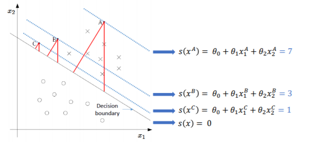
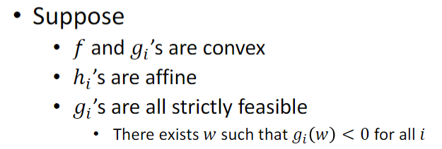

## 问题引入

SVM算法用于解决二分类问题

对于这样的LR问题，通常我们会让神经网络输出的值经过一个sigmoid函数

这样正值对应正类，负值对应负类

如下图，在训练好一个分类器后，我们会得到一个决策边界$w^Tx+b=0$，点到决策边界的距离越大，经过sigmoid函数后越接近1和0，也可以理解为网络对该点的预测更自信

SVM试图找出一个决策边界，使得数据点离决策边界较远

## SVM数学推导

首先我们需要定义什么叫数据点离决策边界较远，对于给定的点$(x_i,y_i)$和对应的决策边界$w^Tx+b=0$，其函数间隔为
$$
\gamma=y_i(w^Tx_i+b)
$$
但函数间隔有个问题，如果等比例增大w和b，决策边界不会改变，但是函数间隔却增大了，所以在函数间隔上加上范数的限制，称为几何间隔（一般规范$||w||=1$）
$$
\gamma=\frac{w^Tx+b}{||w||}
$$
对于一系列的点$(x_1,y_1),(x_2,y_2),...,(x_N,y_N)$，其距离决策边界的最小值定义为
$$
\gamma=\min _{i=1, \ldots, n} \gamma^{i}
$$
根据以上定义，SVM模型可表示为
$$
\begin{aligned}
&\max _{\gamma, w, b} \gamma\\
&\text { s.t. } \quad y^{i}\left(w^{\top} x^{i}+b\right) \geq \gamma, \quad i=1, \ldots, N\\
&\quad\quad||w||=1
\end{aligned}
$$
令$\gamma=1$，则模型等价于
$$
\begin{aligned}
&\max _{w, b} \frac{1}{||w||}\\
&\text { s.t. } \quad y^{i}\left(w^{\top} x^{i}+b\right) \geq 1, \quad i=1, \ldots, N\\
\end{aligned}
$$
也就等价于
$$
\begin{aligned}
&\min _{w, b} \frac12||w||^2\\
&\text { s.t. } \quad y^{i}\left(w^{\top} x^{i}+b\right) \geq 1, \quad i=1, \ldots, N\\
\end{aligned}
$$
于是我们顺利的得到了一个带有不等式约束的凸优化问题

我们可以构建拉格朗日函数，将不等式约束去掉
$$
L(w, b, \alpha)=\frac{1}{2}\|w\|^{2}+\sum_{i=1}^{N} \alpha_{i}\left[1-y^{i}\left(w^{\top} x^{i}+b\right)\right]
$$
令
$$
\theta_D(\alpha)=\max_{\alpha \geq 0} L(w,b,\alpha)
$$
再对该函数求最小
$$
\min_{w,b}\theta_D(\alpha)=\min_{w,b}\max_{\alpha \geq 0} L(w,b,\alpha)
$$
这个函数不太好解，所以利用拉格朗日函数对偶性，将问题转化成
$$
\max_{\alpha \geq 0}\theta_D(\alpha)=\max_{\alpha \geq 0}\min_{w,b} L(w,b,\alpha)
$$
由最优点偏导为0可得
$$
\begin{array}{l}
\frac{\partial L(w, b ; \alpha)}{\partial w}=w-\sum_{i=1}^{N} \alpha_{i} y^{i} x^{i}=0 \\
\frac{\partial L(w, b ; \alpha)}{\partial b}=-\sum_{i=1}^{N} \alpha_{i} y^{i}=0
\end{array}
$$
代入拉格朗日函数消去w和b
$$
\begin{array}{rl}
\min _{w, b} & L(w, b, \alpha) \\
& =\frac{1}{2}\left\|\sum_{i=1}^{N} \alpha_{i} y^{i} x^{i}\right\|_{N}^{2}+\sum_{i=1}^{N} \alpha_{i}-\sum_{i=1}^{N} \alpha_{i} y^{i}\left(\sum_{j=1}^{N} \alpha_{j} y^{j} x^{j}\right)^{\top} x^{i}+b \sum_{i=1}^{N} \alpha_{i} y^{i} \\
& =\sum_{i=1}^{N} \alpha_{i}-\frac{1}{2} \sum_{i=1}^{N} \sum_{j=1}^{N} \alpha_{i} \alpha_{j} y^{i} y^{j} x^{j} x^{i}
\end{array}
$$
接着再最大化这个函数
$$
\begin{array}{ll}
\max _{\alpha} & W(\alpha)=\sum_{i=1}^{N} \alpha_{i}-\frac{1}{2} \sum_{i=1}^{N} \sum_{j=1}^{N} \alpha_{i} \alpha_{j} y^{i} y^{j} x^{j^{\top}} x^{i} \\
\text {s.t.} & \alpha_{i} \geq 0, i=1, \ldots, N\\
&\sum_{i=1}^{N} \alpha_{i} y^{i}=0
\end{array}
$$
通过SMO算法可快速的解出$\alpha^*$的值

求出$\alpha^*$的值后，我们可以由此得出w和b的值
$$
w^*=\sum_{i=1}^{N} \alpha_{i} y^{i} x^{i}\\
b^{*}=-\frac{\max _{i: y^{(i)}=-1} w^{* \top} x^{(i)}+\min _{i: y^{(i)}=1} w^{* \top} x^{(i)}}{2}
$$

## Soft margin

对于线性不可分的数据集，加入hinge loss，允许一部分数据落入间隔之中
$$
\begin{array}{l}
\min _{\boldsymbol{w}, b, \xi_{i}} \frac{1}{2}\|\boldsymbol{w}\|^{2}+C \sum_{i=1}^{m} \xi_{i} \\
\quad y_{i}\left(\boldsymbol{w} \cdot \boldsymbol{x}_{i}+b\right) \geq 1-\xi_{i} \\
\quad \xi_{i} \geq 0, i=1,2, \ldots, N
\end{array}\\
其中\xi_{i}=\max \left(0,1-y_{i}\left(\boldsymbol{w} \cdot \boldsymbol{x}_{i}+b\right)\right)
$$

## Kernels

Soft margin一定程度上解决了对于线性不可分数据集的问题，

## 再来一点点数学

### 拉格朗日函数

将有约束的优化问题化为无约束的优化问题

对于一个带有等式约束的优化问题
$$
\begin{array}{cl}
\min _{w} & f(w) \\
& h_{i}(w)=0, \quad i=1, \dots, l
\end{array}
$$
其拉格朗日函数如下，其中$\beta$为拉格朗日乘数
$$
\mathcal{L}(w, \beta)=f(w)+\sum_{i=1}^{l} \beta_{i} h_{i}(w)
$$
对拉格朗日函数求偏导，即可得到原有约束优化问题的最优解

对于即带等式约束又有不等式约束的问题，需要用到KKT条件，可以看作拉格朗日乘数法的扩展

对于如下的优化问题
$$
min\ f(x)\\
g_i(x)\leq0,i=1,2,...,q\\
h_i(x)=0,i=1,2,...,p
$$
构造拉格朗日函数
$$
L(x, \lambda, \mu)=f(x)+\sum_{j=1}^{p} \lambda_{j} h_{j}(x)+\sum_{k=1}^{q} \mu_{k} g_{k}(x)
$$
$\lambda$和$\mu$称为KKT乘子。在最优解处$x^*$应该满足如下条件
$$
\begin{aligned}
&\nabla_{x} L\left(x^{*}\right)=0\\
&\mu_{k} \geqslant 0\\
&\mu_{k} g_{k}\left({x}^{*}\right)=0\\
&h_{j}\left(x^{*}\right)=0\\
&g_{k}\left({x}^{*}\right) \leqslant 0
\end{aligned}
$$
1指拉格朗日函数的偏导为0，2式约束KKT乘子大于等于0（这样对拉格朗日函数求最大时，可以保证不等式约束成立），3式约束目标函数顶点的梯度方向可以由约束函数在线性的表示出来（互补松弛条件），4,5式是题目原来的约束

将w当作常数，对于拉格朗日函数求最大值，如果w满足约束条件，则拉格朗日函数的值等于$f(w)$
$$
\begin{array}{l}
\qquad \begin{array}{l}
\quad \theta_{\mathcal{P}}(w)=\max _{\alpha, \beta: \alpha_{i} \geq 0} \mathcal{L}(w, \alpha, \beta) \\
\theta_{\mathcal{P}}(w)=\left\{\begin{array}{ll}
f(w) & \text { if } w \text { satisfies primal constraints } \\
+\infty & \text { otherwise }
\end{array}\right.
\end{array}
\end{array}
$$

所以原问题相当于
$$
\min _{w} \theta_{\mathcal{P}}(w)=\min _{w} \max _{\alpha, \beta: \alpha_{i} \geq 0} \mathcal{L}(w, \alpha, \beta)
$$

考虑它的对偶问题
$$
\theta_{\mathcal{D}}(\alpha, \beta)=\min _{w} \mathcal{L}(w, \alpha, \beta)\\
\max _{\alpha, \beta: \alpha_{i} \geq 0} \theta_{\mathcal{D}}(\alpha, \beta)=\max _{\alpha, \beta: \alpha_{i} \geq 0} \min _{w} \mathcal{L}(w, \alpha, \beta)\\
d^{*}=\max _{\alpha, \beta: \alpha_{i} \geq 0} \min _{w} \mathcal{L}(w, \alpha, \beta) \leq \min _{w} \max _{\alpha, \beta: \alpha_{i} \geq 0} \mathcal{L}(w, \alpha, \beta)=p^{*}
$$
当满足以下条件时，$d^*=p^*$

### SMO算法

## 参考资料

[支持向量机（SVM）——原理篇](https://zhuanlan.zhihu.com/p/31886934)

课程ppt

