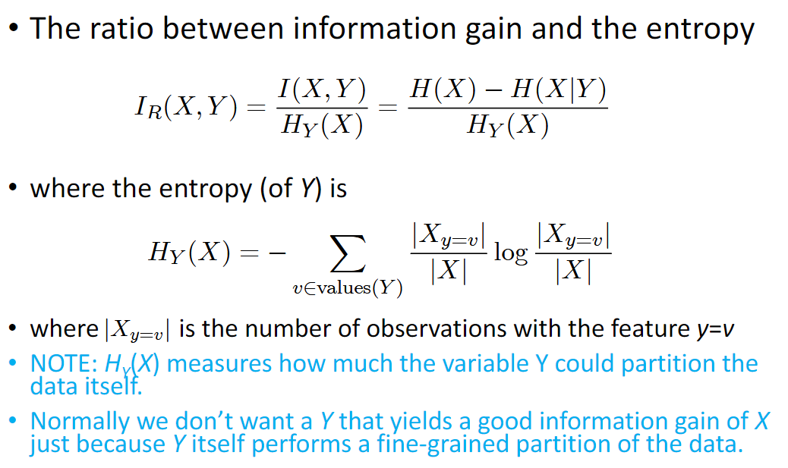
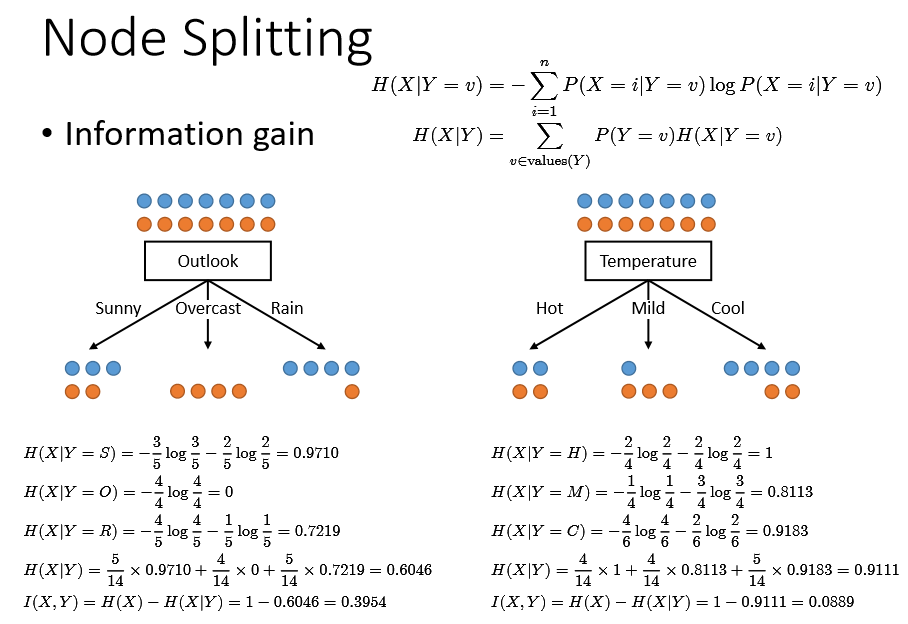
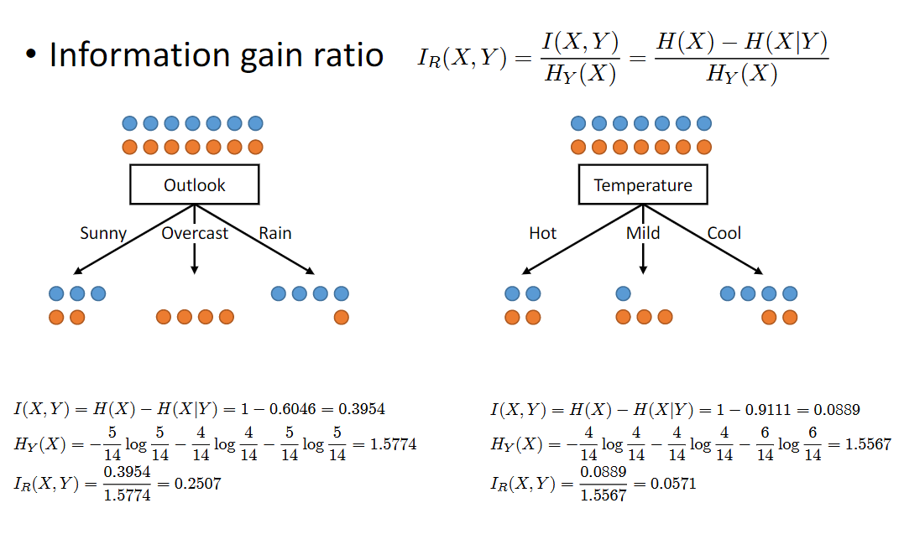
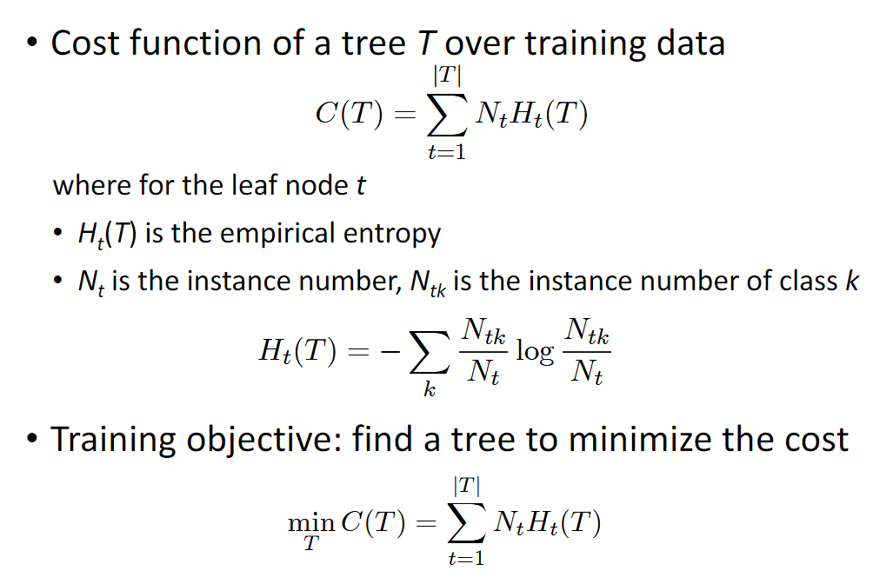
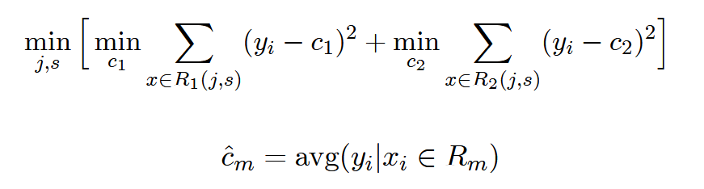
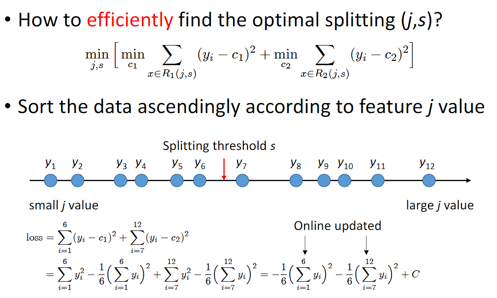
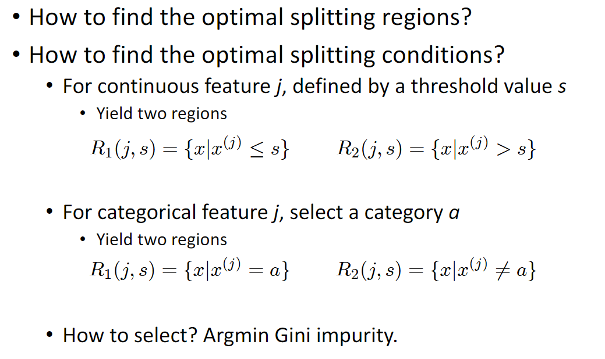
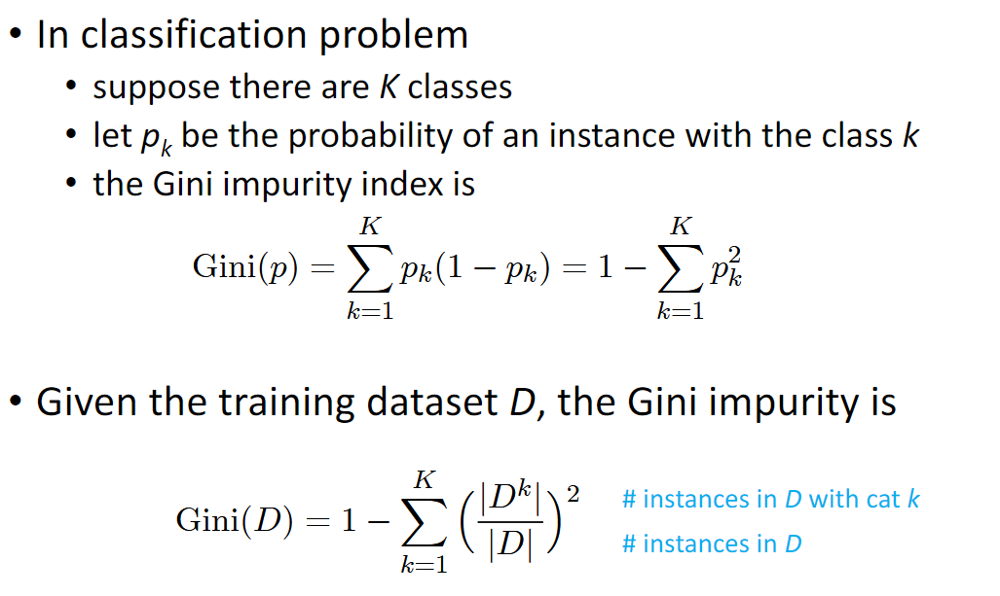

## 信息熵

$$
P\left(X=x_{i}\right)=p_{i}\\
H(X)=-\sum_{i=1}^{n} p_{i} \log p_{i}
$$
对于二分类有
$$
H(X)=-p_{1} \log p_{1}-\left(1-p_{1}\right) \log \left(1-p_{1}\right)
$$

## 交叉熵

在给定的真实分布下，使用非真实分布指定的策略消除系统的不确定性所需要付出努力的大小
$$
H(p, q)=-\int p(x) \log q(x) d x
$$

## 相对熵

衡量两个概率分布之间的差异
$$
D_{\mathrm{KL}}(p \| q)=\int p(x) \log \frac{p(x)}{q(x)} d x=H(p, q)-H(p)
$$

## 条件熵和信息增益

条件熵：在给定一个条件Y下，X的信息熵

信息增益：在一个条件下，信息不确定性减少的程度

### 信息增益比

$H_Y(X)$描述了特征Y对于原数据集分类的好坏

## 树算法

- 根据信息增益划分
  - 用信息增益去划分，树会偏好有较多值的特征

- 根据信息增益率划分

### ID3

使用信息增益进行树的划分

从根节点开始，计算所有特征的信息增益，选择信息增益最大的特征进行划分，直至信息增益为0或没有特征可以选择

#### 过拟合

加入惩罚因子

缺点：

- 只适用于离散数据
- 用信息增益划分，效果不好

### C4.5

使用信息增益率进行树的划分，过程和ID3类似

### CART

使用基尼系数进行树的划分

#### 回归树

- 输入：训练数据D
- 输出：回归树f(x)

不断地二分区域，选定`ferture j`和`threshold s`两个区域可如下的定义

最小化划分之后两个区域内点的均分误差

其中c是区域内所有点的平均

寻找所有可能的划分阈值，找出最小的loss

#### 分类树

