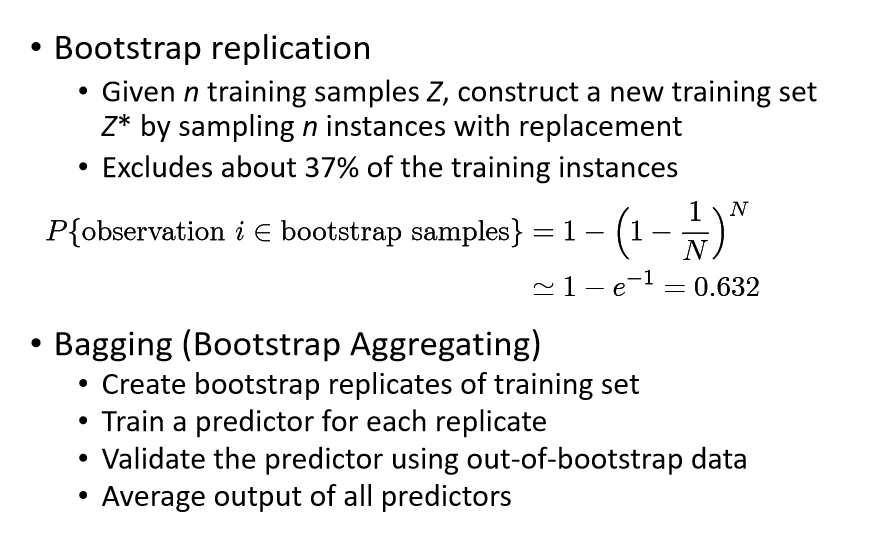
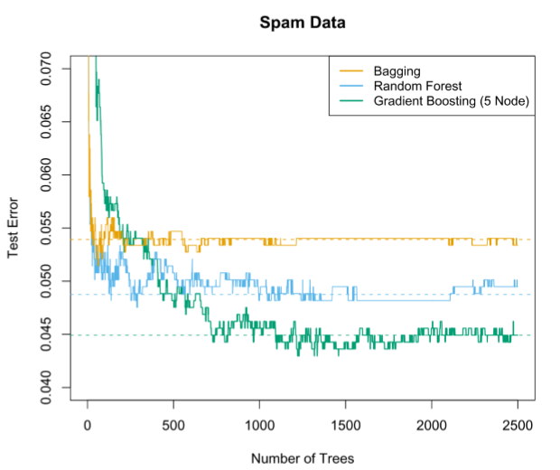

# 集成学习

建立多个模型来解决问题

对于多个模型输出的结果，最后结果的选取有以下方法

- 投票
- 加权投票
- 将结果stack起来丢进新的网络

## Bagging

### Bootstrap replication 

自助取样法

有放回的取样，弄出多个数据集训练多个模型

## Random Forest

1. 假如有N个样本，则有放回的随机选择N个样本(每次随机选择一个样本，然后返回继续选择)。这选择好了的N个样本用来训练一个决策树，作为决策树根节点处的样本。
2. 当每个样本有M个属性时，在决策树的每个节点需要分裂时，随机从这M个属性中选取出m个属性（一般$m=\sqrt M$），满足条件m << M。然后从这m个属性中采用某种策略（比如说信息增益）来选择1个属性作为该节点的分裂属性。
3. 决策树形成过程中每个节点都要按照步骤2来分裂（很容易理解，如果下一次该节点选出来的那一个属性是刚刚其父节点分裂时用过的属性，则该节点已经达到了叶子节点，无须继续分裂了）。一直到不能够再分裂为止。注意整个决策树形成过程中没有进行剪枝。
4. 按照步骤1~3建立大量的决策树，这样就构成了随机森林了。

## Boosting

根据先前模型的表现修改样本的分布

