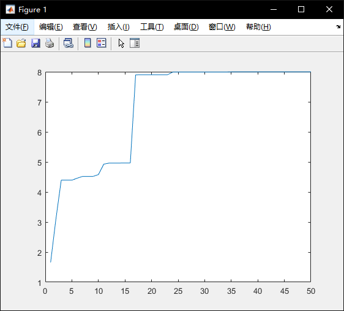
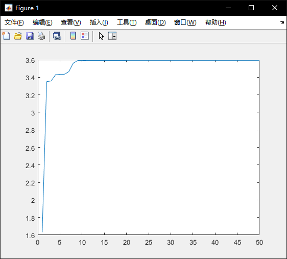
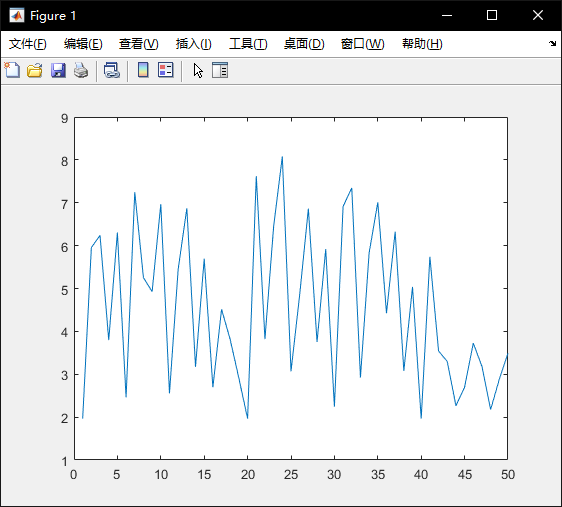
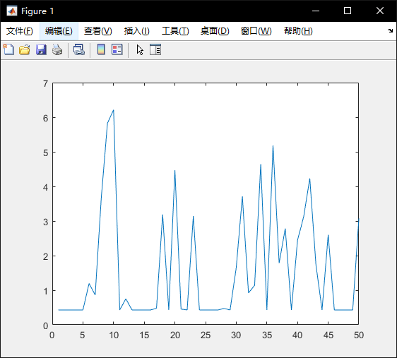
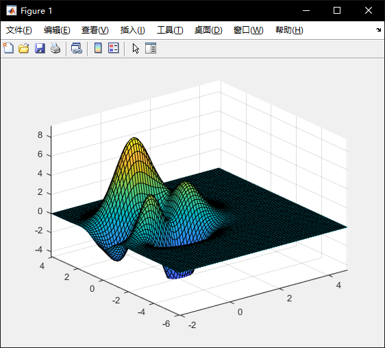
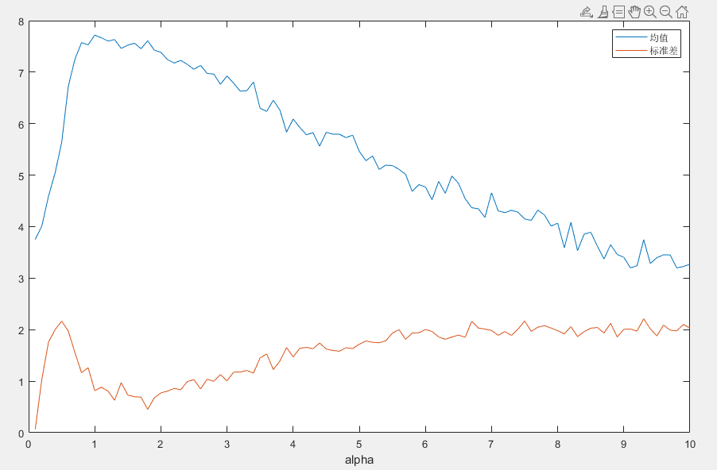
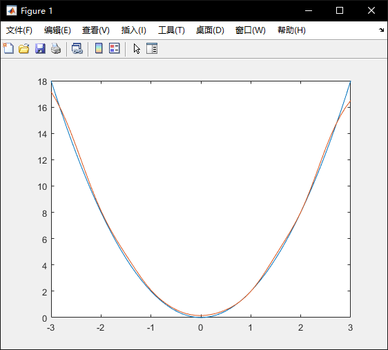
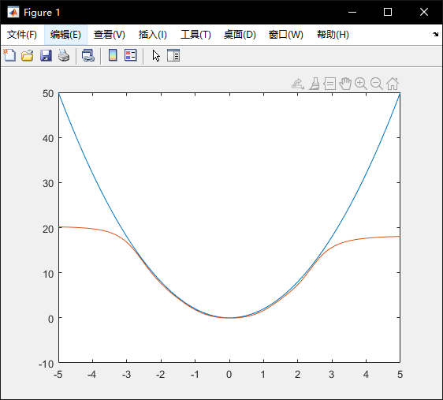

## 1

### 题目分析

没什么好分析的，参数设置如下：

- 初始点：$[0,0]^T,[0,1]^T,[1,0]^T$
- 扩张系数：1.1
- 收缩系数：0.5
- 精度：0.1

### 源码

```matlab
% 单纯形法

epsilon = 0.1;

% 扩张系数
alpha = 1.1;

% 收缩系数
beta = 0.5;

x1 = [0;0];

x2 = [0;1];

x3 = [1;0];

i = 0;

x = [x1,x2,x3];

disp(x)
fprintf("----------------------------------------------\n")

while 1
    x = sortByf(x);
    old = f(x(:,1));
    middle_point = (x(:,1) + x(:,2)) / 2;
    reflect_point = middle_point + (middle_point - x(:,3));
    if f(reflect_point) < f(x(:,1))
        % 小于最优点，扩张
        extern_point = middle_point + alpha * (middle_point - x(:,3));
        if f(extern_point) < f(reflect_point)
            x(:,3) = extern_point;
        else
            x(:,3) = reflect_point;
        end
    elseif f(reflect_point) > f(x(:,1)) && f(reflect_point) < f(x(:,2))
        % 位于最优点和次优点之间，直接替代
        x(:,3) = reflect_point;
    elseif f(reflect_point) > f(x(:,2)) && f(reflect_point) < f(x(:,3))
        % 位于次优点和最差点之间，收缩
        shrink_point = middle_point + beta * (reflect_point - middle_point);
        x(:,3) = shrink_point;
    else
        % 比最差点还要差，压缩
        compress_point = middle_point - beta * (middle_point - x(:,3));
        if f(compress_point) < f(x(:,3))
            % 压缩点小于最差点
            x(:,3) = compress_point;
        else
            % 压缩点依旧大于最差点，压缩原三角形
            x(:,2) = (x(:,1) + x(:,2)) / 2;
            x(:,3) = (x(:,1) + x(:,3)) / 2;
        end
    end
    
    x = sortByf(x);
    disp(x)
    fprintf("----------------------------------------------\n");
    i = i + 1;
    % 避免除0，分母加一个很小的数
    if abs((f(x(:,3)) - f(x(:,1))) / (f(x(:,1) + 1e-5))) <= epsilon 
        break
    end
end

fprintf("迭代次数:%d\n",i);

        
function y = f(x)
    y=(x(1)-5)^2+(x(2)-6)^2;
end

% 将x按函数的值从小到大排序
function x = sortByf(x)
    y1 = f(x(:,1));
    y2 = f(x(:,2));
    y3 = f(x(:,3));
    value=[y1,y2,y3];
    [~, sortIdx] = sort(value);
    x = x(:,sortIdx);
end
```

### 运行结果

运行结果过长只展示最后几步

```
----------------------------------------------
    5.0000    5.0000    5.0000
    6.0000    6.0000    6.0000

----------------------------------------------
    5.0000    5.0000    5.0000
    6.0000    6.0000    6.0000

----------------------------------------------
    5.0000    5.0000    5.0000
    6.0000    6.0000    6.0000

----------------------------------------------
迭代次数:53
```


## 2

### 题目分析

设精度为1e-4，则x,y的解空间被60000等分，$2^{15}\leq 60000 \leq 2^{16}$

所以需要16位二进制数进行编码


采用轮盘法选择交配的个体会使得算法不稳定，因此代码中直接选取一定比例的优良个体作为候选集，在候选集中随机均匀的选择交配的两个个体，同时，如果让优良个体也发生变异，算法最后输出的结果可能离最优点很远，所以变异只在其他个体中进行


可以改变的参数有：

- `N`：种群大小
- `iter`：迭代次数
- `crossover_rate`：交配比例
- `mutation_rate`：变异概率


### 源码

```matlab
% 遗传算法
% 设精度为1e-4,则x,y的解空间被60000等分，需要16位二进制数进行编码

N = 20; % 种群大小
iter = 50; % 迭代次数
crossover_rate = 0.2; % 交配比例
mutation_rate = 0.01; % 变异概率
encode_l = 16; % 编码长度
parent_number = ceil(N*crossover_rate); % 繁殖个体数量
child_number = N - parent_number; % 替代个体数量
sum_p = cumsum(ones(parent_number,1)/parent_number); % 累加选择概率

fitness = ones(N, 1);

% 存储每一代的最优值
best_point = zeros(iter, 2);
best_fitness = zeros(iter, 1);

% 随机初始化
population = -3 + 6*rand(N,2);

for i = 1:iter
    fitness = calaFitness(population);
    
    % 大到小排序
    [fitness, index] = sort(fitness, 'descend');
    
    % 保存最优个体数据
    best_fitness(i) = fitness(1);
    best_point(i,:) = population(index(1), :);
    
    % 选择交配个体
    parent = population(index(1:parent_number), :);
    
    % 交叉繁殖
    for child = 1:2:child_number
        mother_index = ceil(rand * parent_number);
        father_index = ceil(rand * parent_number);
        % 避免自交
        while father_index == mother_index
            father_index = ceil(rand * parent_number);
        end
        mother = parent(mother_index, :);
        father = parent(father_index, :);
        
        bin_mother = encode(mother);
        bin_father = encode(father);
        
     
        % x,y分别更新
        child1_chrom = ["",""];
        child2_chrom = ["",""];
        for chrom = 1:2
            % 随机选个交叉点
            crossover_point = randi([2,14],1);
            
            mother_chrom = bin_mother(chrom, :);
            father_chrom = bin_father(chrom, :);
            
            mother_part1 = mother_chrom(1:crossover_point);
            mother_part2 = mother_chrom(crossover_point+1:encode_l);
            
            father_part1 = father_chrom(1:crossover_point);
            father_part2 = father_chrom(crossover_point+1:encode_l);
            
            child1_chrom(chrom) = [mother_part1, father_part2];
            child2_chrom(chrom) = [father_part1, mother_part2];
        end
        child1 = decode(child1_chrom);
        child2 = decode(child2_chrom);
        population(parent_number + child, :) = child1;
        population(parent_number + child + 1, :) = child2;
    end
    
    % 变异
    mutation_number = ceil(N * 2 * encode_l * mutation_rate);
    for j = 1:mutation_number
        % 随机选一个个体中的一个染色体的一个位置
        mutation_unit_index = randi([parent_number,N],1);
        mutation_chrom_index = randi([1,2],1);
        mutation_position = randi([1,16],1);
        % 翻转
        temp = encode(population(mutation_unit_index ,mutation_chrom_index));
        if temp(mutation_position) == "0"
            temp(mutation_position) = "1";
        else
            temp(mutation_position) = "0";
        end
        temp = decode(temp);
        population(mutation_unit_index ,mutation_chrom_index) = temp;
    end
end

plot(best_fitness)

[best_value, index] = max(best_fitness);

fprintf("最优点：[%.4f,%.4f]\n",best_point(index,:));
fprintf("函数值：%.4f\n",best_value);

% 二进制解码
function x = decode(x)
    x = -3+bin2dec(x)*6/(2^16-1);
end

% 编码到二进制
function x = encode(x)
    x = (x + 3) / (6 / 2^16);
    x = dec2bin(x, 16);
end

function fitness = calaFitness(population)
    N = size(population, 1);
    fitness = zeros(N,1);
    for i = 1:N
        fitness(i) = f(population(i,:));
    end
end

function y = f(x)
    y = 3 * (1 - x(1))^2 * exp(-x(1)^2 - (x(2) + 1)^2) - 10 * (x(1) / 5 - x(1)^3 - x(2)^5) * exp(-x(1)^2 - x(2)^2) - exp(-(x(1)+1)^2 - x(2)^2) / 3;
end
```

### 运行结果与分析

以下运行结果的种群大小和迭代次数均为20,50，最优解的值大约为8.1，图表显示的是迭代次数与每次迭代的最优个体的函数值的关系

#### 正常的交配比例和正常的变异概率

交配比例=0.3，变异概率=0.05

此时算法基本可以稳定的找出与最优解相近的解



#### 正常的交配比例和过低的变异概率

交配比例=0.3，变异概率=0.001

此时算法大多数时候都可以找出与最优解相近的解

但由于变异概率过低，群体有时会无法进化，一直保持在某个值



#### 正常的交配比例和过高的变异概率

交配比例=0.3，变异概率=0.8

此时算法输出的值会不稳定



#### 过高的交配比例和正常的变异概率

交配比例=0.5，变异概率=0.05

由于保存了每次迭代的最优个体，算法依旧可以找到一个合适的解，但由于交配中包含了过多的不良个体，每次迭代的输出很不稳定


当交配比例非常高时（交配比例=0.95），算法找出的最优点会离理论最优点相差很远



#### 过低的交配比例和正常的变异概率

交配比例过低对算法基本没什么影响，不过由于算法会选择一定比例的优良个体进行交配，如果比例设置过低，最后可能只剩下一个个体，无法进行交配过程，导致死循环


## 3

### 题目分析

第一问，用罚函数求解此问题只需要把罚函数添加到原函数中，利用各种优化算法都可以求解，代码中就直接使用matlab的`fminsearch`进行搜索，加大`gamma`的值可以使得求出的解更加接近最优解


第二问，求$\gamma$的的最小值，使得罚函数法求出的解距离该问题的解不超过$\epsilon$

对于原问题，其最优解显然是$a$，如果要使得罚函数法求出的解距离该问题的解不超过$\epsilon$，即罚函数法求出的函数值应该是$a-\epsilon$

对加入罚函数之后的目标函数求导可得
$$
f(x)=x+\gamma max(a-x,0)^2\\
f'(x)=
\begin{cases}
1-2\gamma(a-x) & x<a\\
1 & x\geq a
\end{cases}
$$
对目标函数求最小也就是求导数为0的点，即$f'(a-\epsilon)=0$，可得
$$
\gamma=\frac{1}{2\epsilon}=0
$$

### 源码

```matlab
global a;

a = 5;

gamma = 10000;

fun = @(x)x + gamma*p(x);

val = fminsearch(fun,rand);

fprintf("最优解:%.4f\n",val)

% 罚函数
function y = p(x)
    global a;
    y = max(a-x,0)^2;
end

```

### 运行结果

```
>> q3
最优解:5.0000
```


## 4

### 题目分析

题目给出的函数图像大致如下，在$|x|,|y| \leq 3$的范围内波动较大，其他地方基本都是平原



而题目给出的定义域为$x\geq-3,y\leq3$，如果初始点设在很远的地方，且邻域设置不大时，模拟退火算法会花费大量时间在平原区域搜索，而无法找到最优解（比如设初始点为[100,-100]，$\alpha$为1.5）

由于可行域很大，随机扰动时可能会让搜索点跑到平原区域使得算法稳定性下降，代码中设定在每一个温度下搜索10次后会让搜索点返回最优点（去掉之后算法依旧可以找到一个较好的解，但并不稳定）


代码中使用`a`控制邻域的范围

其他参数设置如下：

- 初始温度：1000
- 终止温度：1
- 起始点：[0,0]
- 在每一个温度下的搜索次数：10

#### α=0.1

100次运算结果均值:3.7538，标准差:0.1183

#### α=1

100次运算结果均值:7.6518，标准差:0.9800

#### α=10

100次运算结果均值:3.0231，标准差:2.1215

$\alpha$与算法表现的关系如下图所示



- $\alpha$过高或过低都会使得算法表现不佳
- $\alpha$过高时，算法不稳定且找出的解不好
- $\alpha$过低时，虽然算法稳定但找出的解不好


### 源码

```matlab
% 模拟退火

T = 1000; % 初始温度 
stop_T =1; % 停止温度
X = [0,0];
a = 10; % 邻域范围
markov = 10;

mean_value = zeros(100,1);
std_value = zeros(100,1);

for a = 0.1:0.1:10
    val = zeros(100,1);
    % 运行100次求平均值和标准差
    for time = 1:100
        [best_value, best_point] = SA(T,stop_T,a,markov,X,@f);
        val(time)=best_value;
    end
    mean_value(int8(a*10)) = mean(val);
    std_value(int8(a*10)) = std(val);
end
% fprintf("最优点：[%.4f,%.4f]\n",best_point);
% fprintf("函数值：%.4f\n",best_value);
plot(0.1:0.1:10,mean_value,0.1:0.1:10,std_value);
legend("均值","标准差");
xlabel('alpha');
% fprintf("100次运算结果均值:%.4f，标准差:%.4f\n",mean(val),std(val));


function d = disturb(range)
    l = range(1);
    r = range(2);
    d = (l + (r-l) * [rand, rand]);
end

function y = f(x,gamma)
    y = 3 * (1 - x(1))^2 * exp(-x(1)^2 - (x(2) + 1)^2) - 10 * (x(1) / 5 - x(1)^3 - x(2)^5) * exp(-x(1)^2 - x(2)^2) - exp(-(x(1)+1)^2 - x(2)^2) / 3;
    % 加入罚函数限制可行域
    y = y - gamma*max(-x(1)-3,0).^2 - gamma*max(-3+x(2),0).^2;
end

function [best_value, best_point] = SA(start_T,stop_T,a,markov,start_point,f)
    iter = 1;
    T = start_T;
    X = start_point;
    best_point = X;
    best_value = f(X,0);
    while T > stop_T
        for i = 1:markov
            % 随机扰动
            new_X = X + disturb([-a,a]);

            delta = f(new_X,10000) - f(X,10000);
            if delta > 0
                % 函数值增大，接受新点
                X = new_X;
                % 保存最佳点
                if f(X,0) > best_value
                    best_point = X;
                    best_value = f(X,0);
                end
            else
                % 函数值减小，按一定概率接受
                if exp(delta/T) > rand
                    X = new_X;
                end
            end
        end
        % 让X回到最优点，否则X很有可能跑到很远
        X = best_point;
        iter = iter + 1;
        T = T / log(iter);
    end
end

```


## 5

以下程序通过神经网络+BP算法拟合某个特定的函数，程序设定的函数为一个简单的二次函数，对于更复杂的函数，需要增大隐藏层的维度或加大网络的层数。

### 源码

```matlab
N = 64; % 每次生成的数据个数
D_in = 1; % 输入维度
H_1 = 20; % 隐藏层1维度
H_2 = 30; % 隐藏层2维度
D_out = 1; % 输出层维度
learning_rate = 1e-3; % 学习率
iter = 10000; % 迭代次数

% 随机生成初始权重
w1 = rand([H_1, D_in]);
w2 = rand([H_2, H_1]);
w3 = rand([D_out, H_2]);

for t = 1:iter
    % 随机生成数据
    x = -3 + 6.*rand([D_in, N]);
    y = f(x);
    
    % 前向
    h1 = sigmoid(w1*x);
    
    h2 = sigmoid(w2*h1);

    y_pred = w3*h2;

    % 反向传播
    loss = sum(0.5.*(y_pred - y).^2) / N;
    
    if mod(t, 100) == 0
        fprintf("第%d次迭代，loss=%.4f\n",t,loss);
    end

    e = y_pred - y;
    
    delta3 = e; 
    delta2 = w3'*delta3.*h2.*(1-h2);
    delta1 = w2'*delta2.*h1.*(1-h1);
    
    grad_w3 = delta3*h2';
    grad_w2 = delta2*h1';
    grad_w1 = delta1*x';

    % 更新权重
    w1 = w1 - learning_rate * grad_w1;
    w2 = w2 - learning_rate * grad_w2;
    w3 = w3 - learning_rate * grad_w3;
end

% 画图对比
x = -3:0.1:3;
y = 2.*x.^2;
plot(x,y)
hold on
h1 = sigmoid(w1*x);
h2 = sigmoid(w2*h1);
y_pred = w3*h2;
plot(x,y_pred)

function y = sigmoid(x)
    y = 1./(1+exp(-x));
end

function y = f(x)
    y = 2.*x.^2;
end
```

### 运行结果

如下图，红线为神经网络拟合的函数，蓝线为实际的函数图像，在给定的数据范围内，神经网络基本完美拟合了函数



而在所给的数据范围外，神经网络拟合的效果就很差了

