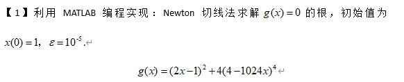
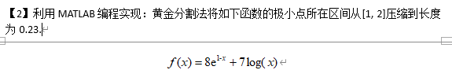
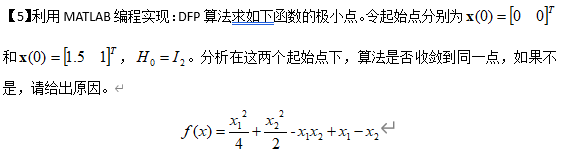

以下所有程序均在matlab R2020a运行通过，需要使用`symbolic`库

## 1



`g(x)=0`在实数域上无解，我觉得应该是想问g(x)的最小值？

如果要求近似解，以下程序迭代后得出的函数最小值约为0.9843，也不满足终止条件

### 程序

```matlab
syms g(x) x;
epsilon = 1e-5;
X(1) = 1;

g(x) = (2*x-1)^2 + 4*(4-1024*x)^4;

grad = diff(g);

grad2 = diff(diff(g));

fprintf("fminsearch answer = %f\n\n", fminsearch(g,X(1)))

i = 1;
while norm(grad(X(i))) > epsilon
  X(i+1) = X(i) - grad(X(i))/grad2(X(i));
  i = i + 1;
  fprintf("grad=%.4f\n", grad(X(i)));
  fprintf("g(x)=%.4f\n", g(X(i)));
  fprintf("x=%.4f\n\n", X(i));
end
```

### 运行结果

```
fminsearch answer = 0.003906

grad=5151653888000.7471
g(x)=855255039999.9807
x=0.6680

grad=1526415966814.3877
g(x)=
168939267160.5052
x=0.4466

grad=452271397573.8669
g(x)=33370719439.3417
x=0.2990

grad=134006340021.0324
g(x)=6591747050.1428
x=0.2007

grad=39705582227.5417
g(x)=1302073491.9048
x=0.1351

grad=11764616955.3575
g(x)=257199702.7098
x=0.0914

grad=3485812430.2399
g(x)=
50804880.2126
x=0.0622

grad=1032833311.6693
g(x)=10035532.5997
x=0.0428

grad=306024683.9331
g(x)=1982328.1606
x=0.0298

grad=90673979.4111
g(x)=391571.7469
x=0.0212

grad=26866363.2512
g(x)=77348.2703
x=0.0154

grad=7960402.9042
g(x)=15279.4438
x=0.0116

grad=2358636.8732
g(x)=3018.9405
x=0.0090

grad=698854.3439
g(x)=597.1164
x=0.0073

grad=207066.9268
g(x)=118.7339
x=0.0062

grad=61352.1359
g(x)=
24.2402
x=0.0054

grad=18177.3827
g(x)=5.5759
x=0.0049

grad=5384.8630
g(x)=1.8899
x=0.0046

grad=1594.4871
g(x)=1.1623
x=0.0044

grad=471.4141
g(x)=1.0189
x=0.0042

grad=138.6569
g(x)=0.9908
x=0.0041

grad=40.0794
g(x)=0.9854
x=0.0040

grad=10.9272
g(x)=
0.9844
x=0.0040

grad=2.4542
g(x)=0.9843
x=0.0040

grad=0.2993
g(x)=0.9843
x=0.0040

grad=0.0069
g(x)=0.9843
x=0.0040

grad=0.0000
g(x)=0.9843
x=0.0040
```


## 2



### 程序

```matlab
syms f(x) x;
l = 0.23;
f(x) = 8*exp(1-x) + 7*log(x);

a = 1;
b = 2;

while abs(a-b) > l
    t1 = a + 0.618 * (b-a);
    t2 = a + 0.382 * (b-a);
    if f(t1) < f(t2)
        a = t2;
    else
        b = t1;
    end
    fprintf("搜索区间：[%.4f,%.4f]\n",a,b);
end
```

### 运行结果

```
搜索区间：[1.3820,2.0000]
搜索区间：[1.3820,1.7639]
搜索区间：[1.5279,1.7639]
搜索区间：[1.5279,1.6738]
```

## 3


### 程序

```python
syms x1 x2 t;
epsilon = 1e-4;
X = [-2;2];

f(x1,x2) = 100*(x2-x1^2)^2+(1-x1)^2;

g = gradient(f);

H = hessian(f);

i=1;

fun = @(x)100*(x(2) - x(1)^2)^2 + (1 - x(1))^2;
fprintf("fminsearch answer = [%f,%f]\n\n", fminsearch(fun,X))

while norm(g(X(1),X(2))) > epsilon
    grad = g(X(1),X(2));
    G = inv(H(X(1),X(2)));
    p = -G * grad;
    t = armijo(f,g,X,p);
    X = X + t * p;
    i = i + 1;
    fprintf("grad=[%.4f,%.4f]\n", g(X(1),X(2)));
    fprintf("f(x1,x2)=%.4f\n", f(X(1),X(2)));
    fprintf("X=[%.4f,%.4f]\n\n", X(1),X(2));
end

function step = armijo(f,g,x,d)
    alpha = 0.2;
    beta = 0.5;
    max_iter = 50;
    m = 0;
    while m <= max_iter
        temp1 = x + beta^m*d;
        temp2 = x + alpha*beta^m.*g(x(1),x(2)).*d;
        if f(temp1(1), temp1(2)) <= f(temp2(1), temp2(2))
            best = m;
            break
        m=m+1;
        end 
    end
    step = beta^best;
end
```

### 运行结果

```
fminsearch answer = [0.999991,0.999983]

grad=[-6.0296,-0.0112]
f(x1,x2)=8.9552
X=[-1.9925,3.9701]

grad=[3387.0812,-1751.5995]
f(x1,x2)=7670.2530
X=[0.9669,-7.8232]

grad=[-0.0662,-0.0000]
f(x1,x2)=0.0011
X=[0.9669,0.9349]

grad=[0.4385,-0.2192]
f(x1,x2)=0.0001
X=[
1.0000,0.9989]

grad=[-0.0000,-0.0000]
f(x1,x2)=0.0000
X=[1.0000,1.0000]

```

## 4


### 程序

```matlab
syms x1 x2;
epsilon = 1e-5;

f(x1,x2) = x1^2 + 2*x2^2 - 4*x1 - 2*x1*x2;

g = gradient(f);

H = hessian(f);

X = [1;1];

grad = g(X(1),X(2));
p = -grad;

while norm(g(X(1),X(2))) > epsilon
    grad = g(X(1),X(2));
    step = -(grad' * p) / (p' * H * p);
    step = step(0,0);
    X = X + step * p;
    beta = (norm(g(X(1),X(2))) / norm(grad))^2;
    p = -g(X(1),X(2)) + beta .* p;
    fprintf("grad=[%.4f,%.4f]\n", g(X(1),X(2)));
    fprintf("f(x1,x2)=%.4f\n", f(X(1),X(2)));
    fprintf("X=[%.4f,%.4f]\n\n", X(1),X(2));
end
```

### 运行结果

```
fminsearch answer = [3.999976,1.999973]

grad=[-1.0000,-2.0000]
f(x1,x2)=-5.5000
X=[2.0000,0.5000]

grad=[0.0000,0.0000]
f(x1,x2)=-8.0000
X=[4.0000,2.0000]
```

## 5



两个起始点都可以收敛到同一点$[0,1]^T$，此处梯度为0，为函数的一个鞍点

但该函数并不是凸函数，该点不是极小点

### 程序

```matlab
syms x1 x2;
epsilon = 1e-5;

f(x1,x2) = x1^2/4 + x2^2/2 - x1*x2 + x1 - x2;

g = gradient(f);

G = hessian(f);

% X = [0;0];
X = [1.5;1];

H = eye(2);

while norm(g(X(1),X(2))) > epsilon
    grad = g(X(1),X(2));
    p = -H * grad;
    alpha = -(grad' * p) / (p' * G * p);
    alpha = alpha(0,0);
    new_X = X + p * alpha;
    new_grad = g(new_X(1),new_X(2));
    s = new_X - X;
    y = new_grad - grad;
    H = H + (s * s') / (s' * y) - (H * y * y' * H) / (y' * H * y);
    X = new_X;
    fprintf("grad=[%.4f,%.4f]\n", g(X(1),X(2)));
    fprintf("f(x1,x2)=%.4f\n", f(X(1),X(2)));
    fprintf("X=[%.4f,%.4f]\n\n", X(1),X(2));
end
```

### 运行结果

#### X = [0;0]

```
grad=[0.1429,0.1429]
f(x1,x2)=-0.5714
X=[-0.5714,0.5714]

grad=[0.0000,0.0000]
f(x1,x2)=-0.5000
X=[0.0000,1.0000]
```

#### X = [1.5;1]

```
grad=[-0.3529,-0.1765]
f(x1,x2)=-0.7647
X=[1.0588,1.8824]

grad=[0.0000,0.0000]
f(x1,x2)=-0.5000
X=[0.0000,1.0000]
```

