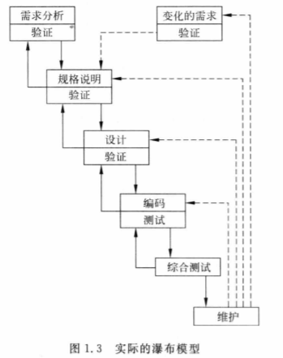
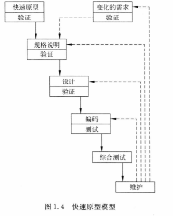
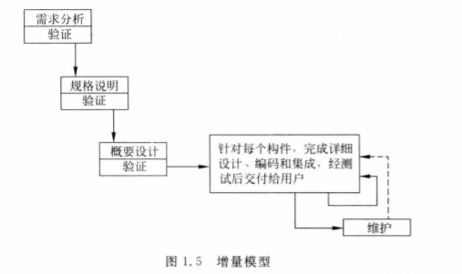
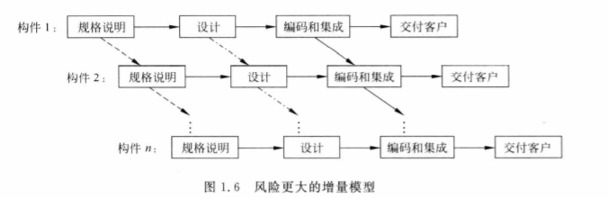
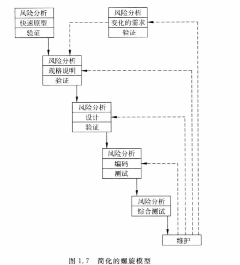
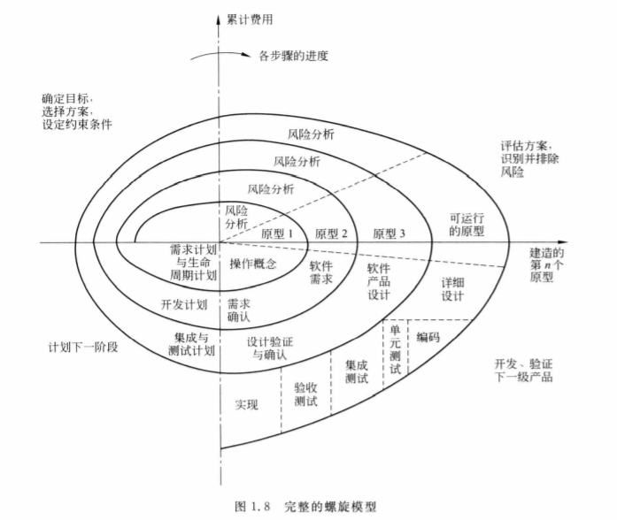
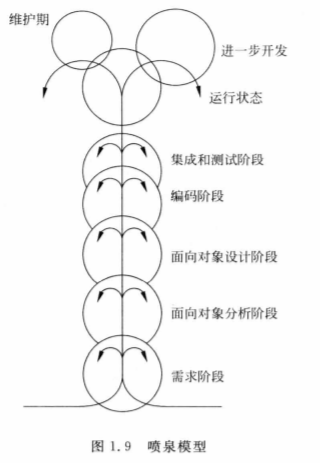
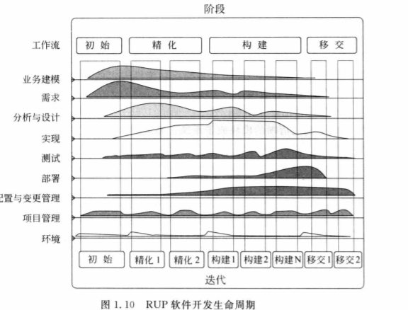
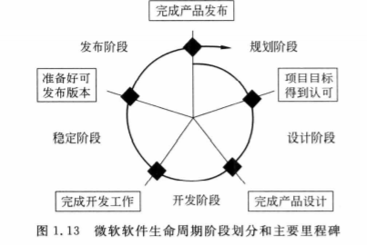
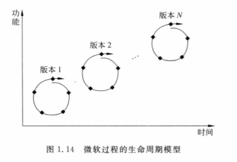

# 软件工程学概述

## 软件工程

为了确保软件产品质量和开发效率而诞生的学科

### 软件工程方法学

- 传统方法学
- 面向对象方法学

## 软件生命周期

- 软件定义
  - 问题定义
  - 可行性研究
  - 需求分析
- 软件开发
  - 总体设计
  - 详细设计
  - 编码和单元测试
  - 综合测试
- 运行维护

## 软件过程

### 瀑布模型

- 阶段间具有顺序性和依赖性
- 推迟实现的观点
- 质量保证的观点
  - 每个阶段都需要完成文档的编写
  - 每个阶段结束前都要对所完成的文档进行评审

优点：提高软件质量，降低维护成本，缓解软件危机

缺点：模型缺乏灵活性，无法解决需求不明确问题。用户不经过实践提出完整准确需求不切实际

### 快速原型模型

快速建立反映用户主要需求的原型系统，反复由用户评价修正需求，开发出最终产品

优点：

- 确定需求上优于瀑布模型
- 提供学习手段，通过开发原型和演示原型对开发者和使用者了解系统都有积极作用
- 有的软件模型可以成为最终产品的一部分

缺点：

快速建立的系统结构加连续修改可能导致产品质量低下，原型系统的内部结构可能不好

### 增量模型

分批向用户提交产品

优点：

- 较短时间向用户提交可完成有用工作产品
- 用户有充裕时间学习适应产品
- 软件结构必须开放，方便向现有产品加入新构件

缺点：

第三个优点较难实现

### 螺旋模型

加入风险分析，常指导大型软件开发

笛卡尔坐标四象限表达四方面活动

- 制定计划：确定目标、选定方案、设定约束条件
- 风险分析：评估方案，识别和消除风险
- 实施工程：软件开发
- 客户评估：评价开发工作，计划下一阶段工作

沿螺线自内向外每旋转一圈开发出更完善新版本

优点：

大型软件开发项目有较好的风险控制

缺点：

- 需要风险评估的经验
- 契约开发通常需要事先指定过程模型和发布产品
- 普及不如前述模型

### 喷泉模型

面向对象生命周期模型

- 迭代：求精，系统某部分常被重复工作多次，相关功能在每次迭代中逐渐加入演进系统
- 无缝：分析、设计、编码各阶段间不存在明显边界

优点：

无缝，可同步开发，提高开发效率，节省开发时间，适应面向对象软件

缺点：

可能随时加各种信息、需求与资料，需严格管理文档，审核的难度加大

### Rational统一过程

由Rational软件公司推出的一种软件过程，该过程强调以迭代和渐增方式开发软件。Rational统一过程是一个二维生命周期模型。

RUP有9个核心工作流，包括6个核心过程工作流和3个核心支持工作流。RUP有4个连续阶段，每个阶段有明确目标，通过一次或多次迭代完成。

优点：

- 不断的版本发布成为一种团队日常工作的真正驱动力
- 将发现问题、制定方案和解决过程集成到下一次迭代
- 迭代开发，降低风险
- 更好地安排产品开发的辅助过程

### 敏捷过程与极限编程

### 微软过程

- 规划阶段
  - 开展市场调查研究，结合公司战略形成产品的远景目标。
- 设计阶段
  - 根据产品远景目标，完成软件功能规格说明和总体设计，确定产品开发的主要进度。
- 开发阶段
  - 完成产品中所有构件的开发工作。
- 稳定阶段
  - 实行全面的内部和外部测试，最终形成可发布的RTM版本
- 发布阶段
  - 确认产品质量符合发布标准后，发布产品及相关消息

