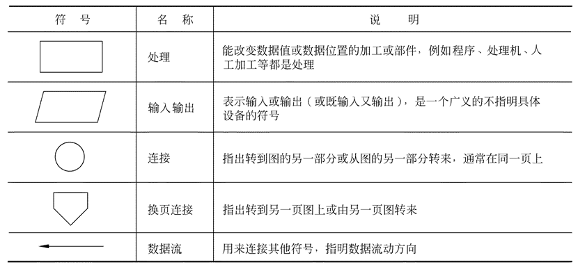
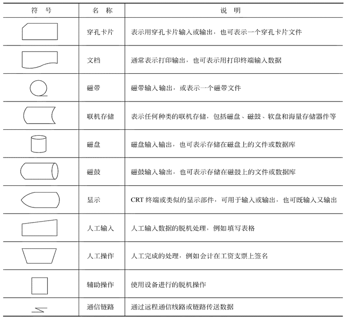
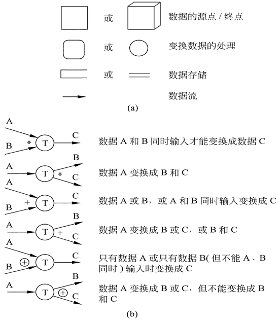
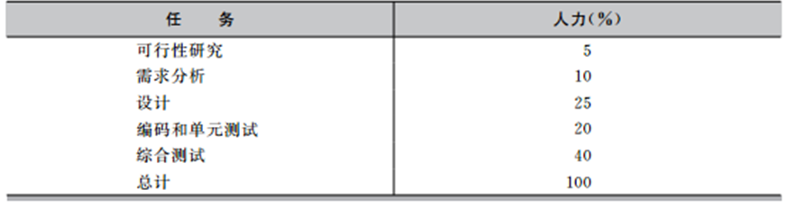

# 可行性研究

## 可行性研究的任务

- 技术可行性
- 经济可行性
- 操作可行性

## 可行性研究过程

1. 复查系统规模和目标
2. 研究目前正在使用的系统
3. 导出新系统的高层逻辑模型
4. 进一步定义问题
5. 导出和评价供选择的解法
6. 推荐行动方针
7. 草拟开发计划书
8. 写文档提交审查

## 系统流程图

## 数据流图

描绘信息流和数据从输入移动到输出的过程中所经受的变换

## 数据字典

数据字典是关于数据的信息的集合，也就是对数据流图中包含的所有元素的定义的集合。

### 数据字典的内容

- 数据流
- 数据流分类（数据元素）
- 数据存储
- 处理

## 成本/效益分析

软件开发成本主要表现为人力消耗(乘以平均工资则得到开发费用)。成本估计不是精确的科学，因此应该使用几种不同的估计技术以便相互校验。

- 代码行技术
  - 根据代码行数对比以往类似工程
- 任务分解技术
  - 按开发阶段划分任务，然后对比以往工程
  - 
- 自动估计成本技术
