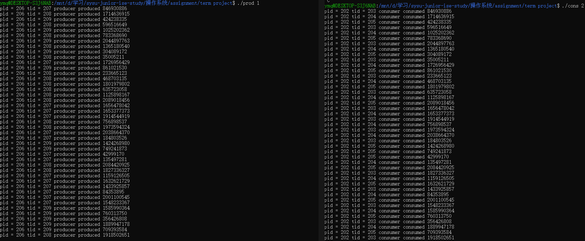
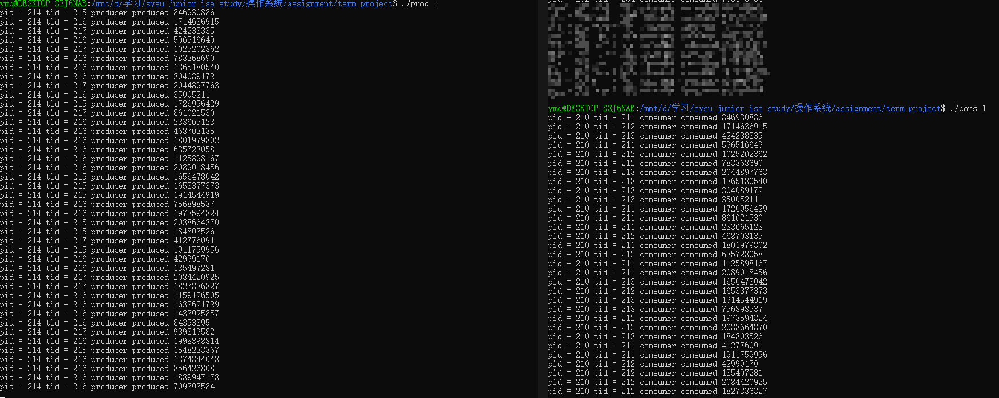
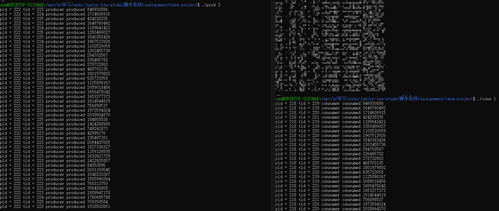
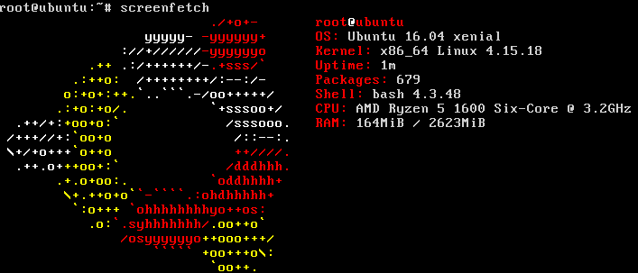
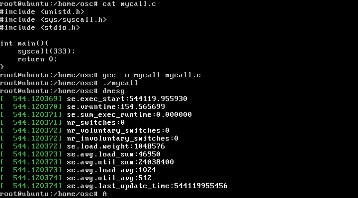

## 1


## 2

### $\lambda p < \lambda c$



### $\lambda p = \lambda c$



$\lambda p > \lambda c$



## 3

以下分析基于linux内核版本5.3.7


### 相关的数据结构

#### task_struct

定义在`/linux/sched.h`中

```c
struct task_struct {
    /* -1 unrunnable, 0 runnable, >0 stopped: */
	volatile long state;

	int on_rq;

	int prio;
	int static_prio;
	int normal_prio;
	unsigned int rt_priority;

	const struct sched_class *sched_class;
	struct sched_entity se;
	struct sched_rt_entity rt;
    ...
}
```

#### sched_entity

调度器实体，在`task_struct`中以变量`se`存在，`vruntime`存放着进程的虚拟运行时间，以ns为单位

定义在`/linux/sched.h`中

```c
struct sched_entity {
	/* For load-balancing: */
	struct load_weight load;
	unsigned long runnable_weight;
	struct rb_node run_node; 
	struct list_head group_node;
	unsigned int on_rq;

	u64 exec_start;
	u64 sum_exec_runtime;
	u64 vruntime;
	u64 prev_sum_exec_runtime;

	u64 nr_migrations;

	struct sched_statistics statistics;
}
```

#### cfs_rq

定义在`kernel/sched/sched.h`

```c
struct cfs_rq {
	struct load_weight	load;
	unsigned long		runnable_weight;
	unsigned int		nr_running;
	unsigned int		h_nr_running;

	u64			exec_clock;
	u64			min_vruntime;

	struct rb_root_cached	tasks_timeline;

	/*
	 * 'curr' points to currently running entity on this cfs_rq.
	 * It is set to NULL otherwise (i.e when none are currently running).
	 */
	struct sched_entity	*curr;
	struct sched_entity	*next;
	struct sched_entity	*last;
	struct sched_entity	*skip;
};
```

几个数据结构的关系大体总结来说就是，`task_struct`保存了任务信息和调度实体`sched_entity`，`sched_entity`中包含了`run_node`，也就是红黑树中的结点，CFS会在每个CPU上维护一个`cfs_rq`，`cfs_rq`保存有红黑树的根结点，该红黑树以调度实体的`vruntime`为键值。

### CFS的实现

#### 创建进程

进程被创建后，会调用`enqueue_entity`函数，更新相应的信息并将进程插入到红黑树中

```c
static void
enqueue_entity(struct cfs_rq *cfs_rq, struct sched_entity *se, int flags)
{
	bool renorm = !(flags & ENQUEUE_WAKEUP) || (flags & ENQUEUE_MIGRATED);
	bool curr = cfs_rq->curr == se;

	/*
	 * If we're the current task, we must renormalise before calling
	 * update_curr().
	 */
	if (renorm && curr)
		se->vruntime += cfs_rq->min_vruntime;

	update_curr(cfs_rq);

	/*
	 * Otherwise, renormalise after, such that we're placed at the current
	 * moment in time, instead of some random moment in the past. Being
	 * placed in the past could significantly boost this task to the
	 * fairness detriment of existing tasks.
	 */
	if (renorm && !curr)
		se->vruntime += cfs_rq->min_vruntime;

	/*
	 * When enqueuing a sched_entity, we must:
	 *   - Update loads to have both entity and cfs_rq synced with now.
	 *   - Add its load to cfs_rq->runnable_avg
	 *   - For group_entity, update its weight to reflect the new share of
	 *     its group cfs_rq
	 *   - Add its new weight to cfs_rq->load.weight
	 */
	update_load_avg(cfs_rq, se, UPDATE_TG | DO_ATTACH);
	update_cfs_group(se);
	enqueue_runnable_load_avg(cfs_rq, se);
	account_entity_enqueue(cfs_rq, se);

	if (flags & ENQUEUE_WAKEUP)
		place_entity(cfs_rq, se, 0);

	check_schedstat_required();
	update_stats_enqueue(cfs_rq, se, flags);
	check_spread(cfs_rq, se);
	if (!curr)
		__enqueue_entity(cfs_rq, se);
	se->on_rq = 1;

	if (cfs_rq->nr_running == 1) {
		list_add_leaf_cfs_rq(cfs_rq);
		check_enqueue_throttle(cfs_rq);
	}
}
```

`__enqueue_entity`负责将调度实体插入到树中

```c
/*
 * Enqueue an entity into the rb-tree:
 */
static void __enqueue_entity(struct cfs_rq *cfs_rq, struct sched_entity *se)
{
	struct rb_node **link = &cfs_rq->tasks_timeline.rb_root.rb_node;
	struct rb_node *parent = NULL;
	struct sched_entity *entry;
	bool leftmost = true;

	/*
	 * Find the right place in the rbtree:
	 */
	while (*link) {
		parent = *link;
		entry = rb_entry(parent, struct sched_entity, run_node);
		/*
		 * We dont care about collisions. Nodes with
		 * the same key stay together.
		 */
		if (entity_before(se, entry)) {
			link = &parent->rb_left;
		} else {
			link = &parent->rb_right;
			leftmost = false;
		}
	}

	rb_link_node(&se->run_node, parent, link);
	rb_insert_color_cached(&se->run_node,
			       &cfs_rq->tasks_timeline, leftmost);
}
```

#### 删除进程

和插入进程类似，调用`dequeue_entity`函数更新信息，并调用`__dequeue_entity`将调度实体移出红黑树

```c
static void
dequeue_entity(struct cfs_rq *cfs_rq, struct sched_entity *se, int flags)
{
	/*
	 * Update run-time statistics of the 'current'.
	 */
	update_curr(cfs_rq);

	/*
	 * When dequeuing a sched_entity, we must:
	 *   - Update loads to have both entity and cfs_rq synced with now.
	 *   - Subtract its load from the cfs_rq->runnable_avg.
	 *   - Subtract its previous weight from cfs_rq->load.weight.
	 *   - For group entity, update its weight to reflect the new share
	 *     of its group cfs_rq.
	 */
	update_load_avg(cfs_rq, se, UPDATE_TG);
	dequeue_runnable_load_avg(cfs_rq, se);

	update_stats_dequeue(cfs_rq, se, flags);

	clear_buddies(cfs_rq, se);

	if (se != cfs_rq->curr)
		__dequeue_entity(cfs_rq, se);
	se->on_rq = 0;
	account_entity_dequeue(cfs_rq, se);

	/*
	 * Normalize after update_curr(); which will also have moved
	 * min_vruntime if @se is the one holding it back. But before doing
	 * update_min_vruntime() again, which will discount @se's position and
	 * can move min_vruntime forward still more.
	 */
	if (!(flags & DEQUEUE_SLEEP))
		se->vruntime -= cfs_rq->min_vruntime;

	/* return excess runtime on last dequeue */
	return_cfs_rq_runtime(cfs_rq);

	update_cfs_group(se);

	/*
	 * Now advance min_vruntime if @se was the entity holding it back,
	 * except when: DEQUEUE_SAVE && !DEQUEUE_MOVE, in this case we'll be
	 * put back on, and if we advance min_vruntime, we'll be placed back
	 * further than we started -- ie. we'll be penalized.
	 */
	if ((flags & (DEQUEUE_SAVE | DEQUEUE_MOVE)) != DEQUEUE_SAVE)
		update_min_vruntime(cfs_rq);
}
```


#### 进程选择

CFS调度算法使用红黑树储存所有的进程，红黑树根据`vruntime`对进程进行排序，CFS调度算法选择`vruntime`最小的进程运行，即红黑树的最左节点，选取最左节点的函数(定义在`fair.c`600行)如下，最左节点被保存在`cfs_rq.tasks_timeline->leftmost`中

```c
struct sched_entity *__pick_first_entity(struct cfs_rq *cfs_rq)
{
	struct rb_node *left = rb_first_cached(&cfs_rq->tasks_timeline);

	if (!left)
		return NULL;

	return rb_entry(left, struct sched_entity, run_node);
}
```

当调度器挑选下一个运行的进程时，会调用`pick_next_task_fair`方法，该方法又会调用`pick_next_entity`方法找出下一个进程，`pick_next_task_fair`方法定义如下，当`CONFIG_FAIR_GROUP_SCHED`被定义时，意味着`sched_entity`有可能是一个进程组，所以需要额外的处理，将这部分代码去掉，核心部分的源码如下

```c
static struct task_struct *
pick_next_task_fair(struct rq *rq, struct task_struct *prev, struct rq_flags *rf)
{
	struct cfs_rq *cfs_rq = &rq->cfs;
	struct sched_entity *se;
	struct task_struct *p;
	int new_tasks;

again:
    // 队列上没有其他可运行的任务
	if (!cfs_rq->nr_running)
		goto idle;
	
    // 将上一个进程放回队列
	put_prev_task(rq, prev);
	
    // 选出下一个任务
	do {
		se = pick_next_entity(cfs_rq, NULL);
		set_next_entity(cfs_rq, se);
		cfs_rq = group_cfs_rq(se);
	} while (cfs_rq);

	p = task_of(se);

// curr继续运行直到有新任务出现
idle:
	update_misfit_status(NULL, rq);
	new_tasks = idle_balance(rq, rf);

	/*
	 * Because idle_balance() releases (and re-acquires) rq->lock, it is
	 * possible for any higher priority task to appear. In that case we
	 * must re-start the pick_next_entity() loop.
	 */
	if (new_tasks < 0)
		return RETRY_TASK;

	if (new_tasks > 0)
		goto again;

	/*
	 * rq is about to be idle, check if we need to update the
	 * lost_idle_time of clock_pelt
	 */
	update_idle_rq_clock_pelt(rq);

	return NULL;
}
```

`pick_next_entity`方法定义如下

```c
/*
 * Pick the next process, keeping these things in mind, in this order:
 * 1) keep things fair between processes/task groups
 * 2) pick the "next" process, since someone really wants that to run
 * 3) pick the "last" process, for cache locality
 * 4) do not run the "skip" process, if something else is available
 */
static struct sched_entity *
pick_next_entity(struct cfs_rq *cfs_rq, struct sched_entity *curr)
{
    // 选出最左节点
	struct sched_entity *left = __pick_first_entity(cfs_rq);
	struct sched_entity *se;

	/*
	 * If curr is set we have to see if its left of the leftmost entity
	 * still in the tree, provided there was anything in the tree at all.
	 */
	if (!left || (curr && entity_before(curr, left)))
		left = curr;

	se = left; /* ideally we run the leftmost entity */

	/*
	 * Avoid running the skip buddy, if running something else can
	 * be done without getting too unfair.
	 */
    // 如果选出的任务被设为skip，再选一个
	if (cfs_rq->skip == se) {
		struct sched_entity *second;

		if (se == curr) {
			second = __pick_first_entity(cfs_rq);
		} else {
			second = __pick_next_entity(se);
			if (!second || (curr && entity_before(curr, second)))
				second = curr;
		}

		if (second && wakeup_preempt_entity(second, left) < 1)
			se = second;
	}

	/*
	 * Prefer last buddy, try to return the CPU to a preempted task.
	 */
    
	if (cfs_rq->last && wakeup_preempt_entity(cfs_rq->last, left) < 1)
		se = cfs_rq->last;

	/*
	 * Someone really wants this to run. If it's not unfair, run it.
	 */
	if (cfs_rq->next && wakeup_preempt_entity(cfs_rq->next, left) < 1)
		se = cfs_rq->next;

	clear_buddies(cfs_rq, se);

	return se;
}
```


#### 进程唤醒

在`euqueue_entity`方法中有这样一个分支，用于处理唤醒进程

```c
if (flags & ENQUEUE_WAKEUP)
    place_entity(cfs_rq, se, 0);
```

在`place_entity`函数中，对应的代码分支如下，主要作用是以`min_vruntime`为基础，对唤醒进程的`vruntime`重新进行设定，使其可以获得合理的CPU运行时间

```c
static void
place_entity(struct cfs_rq *cfs_rq, struct sched_entity *se, int initial)
{
	u64 vruntime = cfs_rq->min_vruntime;

	/* sleeps up to a single latency don't count. */
	if (!initial) {
		unsigned long thresh = sysctl_sched_latency;

		/*
		 * Halve their sleep time's effect, to allow
		 * for a gentler effect of sleepers:
		 */
		if (sched_feat(GENTLE_FAIR_SLEEPERS))
			thresh >>= 1;

		vruntime -= thresh;
	}

	/* ensure we never gain time by being placed backwards. */
	se->vruntime = max_vruntime(se->vruntime, vruntime);
}
```

#### 进程抢占

在`pick_next_entity`中可看到其调用了`wakeup_preempt_entity`，该函数用于判断`se`是否可以抢断`curr`，只有当se的`vruntime`小于`curr`的`vruntime`时才有可能抢断，为了避免频繁的切换，还会调用`wakeup_gran`方法使得权重低的进程不会轻易抢占权重高的进程

```c
/*
 * Should 'se' preempt 'curr'.
 *
 *             |s1
 *        |s2
 *   |s3
 *         g
 *      |<--->|c
 *
 *  w(c, s1) = -1
 *  w(c, s2) =  0
 *  w(c, s3) =  1
 *
 */
static int
wakeup_preempt_entity(struct sched_entity *curr, struct sched_entity *se)
{
	s64 gran, vdiff = curr->vruntime - se->vruntime;

	if (vdiff <= 0)
		return -1;

	gran = wakeup_gran(se);
	if (vdiff > gran)
		return 1;

	return 0;
}
```

`wakeup_gran`的定义如下，`calc_delta_fair`在下方的问题回答中有分析到

```c
static unsigned long wakeup_gran(struct sched_entity *se)
{
	unsigned long gran = sysctl_sched_wakeup_granularity;

	/*
	 * Since its curr running now, convert the gran from real-time
	 * to virtual-time in his units.
	 *
	 * By using 'se' instead of 'curr' we penalize light tasks, so
	 * they get preempted easier. That is, if 'se' < 'curr' then
	 * the resulting gran will be larger, therefore penalizing the
	 * lighter, if otoh 'se' > 'curr' then the resulting gran will
	 * be smaller, again penalizing the lighter task.
	 *
	 * This is especially important for buddies when the leftmost
	 * task is higher priority than the buddy.
	 */
	return calc_delta_fair(gran, se);
}
```

#### 不知道怎么归类的信息

`sched_feat`用于检查某个特性是否开启，在`features.h`中可以查到`feature`是否开启

### 简述进程优先级、nice值和权重之间的关系

进程优先级越高，nice值越低，而权重由nice值转化得

进程的权重在`sched_entity`有所体现，而进程的权重根据nice值变换得，在`fair.c`中可看到与权重更新相关的函数`reweight_task`（2908行），其中调用了`sched_prio_to_weight`，在`kernel/sched/core.c`中可找到定义（7563行）如下

```c
const int sched_prio_to_weight[40] = {
 /* -20 */     88761,     71755,     56483,     46273,     36291,
 /* -15 */     29154,     23254,     18705,     14949,     11916,
 /* -10 */      9548,      7620,      6100,      4904,      3906,
 /*  -5 */      3121,      2501,      1991,      1586,      1277,
 /*   0 */      1024,       820,       655,       526,       423,
 /*   5 */       335,       272,       215,       172,       137,
 /*  10 */       110,        87,        70,        56,        45,
 /*  15 */        36,        29,        23,        18,        15,
};
```

nice值的范围为-20~19，转换关系如上所示，公式为
$$
1024*（1.25）^{(-nice)}
$$
nice值每降一个单位，CPU使用时间+10%

### CFS调度器中的vruntime的基本思想是什么？是如何计算的？何时得到更新？其中的min_vruntime有什么作用？

#### 基本思想

`vruntime`是每个进程的虚拟运行时间，CFS根据该信息衡量哪个进程最应该被调度，权重越大的进程，虚拟运行时间越小，这样被调度的机会也就越大

#### 计算

在`sched/fair.c`中，`update_curr`计算了实际运行时间并存放在`delta_exec`中，而`vruntime`的更新数值经`calc_delta_fair`计算而来

```c
static void update_curr(struct cfs_rq *cfs_rq)
{
	struct sched_entity *curr = cfs_rq->curr; // 获取当前进程
	u64 now = rq_clock_task(rq_of(cfs_rq));
	u64 delta_exec;

	if (unlikely(!curr))
		return;

	delta_exec = now - curr->exec_start; // 计算运行时间
	if (unlikely((s64)delta_exec <= 0))
		return;

	curr->exec_start = now; //更新exec_start

	schedstat_set(curr->statistics.exec_max,
		      max(delta_exec, curr->statistics.exec_max));

	curr->sum_exec_runtime += delta_exec; // 更新运行总时间
	schedstat_add(cfs_rq->exec_clock, delta_exec);

	curr->vruntime += calc_delta_fair(delta_exec, curr); 
	update_min_vruntime(cfs_rq);

	if (entity_is_task(curr)) {
		struct task_struct *curtask = task_of(curr);

		trace_sched_stat_runtime(curtask, delta_exec, curr->vruntime);
		cgroup_account_cputime(curtask, delta_exec);
		account_group_exec_runtime(curtask, delta_exec);
	}

	account_cfs_rq_runtime(cfs_rq, delta_exec);
}
```

`calc_delta_fair`定义如下

```c
static inline u64 calc_delta_fair(u64 delta, struct sched_entity *se)
{
	if (unlikely(se->load.weight != NICE_0_LOAD))
		delta = __calc_delta(delta, NICE_0_LOAD, &se->load);

	return delta;
}
```

其调用的函数`__calc_delta`定义如下

```c
static u64 __calc_delta(u64 delta_exec, unsigned long weight, struct load_weight *lw)
{
	u64 fact = scale_load_down(weight); // fact = weight
	int shift = WMULT_SHIFT; // shift = 32

	__update_inv_weight(lw);

	if (unlikely(fact >> 32)) {
		while (fact >> 32) {
			fact >>= 1;
			shift--;
		}
	}

	/* hint to use a 32x32->64 mul */
	fact = (u64)(u32)fact * lw->inv_weight;

	while (fact >> 32) {
		fact >>= 1;
		shift--;
	}

	return mul_u64_u32_shr(delta_exec, fact, shift);
}
```

`NICE_0_LOAD`使用宏定义，将相关定义找出为如下三条

```c
#define NICE_0_LOAD (1L << NICE_0_LOAD_SHIFT)
#define NICE_0_LOAD_SHIFT (SCHED_FIXEDPOINT_SHIFT)
#define SCHED_FIXEDPOINT_SHIFT 10
```

即`NICE_0_LOAD`的默认值为1024，也是`nice`值为0对应的权重

根据`__cala_delta`函数的注释可知，vruntime更新的数值计算公式如下
$$
delta = delta × \frac{NICE\_0\_LOAD}{curr->se->load.weight}
$$

所以权重越高的进程，vruntime越小

#### 更新

由上面的分析可知`vruntime`在`update_curr()`中被更新，所以只要调用了该函数的过程都会更新`vruntime`，所以进程切换，进程的入队与出队的时候都会更新`vruntime`，大体总结来说就是，只要函数在运行时`curr`还在运行，那么就要更新`curr`的`vruntime`

#### min_vruntime的作用

`min_vruntime`在`init_cfs_rq`中被初始化`-1<<20`

```c
void init_cfs_rq(struct cfs_rq *cfs_rq)
{
	cfs_rq->tasks_timeline = RB_ROOT_CACHED;
	cfs_rq->min_vruntime = (u64)(-(1LL << 20));
#ifndef CONFIG_64BIT
	cfs_rq->min_vruntime_copy = cfs_rq->min_vruntime;
#endif
#ifdef CONFIG_SMP
	raw_spin_lock_init(&cfs_rq->removed.lock);
#endif
}
```

在调用`update_curr`和`dequeue_entity`函数时，`min_vruntime`都会被更新

`min_vruntime`的更新代码如下，已做相应的注释

```c
static void update_min_vruntime(struct cfs_rq *cfs_rq)
{
    // 设置vruntime的值
	struct sched_entity *curr = cfs_rq->curr;
	struct rb_node *leftmost = rb_first_cached(&cfs_rq->tasks_timeline);

	u64 vruntime = cfs_rq->min_vruntime;

	if (curr) {
		if (curr->on_rq)
			vruntime = curr->vruntime;
		else
			curr = NULL;
	}
	
    // 找到最左节点，即vruntime最小的节点
	if (leftmost) { /* non-empty tree */
		struct sched_entity *se;
		se = rb_entry(leftmost, struct sched_entity, run_node);
		
         // 设置vruntime为curr和最左进程中较小的
		if (!curr)
			vruntime = se->vruntime;
		else
			vruntime = min_vruntime(vruntime, se->vruntime);
	}

	/* ensure we never gain time by being placed backwards. */
	cfs_rq->min_vruntime = max_vruntime(cfs_rq->min_vruntime, vruntime);
#ifndef CONFIG_64BIT
	smp_wmb();
	cfs_rq->min_vruntime_copy = cfs_rq->min_vruntime;
#endif
}
```

更新函数的作用为比较curr进程和红黑树中最左节点的vruntime，若两者中的较小值比当前的`min_vruntime`大，则更新该值，即该值是单调递增的，在`fair.c`搜索这个值，可看出`min_vruntime`的作用主要为

1. 保证新进程或休眠进程的`vruntime`为合理的时间

新进程的`vruntime`大于等于`min_vruntime`小于父进程的`vruntime`

如果一个进程长时间休眠，此时休眠进程的`vruntime`会很小，为了避免休眠进程在被唤醒后长时间抢占CPU，会以`min_vruntime`为基础，为休眠进程重新设定`vruntime`

```c
static void
place_entity(struct cfs_rq *cfs_rq, struct sched_entity *se, int initial)
{
	u64 vruntime = cfs_rq->min_vruntime;

	/*
	 * The 'current' period is already promised to the current tasks,
	 * however the extra weight of the new task will slow them down a
	 * little, place the new task so that it fits in the slot that
	 * stays open at the end.
	 */
	if (initial && sched_feat(START_DEBIT)) // 新进程
		vruntime += sched_vslice(cfs_rq, se);

	/* sleeps up to a single latency don't count. */
	if (!initial) { // 休眠进程
		unsigned long thresh = sysctl_sched_latency;

		/*
		 * Halve their sleep time's effect, to allow
		 * for a gentler effect of sleepers:
		 */
		if (sched_feat(GENTLE_FAIR_SLEEPERS))
			thresh >>= 1;

		vruntime -= thresh;
	}

	/* ensure we never gain time by being placed backwards. */
	se->vruntime = max_vruntime(se->vruntime, vruntime);
}
```

2. 保证进程从一个CPU转到其他CPU执行的时候`vruntime`值正确

由于不同的CPU运行队列上`min_vruntime`是不同的，对于一个进程在不同CPU上执行的情况，Linux内核的处理是根据`min_vruntime`对进程的`vruntime`进行处理，公式如下
$$
vruntime_{A\ to\ B} = vruntime - min\_vruntime_A+min\_vruntime_B
$$
所以在

`enqueue_entity`中有

```c
se->vruntime += cfs_rq->min_vruntime;
```

`dequeue_entity`中有

```c
se->vruntime -= cfs_rq->min_vruntime;
```

### 添加系统调用

基于内核版本4.15.0更改

` arch/x86/entry/syscalls/syscall_64.tbl `添加

```
333 common mycall sys_mycall
```

` include/linux/syscalls.h `添加

```c
asmlinkage long sys_mycall(void);
```

` kernel/sys.c `添加(SPLIT_NS的定义也要移过来)

```c
SYSCALL_DEFINE0(mycall){
	printk("se.exec_start:%Ld.%06ld\n", SPLIT_NS(current->se.exec_start));
    printk("se.vruntime:%Ld.%06ld\n", SPLIT_NS(current->se.vruntime));
    printk("se.sum_exec_runtime:%Ld.%06ld\n", SPLIT_NS(current->se.sum_exec_runtime));
    printk("nr_switches:%lu\n", current->nvcsw + current->nivcsw);
    printk("nr_voluntary_switches:%lu\n", current->nvcsw);
    printk("nr_involuntary_switches:%lu\n", current->nivcsw);
    printk("se.load.weight:%lu\n", current->se.load.weight);
    printk("se.avg.load_sum:%llu\n", current->se.avg.load_sum);
    printk("se.avg.util_sum:%d\n", current->se.avg.util_sum);
    printk("se.avg.load_avg:%lu\n", current->se.avg.load_avg);
    printk("se.avg.util_avg:%lu\n", current->se.avg.util_avg);
    printk("se.avg.last_update_time:%llu\n", current->se.avg.last_update_time);
	return 0;
}
```

原系统的screenfetch截图


添加系统调用，重新编译内核后的sceenfetch截图



系统调用后的截图

