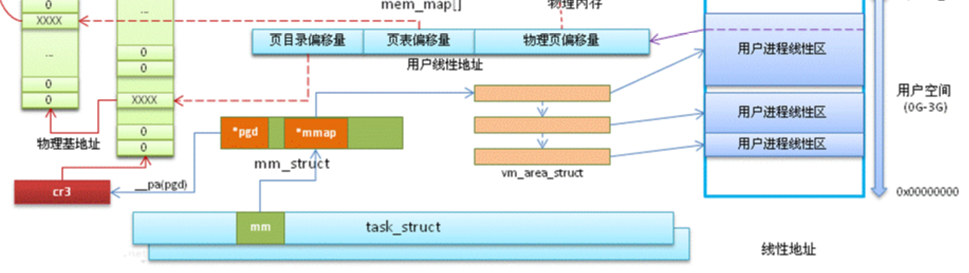
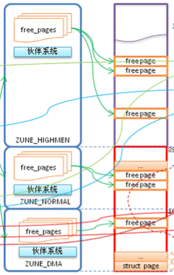
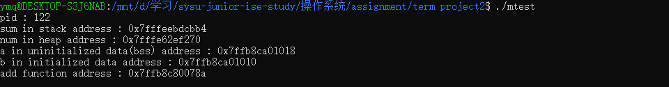
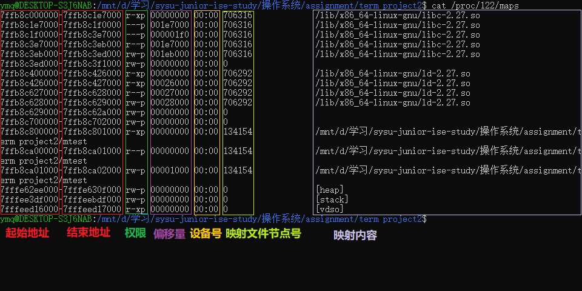
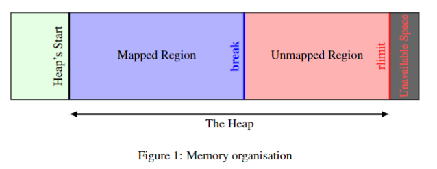
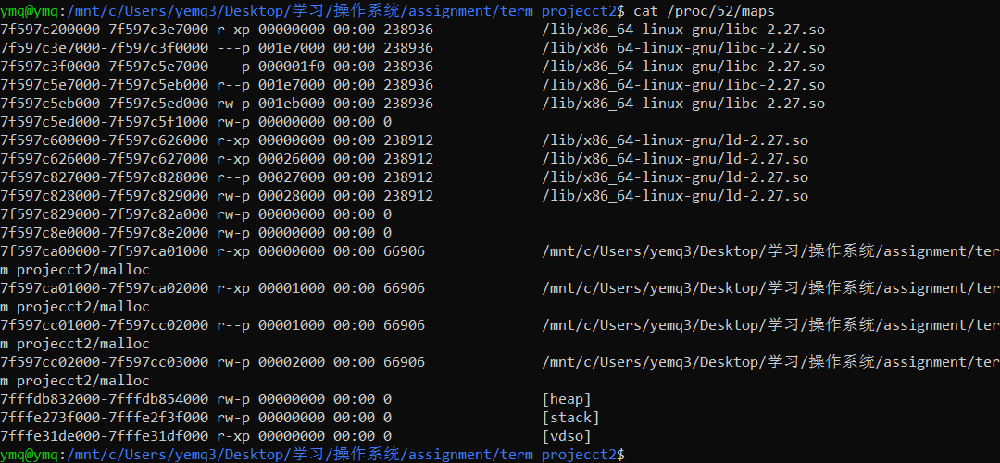

# 操作系统大作业2

## 虚存管理模拟程序

### Chapter 10. Programming Projects: Designing a Virtual Memory Manager（OSC 10th ed.）

#### (1) 保持为vm.c，使用如下测试脚本test.sh，进行地址转换测试，并和correct.txt比较

测试脚本test.sh运行如下


#### (2)  实现LRU的TLB

需要测试的话改一下代码的宏定义即可

```c
#define TLBMethod "LRU"  // "FIFO" or "LRU"
```

测试脚本test.sh运行如下


#### (3)  实现基于LRU的Page Replacement

将物理内存的`NUM_FRAME`从256改为128

``` c
#define NUM_FRAME 128
```

测试脚本test.sh运行如下


#### (5)  使用FIFO和LRU分别运行vm（TLB和页置换统一策略），打印比较Page-fault rate和TLB hit rate，给出运行的截屏。

使用`FIFO`策略的测试如下


使用`LRU`策略的测试如下


#### （**附加题10分**）编写一个简单trace生成器程序（可以用任意语言，报告里面作为附件提供），运行生成自己的addresses-locality.txt，包含1万条访问记录，体现内存访问的局部性（参考Figure 10.21, OSC 10th ed.），绘制类似图表，表现内存页的局部性访问轨迹。然后以该文件为参数运行vm，比较FIFO和LRU策略下的性能指标，最好用图对比。给出结果及分析。

代码在附加题文件夹中，`test.c`用于生成地址，`run.py`用于处理地址并画出图标，`vm.c`用于测试不同策略下的性能指标，`vm.c`与上面的程序稍微有所不同，修改了部分代码方便测试，测试的话可以直接用`make`测试

因为模拟程序里面只有三个函数，所以内存都集中在三块区域

 

 放大某一区域看大概是这样


##### FIFO


##### LRU


 

 

## Linux内存管理实验

基于 `linux5.3.7` 分析

阅读Linux内存管理相关代码片段，提供程序和阅读报告，描述关键数据结构中和内存相关的成员的意义，以及指针指向关系。涉及的数据结构包括（但不限于）task_struct，mm_struct, vm_area_struct, vm_operations_struct, page等

### 分析图1（注：图1是2级页表，对应于IA-32位系统），解释图中每一类方框和箭头的含义，在代码树中寻找相关数据结构片段，做简单解释。30分。

#### 数据结构

##### task_struct

`/linux/sched.h`

```c
struct task_struct {
    /* -1 unrunnable, 0 runnable, >0 stopped: */
	volatile long state;

	int on_rq;

	int prio;
	int static_prio;
	int normal_prio;
	unsigned int rt_priority;

	const struct sched_class *sched_class;
	struct sched_entity se;
	struct sched_rt_entity rt;
    ...
}
```

##### mm_struct

`include/linux/mm_types.h`

```c
struct mm_struct {
	struct {
		struct vm_area_struct *mmap;		/* list of VMAs */
		struct rb_root mm_rb;
		u64 vmacache_seqnum;                   /* per-thread vmacache */

		unsigned long mmap_base;	/* base of mmap area */
		unsigned long mmap_legacy_base;	/* base of mmap area in bottom-up allocations */

		unsigned long task_size;	/* size of task vm space */
		unsigned long highest_vm_end;	/* highest vma end address */
		pgd_t * pgd;

		atomic_t mm_users;

		atomic_t mm_count;


		int map_count;			/* number of VMAs */

		spinlock_t page_table_lock; /* Protects page tables and some
					     * counters
					     */
		struct rw_semaphore mmap_sem;

		struct list_head mmlist; 

		unsigned long hiwater_rss; /* High-watermark of RSS usage */
		unsigned long hiwater_vm;  /* High-water virtual memory usage */

		unsigned long total_vm;	   /* Total pages mapped */
		unsigned long locked_vm;   /* Pages that have PG_mlocked set */
		atomic64_t    pinned_vm;   /* Refcount permanently increased */
		unsigned long data_vm;	   /* VM_WRITE & ~VM_SHARED & ~VM_STACK */
		unsigned long exec_vm;	   /* VM_EXEC & ~VM_WRITE & ~VM_STACK */
		unsigned long stack_vm;	   /* VM_STACK */
		unsigned long def_flags;

		spinlock_t arg_lock; /* protect the below fields */
		unsigned long start_code, end_code, start_data, end_data;
		unsigned long start_brk, brk, start_stack;
		unsigned long arg_start, arg_end, env_start, env_end;

		unsigned long saved_auxv[AT_VECTOR_SIZE]; /* for /proc/PID/auxv */

		struct mm_rss_stat rss_stat;

		struct linux_binfmt *binfmt;

		/* Architecture-specific MM context */
		mm_context_t context;

		unsigned long flags; /* Must use atomic bitops to access */

		struct core_state *core_state; /* coredumping support */

		struct user_namespace *user_ns;

		/* store ref to file /proc/<pid>/exe symlink points to */
		struct file __rcu *exe_file;

		atomic_t tlb_flush_pending;

		struct uprobes_state uprobes_state;

		struct work_struct async_put_work;

	} __randomize_layout;

	unsigned long cpu_bitmap[];
};
```

##### vm_area_struct

` include/linux/mm_types.h `

```c
struct vm_area_struct {
	/* The first cache line has the info for VMA tree walking. */

	unsigned long vm_start;		/* Our start address within vm_mm. */
	unsigned long vm_end;		/* The first byte after our end address
					   within vm_mm. */

	/* linked list of VM areas per task, sorted by address */
	struct vm_area_struct *vm_next, *vm_prev;

	struct rb_node vm_rb;

	unsigned long rb_subtree_gap;

	/* Second cache line starts here. */

	struct mm_struct *vm_mm;	/* The address space we belong to. */
	pgprot_t vm_page_prot;		/* Access permissions of this VMA. */
	unsigned long vm_flags;		/* Flags, see mm.h. */

	struct {
		struct rb_node rb;
		unsigned long rb_subtree_last;
	} shared;

	struct list_head anon_vma_chain; /* Serialized by mmap_sem &
					  * page_table_lock */
	struct anon_vma *anon_vma;	/* Serialized by page_table_lock */

	/* Function pointers to deal with this struct. */
	const struct vm_operations_struct *vm_ops;

	/* Information about our backing store: */
	unsigned long vm_pgoff;		/* Offset (within vm_file) in PAGE_SIZE
					   units */
	struct file * vm_file;		/* File we map to (can be NULL). */
	void * vm_private_data;		/* was vm_pte (shared mem) */

	struct vm_userfaultfd_ctx vm_userfaultfd_ctx;
} __randomize_layout;
```

##### vm_operations_struct

`include/linux/mm.h`

```c
/*
 * These are the virtual MM functions - opening of an area, closing and
 * unmapping it (needed to keep files on disk up-to-date etc), pointer
 * to the functions called when a no-page or a wp-page exception occurs.
 */
struct vm_operations_struct {
	void (*open)(struct vm_area_struct * area);
	void (*close)(struct vm_area_struct * area);
	int (*split)(struct vm_area_struct * area, unsigned long addr);
	int (*mremap)(struct vm_area_struct * area);
	vm_fault_t (*fault)(struct vm_fault *vmf);
	vm_fault_t (*huge_fault)(struct vm_fault *vmf,
			enum page_entry_size pe_size);
	void (*map_pages)(struct vm_fault *vmf,
			pgoff_t start_pgoff, pgoff_t end_pgoff);
	unsigned long (*pagesize)(struct vm_area_struct * area);

	/* notification that a previously read-only page is about to become
	 * writable, if an error is returned it will cause a SIGBUS */
	vm_fault_t (*page_mkwrite)(struct vm_fault *vmf);

	/* same as page_mkwrite when using VM_PFNMAP|VM_MIXEDMAP */
	vm_fault_t (*pfn_mkwrite)(struct vm_fault *vmf);

	/* called by access_process_vm when get_user_pages() fails, typically
	 * for use by special VMAs that can switch between memory and hardware
	 */
	int (*access)(struct vm_area_struct *vma, unsigned long addr,
		      void *buf, int len, int write);

	/* Called by the /proc/PID/maps code to ask the vma whether it
	 * has a special name.  Returning non-NULL will also cause this
	 * vma to be dumped unconditionally. */
	const char *(*name)(struct vm_area_struct *vma);

#ifdef CONFIG_NUMA
	/*
	 * set_policy() op must add a reference to any non-NULL @new mempolicy
	 * to hold the policy upon return.  Caller should pass NULL @new to
	 * remove a policy and fall back to surrounding context--i.e. do not
	 * install a MPOL_DEFAULT policy, nor the task or system default
	 * mempolicy.
	 */
	int (*set_policy)(struct vm_area_struct *vma, struct mempolicy *new);

	/*
	 * get_policy() op must add reference [mpol_get()] to any policy at
	 * (vma,addr) marked as MPOL_SHARED.  The shared policy infrastructure
	 * in mm/mempolicy.c will do this automatically.
	 * get_policy() must NOT add a ref if the policy at (vma,addr) is not
	 * marked as MPOL_SHARED. vma policies are protected by the mmap_sem.
	 * If no [shared/vma] mempolicy exists at the addr, get_policy() op
	 * must return NULL--i.e., do not "fallback" to task or system default
	 * policy.
	 */
	struct mempolicy *(*get_policy)(struct vm_area_struct *vma,
					unsigned long addr);
#endif
	/*
	 * Called by vm_normal_page() for special PTEs to find the
	 * page for @addr.  This is useful if the default behavior
	 * (using pte_page()) would not find the correct page.
	 */
	struct page *(*find_special_page)(struct vm_area_struct *vma,
					  unsigned long addr);
};
```


##### page

` include/linux/mm_types.h `

```c
struct page {
	unsigned long flags;		/* Atomic flags, some possibly
					 * updated asynchronously */
	union {
		struct {	/* Page cache and anonymous pages */
			struct list_head lru;
			/* See page-flags.h for PAGE_MAPPING_FLAGS */
			struct address_space *mapping;
			pgoff_t index;		/* Our offset within mapping. */
			unsigned long private;
		};
		struct {	/* page_pool used by netstack */
			dma_addr_t dma_addr;
		};
		struct {	/* slab, slob and slub */
			union {
				struct list_head slab_list;
				struct {	/* Partial pages */
					struct page *next;
				};
			};
			struct kmem_cache *slab_cache; /* not slob */
			/* Double-word boundary */
			void *freelist;		/* first free object */
			union {
				void *s_mem;	/* slab: first object */
				unsigned long counters;		/* SLUB */
				struct {			/* SLUB */
					unsigned inuse:16;
					unsigned objects:15;
					unsigned frozen:1;
				};
			};
		};
		struct {	/* Tail pages of compound page */
			unsigned long compound_head;	/* Bit zero is set */

			/* First tail page only */
			unsigned char compound_dtor;
			unsigned char compound_order;
			atomic_t compound_mapcount;
		};
		struct {	/* Second tail page of compound page */
			unsigned long _compound_pad_1;	/* compound_head */
			unsigned long _compound_pad_2;
			struct list_head deferred_list;
		};
		struct {	/* Page table pages */
			unsigned long _pt_pad_1;	/* compound_head */
			pgtable_t pmd_huge_pte; /* protected by page->ptl */
			unsigned long _pt_pad_2;	/* mapping */
			union {
				struct mm_struct *pt_mm; /* x86 pgds only */
				atomic_t pt_frag_refcount; /* powerpc */
			};
		};
		struct {	/* ZONE_DEVICE pages */
			/** @pgmap: Points to the hosting device page map. */
			struct dev_pagemap *pgmap;
			void *zone_device_data;
		};

		/** @rcu_head: You can use this to free a page by RCU. */
		struct rcu_head rcu_head;
	};

	union {		/* This union is 4 bytes in size. */
		atomic_t _mapcount;
        
		unsigned int page_type;

		unsigned int active;		/* SLAB */
		int units;			/* SLOB */
	};

	/* Usage count. *DO NOT USE DIRECTLY*. See page_ref.h */
	atomic_t _refcount;

} _struct_page_alignment;
```

#### 数据结构包含的信息

对应图中这一部分



`task_struct`中包含`mm_struct`，表示进程的地址空间，`vm_area_struct` 包含了每个内存段的信息，如下图


`mm_struct` 中包含的 `pgd_t *pgd` 指向CR3寄存器，CR3寄存器保存着顶级页表的基地址

#### 寻址机制

下图红色部分内表示 IA32 系统的寻址机制，IA32 架构通过二级页表寻址，地址的前两段为一级页表和二级页表的地址，最后一段为物理页偏移量


#### Zone

对应图中的这部分



Linux 会将页划分为不同的区，在 `include/linux/mmzone.h` 中可看到对于 `zone_type` 的定义

```c
enum zone_type {
#ifdef CONFIG_ZONE_DMA
	/*
	 * ZONE_DMA is used when there are devices that are not able
	 * to do DMA to all of addressable memory (ZONE_NORMAL). Then we
	 * carve out the portion of memory that is needed for these devices.
	 * The range is arch specific.
	 *
	 * Some examples
	 *
	 * Architecture		Limit
	 * ---------------------------
	 * parisc, ia64, sparc	<4G
	 * s390, powerpc	<2G
	 * arm			Various
	 * alpha		Unlimited or 0-16MB.
	 *
	 * i386, x86_64 and multiple other arches
	 * 			<16M.
	 */
	ZONE_DMA,
#endif
#ifdef CONFIG_ZONE_DMA32
	/*
	 * x86_64 needs two ZONE_DMAs because it supports devices that are
	 * only able to do DMA to the lower 16M but also 32 bit devices that
	 * can only do DMA areas below 4G.
	 */
	ZONE_DMA32,
#endif
	/*
	 * Normal addressable memory is in ZONE_NORMAL. DMA operations can be
	 * performed on pages in ZONE_NORMAL if the DMA devices support
	 * transfers to all addressable memory.
	 */
	ZONE_NORMAL,
#ifdef CONFIG_HIGHMEM
	/*
	 * A memory area that is only addressable by the kernel through
	 * mapping portions into its own address space. This is for example
	 * used by i386 to allow the kernel to address the memory beyond
	 * 900MB. The kernel will set up special mappings (page
	 * table entries on i386) for each page that the kernel needs to
	 * access.
	 */
	ZONE_HIGHMEM,
#endif
	ZONE_MOVABLE,
#ifdef CONFIG_ZONE_DEVICE
	ZONE_DEVICE,
#endif
	__MAX_NR_ZONES
};
```

- ZONE_DMA：可以执行DMA操作的区域（ZONE_DMA32只能被32位设备访问）
  - 由于硬件的问题，有些区域可能不能使用DMA访问，所以设置一块区域使得需要用到DMA的硬件可以使用这一块内存，而不会被分配到不能使用DMA访问的内存
- ZONE_NORMAL：正常的页
- ZONE_HIGHMEM：只有操作系统能寻址的页
  - 在32位系统上，ZONE_HIGHMEM 为高于896MB 的物理内存


其中伙伴系统通过二分的方法优化内存的分配，当分配内存时，操作系统会二分可用的内存，直至其满足分配需求，且冗余最小

#### Slab

内存的分配由 `slab` 完成，`slab` 可以对不同到数据结构的内存分配进行优化


还有一些杂乱的信息（其实有些前面有提到过

- 内核页大小4KB
- 内核占据高位内存，且使用独立的页表
- IA32的`ZONE_DMA`大小为16M
- 高位内存使用`vmalloc`分配，由操作系统管理，使用的页表也是内核页表


### 参考图2解释内核层不同内存分配接口的区别，包括__get_free_pages，kmalloc，vmalloc等，3分。


#### kmalloc

```c
void * kmalloc (size_t size, gfp_t flags);
```

分配的内存在物理上是连续的，一般用于分配小块的内存（小于page size），`kmalloc` 基于 slab 完成对内存的快速分配

#### vmalloc

```c
void * vmalloc (unsigned long size);
```

分配的内存不一定在物理上连续，一般用于分配大块的内存，`vmalloc `分配的虚拟地址依旧是连续的，使用 `vmalloc` 时，`vmalloc` 会修改内核页表

#### __get_free_pages

```c
/*
 * Common helper functions. Never use with __GFP_HIGHMEM because the returned
 * address cannot represent highmem pages. Use alloc_pages and then kmap if
 * you need to access high mem.
 */
unsigned long __get_free_pages(gfp_t gfp_mask, unsigned int order)
{
	struct page *page;

	page = alloc_pages(gfp_mask & ~__GFP_HIGHMEM, order); //分配连续的物理页
	if (!page)
		return 0;
	return (unsigned long) page_address(page); //物理地址转逻辑地址
}
EXPORT_SYMBOL(__get_free_pages);
```

分配连续物理页，并返回逻辑地址

 

### 参考[Anatomy of a Program in Memory](https://manybutfinite.com/post/anatomy-of-a-program-in-memory/)和[User-Level Memory Management](https://linuxdevices.org/ldfiles/misc/Linux_Programming_by_Example_ch03.pdf)中例程，写一个实验程序mtest.c，生成可执行程序mtest；打印代码段、数据段、BSS，栈、堆等的相关地址；需要创建自己的例子，不允许简单照搬，8分。


一个进程的内存分配如上图所示，进程内存从下到上分为以下几段：

- 代码段：存放程序执行代码
- 数据段：已初始化的全局变量
- BSS：未初始化的全局变量
- 堆：动态分配的内存（malloc）
- 内存映射区域：共享文件存放的地方
- 栈：局部变量

`mtest` 的运行结果如下



可见从上到下，内存地址递减

### 参考[How The Kernel Manages Your Memory](https://manybutfinite.com/post/how-the-kernel-manages-your-memory/)，通过/proc/pid_number/maps，分析mtest各个内存段（参考[链接](https://blog.csdn.net/lijzheng/article/details/23618365)）。绘制图表，解释输出的每一段的各种属性，包括每一列的内容。为了让mtest程序驻留内存，可以在程序末尾加上长时睡眠，并将mtest在后台运行，即./mtest & 6分。



从左到右，每一列的内容如上


### 参考[A Malloc Tutorial](https://wiki-prog.infoprepa.epita.fr/images/0/04/Malloc_tutorial.pdf)以及相关资料（如[链接](https://blog.csdn.net/gfgdsg/article/details/42709943)）回答以下问题：3分

#### 用户程序的内存分配涉及brk/sbrk和mmap两个系统调用，这两种方式的区别是什么，什么时候用brk/sbrk，什么时候用mmap？



1. brk 将上图的 `break` 指针移动到指定的位置，sbrk 用于移动 `break`指针指定大小，brk/sbrk 都是通过在break指针之上按序分配内存，mmap 用于内存分配时，采用匿名映射的方法在文件映射区申请一块内存 
2. malloc 在申请小内存时会采用 brk/sbrk ，申请大内存时则会采用 mmap ，因为使用 brk/sbrk 时为了优化内存使用率，会进行链表查询，合并碎片等操作，当碎片过多时，申请大内存使用 brk/sbrk 会比较慢，因此申请大内存时 mmap 的效率更高 


#### 应用程序开发时，为什么需要用标准库里的malloc而不是直接用这些系统调用接口？malloc额外做了哪些工作？ 

##### 为什么需要用标准库里的malloc而不是直接用这些系统调用接口？

- 系统调用需要进行上下文切换，从用户态到内核态再返回用户态会产生开销，频繁申请内存的时候，使用系统调用会影响性能
- 系统调用接口比较底层，没有做碎片整理，重分配等的工作，直接使用系统调用接口对内存的利用率不高

##### malloc额外做了哪些工作？ 

- 为了避免频繁使用系统调用，采用预分配的方法设定了一块内存池，申请内存时直接从内存池中选择一块内存
- 对于申请大小不同的情况进行了处理，申请小内存时直接调用 brk/sbrk ，申请大内存时使用 mmap 从文件映射区域分配内存
- 使用多个链表管理内存块，分配不同大小的内存时，从接近的大小的链表中查询
- 对于小内存加入`fast bin`链表，避免频繁申请小内存导致的性能下降
- 碎片整理，重分配等


#### malloc的内存分配，是分配的虚拟内存还是物理内存？两者之间如何转换？

1. 分配的是虚拟内存
2. 当内存被实际访问到时，由于发生缺页错误，操作系统会负责进行虚拟内存到物理内存之间的映射

### （**附加题，10分**）模仿malloc接口，实现一对简单的函数，命名为myalloc/myfree，实现堆上的动态内存分配和释放，并提供测试函数。相关代码以myalloc.c文件提供在项目目录下面。在自己的机器上进行实验，观察随着malloc/free的行为，/proc/pid_number/maps中如何反映堆内存的变化情况，给出截屏和解释。实现基本功能5分，在内存块管理方面进行专门优化5分。

代码参考[A Malloc Tutorial](https://wiki-prog.infoprepa.epita.fr/images/0/04/Malloc_tutorial.pdf)，由于程序在64位机上运行，修改了部分代码以让其返回的地址正确

代码实现的功能：

- malloc时先寻找空闲块看是否可以满足需求，再考虑是不是需要扩展heap，且会将多余的内存split出来
- free时合并相邻的free块




Q：分配大小不同的内存，heap增长的数量都一样

A：堆内存的分配是按规定大小扩张的，在Linux系统中，这个值为`0x1000`，也就是4K，程序中分配的区域较小，所以上面的图增长都是4K，增大分配的size显示就会有所不同，不过增加的容量必然是4K的整数倍


