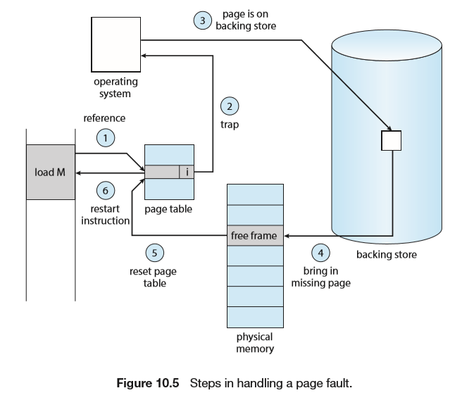
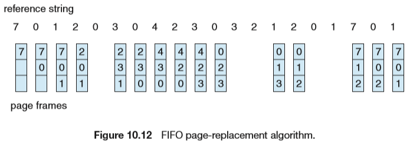
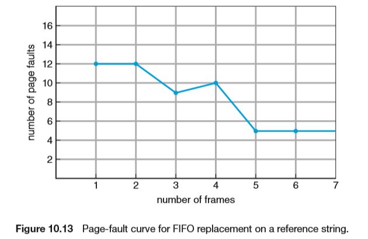
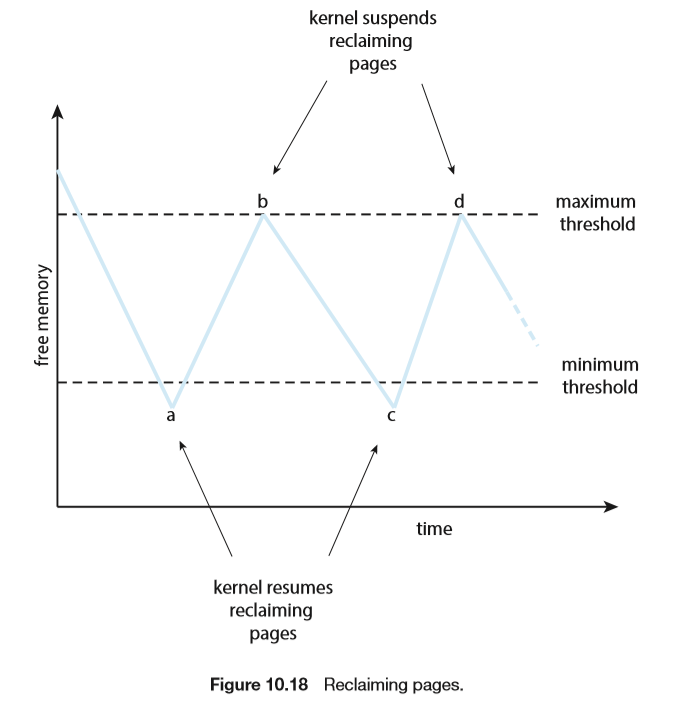
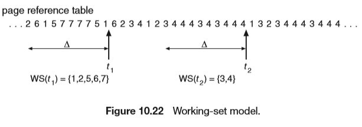
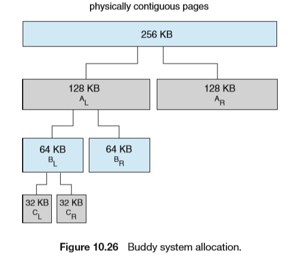

# Virtual Memory

## Background

将LA与PA分开

## Demand Paging

仅在需要的时候才加载入内存

### Basic Concepts

通过`valid-invalid bit`指明程序调入内存的状况

当程序尝试访问`invalid`的页或进行非法地址访问时，会产生`page fault`（缺页错误）

- 检查是否有效内存访问（无效则终止程序）
- 找到一个空闲帧
- 从磁盘调度所需页面
- 修改进程的内部表和页表
- 重新启动进程

pure demand paging：never bring a page into memory until it is required. 

程序具有局部引用`locality of referencce`，一条指令同时产生多个页错误的可能性不大

### Free-Frame List

操作系统维持链表用于分配空闲页表

### Performance of Demad Paging

p为缺页错误产生概率

有效访问时间=（1-p）×内存访问时间+p×缺页错误时间

1.陷入trap到OS

2.保存用户reg和进程状态

3.确定中断是否为page fault

4.检查页引用是否合法并确定所在磁盘位置

5.从磁盘读页到内存的空闲帧(包含磁盘队列中的等待 磁盘的寻到 旋转延迟 磁盘的传输延迟)

6.在等待过程中的CPU调度

7.IO中断

8.保存其他用户寄存器和进程状态（如果进行了6）

9.确定中断是否来自磁盘

10.修正页表和其他相关表，所需页已经在内存中

11.等待CPU再次分配给本进程

12.恢复用户寄存器、进程状态和新页表，重新执行。

缺页错误处理时间主要来自三个方面：

1. Service the page-fault interrupt. 
2. Read in the page. 
3. Restart the process.

## Copy-on-Write

写时复制

允许父子进程开始时共享同一页面，在某个进程要修改共享页时，它才会拷贝一份该页面进行写。

COW加快了进程创建速度。当确定一个页采用COW时，这些空闲页在进程栈或堆必须拓展时可用于分配 或用于管理COW页。OS此案用按需填0 zero fill on demand按需填零页需要在分配前填

## Page Replacement

1. Find the location of the desiredpage on secondary storage. 

2. Find a free frame: 

   a. If there is a free frame, use it. 

   b. Ifthereisnofreeframe,useapage-replacementalgorithmtoselect a victim frame. 

   c. Write the victim frame to secondary storage (if necessary); change the page and frame tables accordingly. 

3. Read the desired page into the newly freed frame; change the page and frame tables. 
4. Continue the process from where the page fault occurred.

针对特定的内存引用序列，运行算法，计算出页错误数。引用序列叫做引用串(reference string)

### FIFO Page replacement

当必须置换一页时，选择最旧的

Belady's anomaly：增大分配帧反而降低了性能

对于引用串：1,2,3,4,1,2,5,1,2,3,4,5

### Optimal Page Replacement 

置换最长时间不被使用的页

需要知道未来信息，在所有算法中页错误率最低

### LRU Page Replacement

least recently used (LRU)

性能最接近OPT

两种实现方法：

- Counters：每个页表都有一个Counter，每次被引用就把时钟信息复制到Counter，置换Counter最小的页

- Stack：每次引用时将页面移动到栈顶部，替换栈底部的页

### LRU Approximation 

页表的每项有一个`reference bit`，初始化为0，引用时置为1，替换引用位为0的页

#### Additional reference bits

在规定时间间隔内记录引用位。在规定的时间间隔内，时钟产生一个中断并且交控制权给OS，OS把每个页的引用位转移到其8位字节的高位，其他位向右移1位，抛弃最低位。这些8位寄存器包含着该页在最近8个周期内的使用情况，全0说明没用过，全1说明每个周期至少都用过1次，值越大越最近使用。有最小值的页是LRU页，被置换。被访问时左边最高位置1，定期右移并且最高位补0.

#### Second-Chance Algorithm

#### Enhanced Second-Chance Algorithm 

？？？

## Allocation of Frames

### Allocation Algorithms

#### **平均分配算法** **Equal allocation**

每个如果有100个帧 5个进程，每一个进程获得20个帧。

#### **按比例分配** **Proportional allocation**

根据进程的大小按比例分配。

#### **优先级分配** **Priority allocation**

同样按比例分配，但是是用优先级进行比例分配。

### Global versus Local Allocation 

##### **全局置换** **global allocation**

允许一个进程从所有帧中选择一个帧进行替换，不管该帧是否已分配给其他进程。

##### **局部置换** **local allocation**

每个进程只能从自己的分配帧中进行置换选择。

###  Reclaiming pages

全局置换的一种策略，当内存低于一定量时，操作系统回收部分页表以保证新进程的运行

### out-of-memory(OOM) killer

当内存非常低时，killer会根据OOM scores（linux系统可以在/proc/2500/oom_score查看）将进程杀掉

### Non-Uniform Memory Access

咕

## Thrashing

频繁的页调度行为叫做抖动（Thrashing），当超过某个阈值时，由于页面调度过多，大部分时间都在IO操作中，导致CPU利用率的骤降

### Cause of Thrashing

按需调页能成的原因是局部性原理，进程从一个局部性移动到另一个，局部性可能重叠。

颠簸发生的原因：局部大小大于总内存大小，不能将全部经常用的页放到内存中。

### Working-Set Model

最近Δ个页的引用

Δ太小不能包含整个局部

Δ太大可能包含过多局部

Δ为无穷时，工作集为被访问的所有页集合

### Page-Fault Frequency

根据页错误率分配`frames`

- 页错误率过高，分配更多的帧
- 页错误率过低，从进程中移走帧

## Memory Compression

？？？

## Allocating Kernel Memory

### Buddy system allocation

### Slab allocation

为了解决Buddy碎片损失的问题，slab是由一个或多个物理上连续的页组成的。Cache包含一个或者多个slab。每个内核数据结构都有一个cache。每个cache都含有内核数据结构的对象实例。当cache被创建时，起初包括若干标记为空闲的对象。对象的数量和slab大小有关，12KB的slab(包含三个连续的页)可以存储6个2KB的对象。当需要内核数据结构的对象时，可以直接从cache上取，并将该对象标记为使用 used。Slab首先从部分空闲的slab中分配，如果没有则从全空的slab进行分配。如果没有，从物理连续页上分配新的slab，把他赋给一个cache，再从slab分配空间。Slab优点：没有碎片引起的内存浪费；内存请求可以快速满足。

