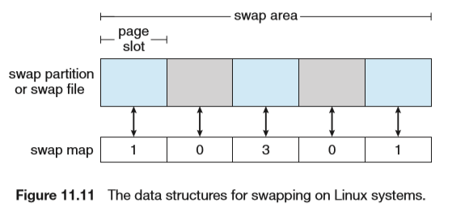
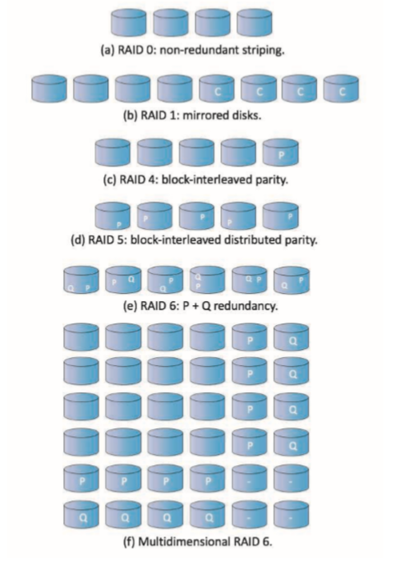

# Mass-Storage Structure

## HDD Scheduling

寻道时间Seek time：磁头移动到包含目标扇区的柱面的时间

旋转延迟rorational latency：旋转到目标扇区的时间

传输时间transfer time：数据传输时间

访问延迟Access Laency=寻道时间+旋转延迟

优化的目的在于最小化寻道时间

### FCFS Scheduling

先来先服务

### SCAN Scheduling

从磁盘一端到另一端，移过的柱面进行服务。到达另一端时改变移动方向，继续处理，也叫做电梯算法

### C-SCAN Scheduling

磁头从一端移动到另一端，到了另一端就马上返回到磁盘开始，返回路径不服务。    

linux中会同时维护两个队列（一个FCFS，一个C-SCAN），如果饥饿超过一定时间（500ms），该操作会在下一次中直接进行，避免饥饿的状况

## NVM Scheduling

FCFS完事了

## Detection and Correction

- CRC：cyclic redundancy check
- ECC：error-correction code

## Storage Device Management

### Drive Formatting, Partitions, and Volumes 

- 物理格式化：填充头部信息（如扇区大小）
- 逻辑格式化：创建文件系统

### Boot Block

一般bootstrap存在ROM里。系统启动顺序：ROM中的代码(simple bootstrap)boot block里的代码(full bootstrap)也就是boot loader如Grub LILO然后是整个OS内核

## Swap-Apace Management

专门用于在内存和外存交换的空间

数字表示映射数量，0表示可用

## Storage Attachment

- Host-attached storage
- Network-attached storage
- Cloud storage
- Storage-Area Networks and Storage Arrays 

## RAID Structure

- 位分条：每个字节分散在多个磁盘
- 块分条：分块存储，常见的方法

使用分条技术可以提高磁盘的性能，增加吞吐量，降低响应时间

- 0：块分条，无冗余
- 1：镜像
- 2：ECC纠错码
- 3：位交错奇偶校验（需要磁盘控制器可以知道扇区是否被正确读取，这样单个校验位就可以纠错）
- 4：块交错奇偶校验
- 5：块交错分布式奇偶校验
- 6：P+Q冗余
- 0+1：先分条后镜像
- 1+0：先镜像后分条，理论上比0+1更优

