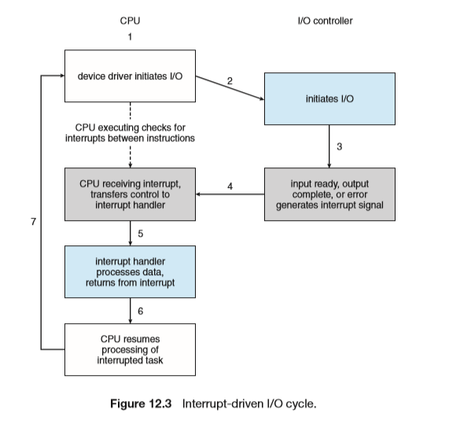

# I/O Systems

## I/O Hardware

设备通过接口连接到总线上，设备通过其他设备连接到总线上称为`daisy chain`，总线下也可以接入其他总线用于低速设备的连接

### Memory-Mapped I/O

IO设备被放在内存空间中，IO设备被映射为内存地址，这样访问IO设备就和访问内存一样

支持MMIO的设备一般有四个寄存器：

- `data-in register`
- `data-out register`
- `status register`
- `control register`

1~4 bytes

### Polling

将信息放入寄存器中，CPU通过周期性的查询以获取信息

- CPU周期从`status register`读`busy bit`
- CPU设读（写）位，如果是读会将数据放入`data-out`
- CPU设置`command-ready bit`
- IO设备控制器读取相应控制位，设置状态，进行相应操作
- 在操作完成后设置相应状态

缺点：IO设备速度不同，对于低速设备，`Polling`会导致CPU资源的浪费

### Interrupts 

通过中断的方式通知CPU

### Direct Memory Access

通过DMA控制器避免CPU频繁的被中断，CPU负责初始化DMA控制器，DMA控制器将数据写到指定的内存并发送中断，再由CPU读取

## Application I/O Interface

