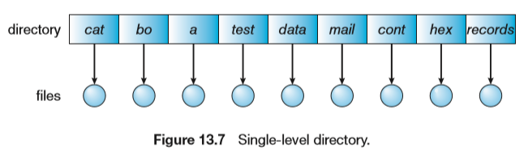
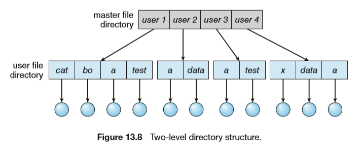
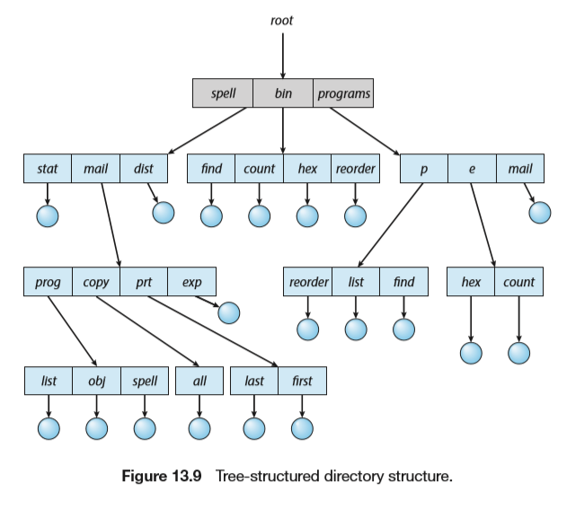
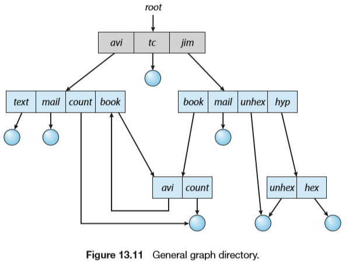
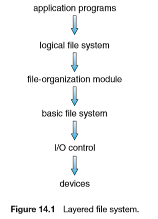
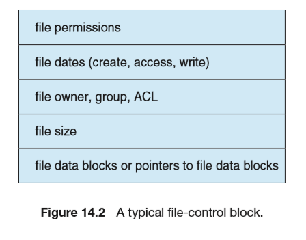
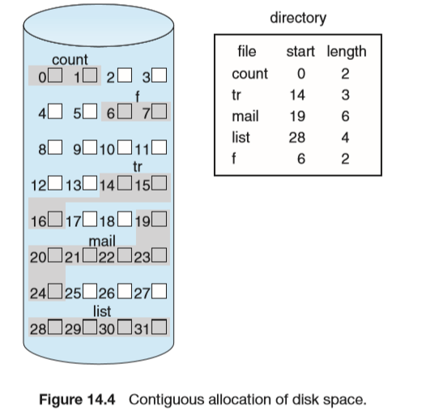
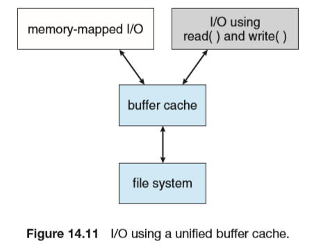

# File-System Interface & Implementation

## File-Ststem Interface

### File Concept

#### File Attributes

#### File Operations

创建 写 读 文件内重定位 删除 截短  

#### File Types

### Access Methods

#### Sequenial access

文件信息按顺序，一个记录接着一个记录处理。访问模式最擦汗能够用，编辑器和编译器用这种方式。读操作读取文件下一文件部分，并自动前移文件指针，跟踪IO位置。写操作向文件尾部增加内容，相应文件指针到新文件结尾。顺序访问基于文件的磁带模型，也适用于随机访问设备。可以重新设置指针到开始位置或者向前向后跳过记录。No read after last write。  

#### Direct access

文件由固定长度的逻辑记录组成，允许程序按任意顺序进行快速读写，直接访问是基于文件的磁盘模型。文件可作为块或记录的编号序列。读写顺序没有限制。可以立即访问大量信息，DB常用。

文件操作必须经过修改从而能将块号作为参数，有读n操作，而不是读下一个；写n操作；定位到n；要实现读n只需要定位n再读下一个即可。注意n是相对块号，相对于文件开始的索引号。

### Directory Structure

#### Single-Level

#### Two-Level

#### Tree-Structured

#### Acyclic-Graph

允许目录含有共享子目录或文件

#### General graph

仅允许向文件链接，不允许链接目录

### Protection

#### Types of Access

- Read
- Write
- Execute
- Append
- Delete
- List
- Attribute change

#### Access Control

三种用户分类

- Owner
- Group
- Other

Linux利用三位数表示文件的权限

 ![“linux 文件权限”的图片搜索结果](data:image/png;base64,iVBORw0KGgoAAAANSUhEUgAAAWEAAACPCAMAAAAcGJqjAAACeVBMVEX////G2KCYtNjampj5+fns7OzU1NQAAAD/AADYlJLD1prY2Nj04ODw9ebk6/X09+z57e3r8Pect9rj4+NuptX/gYIAYrgAqUOZweL/lpeP2K74+v2jvNzjs7Li4uLW47sAr1R50J8Ab73/FBjO4afO790ru20AqEClzfOz38EAZrrioJ5PODf/tbXN2+2zyeSDXFusenhJdW93cWRSWkKVo3kAMWbjl4IXACnBlZf/UhZ5vVXn1N1qmYwAAE8xOkWOseAAACe+v4JwT06eo6WUaWf/AEQmAADB8P//QEP/wsMXGyERAACNp8k3AACesMVziaRueFlVZHiCgoLIwdIAXLcAqG7m//90vuv/c3X/VlhbmM//NDdpJAC4yJTNeF6sl1O55amAXhiPczLIvngAO0gvMyVIeatFVnM5Di9lOgBCT14AAB0vV10oP15LKgAAAC87EQCAqY5yZUobRHSGdYWHk21lUlrYwa2dck7Cm2RxUjf/rr3/van/u9L/0MK84reo4tv/Xzn/37z/i7P/gl7/pMj/0rP/Pmj/8s3/FlNh0MCYyHGN4t8AXMRiOBv/qIr/YIZjt1IPto5ffbz/h53/4flez7EvhMwALlP/mGf/NXV729dyhLvSuIt8PgD/dKBpuE7/gU5PwIBid7j/6Nn/6P+fx2avmob/lYHG8PRxwW72vY//bzB/qsT/PwC+r6IyIQKktrl7hpVgNiYsJiuWVDxCPEtSRTlTMTIoIzcuRkMAHSgAGlYxGih/PCJ1ZzhhYGGfY1EoNihylXZFNRQ2IRyrXUAAG0MWHhpGMACqhpJMAABoXCwVABSaUSkAS1x6S0A/P13PmuKjAAARQElEQVR4nO2cjV8TV7rHhxA7SQQSx8hbcm0MU7AZQQExN91awotSNSEQSqkEE1QUqoi807vea2l1t+2urruV7kJve7dd1929du/tVQSx2upSi7ZUuu1fdJ/nnMkLmECQJLx8zq915sycMy/5zpPfec4xI8cxMTExMTExMTExMTExMTExMTExMTExMTExMTExMTGtPL1RBypY7rtYw0qt5kFbl/s21rL+jRGOu37OCMdZjHDc9MYZMIiaApnw1XzQv3Pa/8hR7TvLcW/i5u+xmZZWcPtx/ZeQmtTnUZx20JSR+xa0I5sNnL/mGl09J9e8hRUF20EF3EZnusWTxilxy2jAijRasaaUinxRDkJY+7YKtPdcDq5U58+RVZMOGv6CFH/5Dlm9y71H1r/ScdrPMkCvAl+TyZTxa+4Cbub9Gk+dR2oafoarjItyzUccl1JvsVjSX1PA0mwxvwycYVMPR6yzoH7TsMxMYqrUSwB3tK6H9/d0ADInJ0eVo9q7Cf68iVvAE/Rbsv/sVbLnd1xqDm7+DiLvQh5hCxG8xWTKvabJg42Mj/Dc70NF3uWGC1hveovTkGYXOU5nTreYzQA33eOxWF57pR426jPhCOVQOuweXlOEIYfoSIP1G1X+XEKnewHZfaDj3gGQ2g9VqrPcuaam85zubVUOuILuQ8B/HoI9R9V0lpxDq/0UEf6hgXsWeHKpGabLSu5C7pVr3LMZGSSY30f0nAi8/0DoGTa8goiH4YIf12+F0DV7NnDO4eE07kWLhQRzQVCG5WITE52r4kfSSOm/gtkaEv4lFlLAHf4OzsAB5ncN2s9V/0nqIZpVH4CbNP3ef5qfkRgFpRrI1uUGwAxxDEwvkt2AGHwEAPuPeNEix6oSL/+x2WLQQfS+xr1iseBdvFJv8es3L8cfQxwFXPVy8Y8hhFVnAy3Abz/REn8ATz5P9yHinBDASPhi8KQXTBkvi+AMlw0XTKZrZFfqZyYS5oE2QHg4GJwuS/rLsAd2OS0WJLp2CIekaMHiC6q9IU0gct9B6/3kt6oAeOLJQcBA+NUQ7xRNGReBrSn3rU+BMt2HURwCGN3gtVlbWz8G2zAXDJnNuGPtuARg3R4shiX8J9Xet7FXa9oXgHqV9HLvBtvMJvxehukKCdkrpgw/VA3p7YKBPpuwLt3sQcDmYbPZE6vPtjIU3iVmEf47ySb+G5e/onvOgUU04qbO32Y2Ye5Tkrdh1Jo+onswnbhCrFnWbMLcnzG1sA+ZiRevKV0N9HTn+AiEzyHb81eJUZAd4BmQZFz9HJK5v8ht5hD+K6B9tQGTM2rDWgCcS7I1kiej5hB2YgA3kARjddvuk4JsbQR94m8OHNiNNmjzs7LAEbJQ1BO01HP/BFwxwbiK0YydHHZ3ez8AkxzMzn7flJuNot0aphBgD2AWFPzgZ9SDte9jegw5h06hAKQeQaFQZFKXRbYeyJOR87JwiJ+0R+QhHV+Ki15IzsjIggzY6Kf/HzAJA0ZuDnZ0n5PqvYb3VMSMPwGHJRabQcdv5Ahgm3cRBnumjMuwJeZhPYzlLpB2udeUQxYMVjNmCvU0ksGIMUuD3m54mUDEUX+jgDN/jsv/pcNkqk9ogw8xI+YgG25C4nTw/AGX+gIpnOXeywtK9gBtXh6yFvPkwTMKRxykAGMSZ326XxZqCtr6egsc8WJ9/RqzYar/q6x0Lfc9MDGtNtn1USpzue80HsraFKWy/Edkb4lS2fIBhuH0KLUGez6Oa1JFqSb/EblkJnhh5eX6j9ieGaW2h7/H1a38rCiV7z8iO1o9v5yfi4mJiWl1KT9/4TZh9bx2iVfOTFviCVaF9u/L2f+Uh+Y+t8RrZ9avySR4llIaVU8bwTEgzG3wmNfYbybmSHdQlbVwq4haOmGOK8C/fF6r0m1SbVIu5QSxIAzDassatQplluqgbuFm8yk2hLk0z/BatIr8nMaUpZ4jRoRhZG3WrzWryG9qfNoEIkQxI8xt0JvX1LTE/n37YsA3loShx8NfWq0RpTQ25S+pgwsoloQhOTbbV/dPUmSlHMzJWmIHF1BsCWOPt/qtQrcpZ1Os+MacMFqFZ3VbhS4r5+CSE4gQxZwwZ1CYV3NyHIsEbZZiT3hVJ8f7m2KTQIQoHoQhObboV2OPt7/pqWfQIis+hDmDfvVNuaXsW8IMWmTFiTBYxSpLjlOWNoMWWXEjDMlx+uqxiiXPoEVWHAmDVayScbQuSxXDBHiO4kl4lSTHyvzYJsAhem7Lli2mK8Hf9sRBhpU/js5vanwzXufWkjdDTXlx/eWJfxxdsMJyi3xqC7GaQYugbEI4d+GGS9J2YhXDlhXlF2+SzAxn0OJ6GW0u/s497j+eMtjNmdstlpX03pJun6pJiTNocUogAsIgjncIo9KG8T2FFZRYbCJvaMUvgQhImYgQRunJm9Er5q+Z9pP3WuLWwYUqOyMRIcwVpJOXbfQLt0yIdDnkxaH4jOHmSGlKSAgPy689r5Apt0YVfX8rTlnwbCXmN8Ib0gq2bzfaPSsjiPfva2xsPLjp4MHF5xFKbUIEFyKX27BIGQyGxR4CgqvN1+HrnkZKqkUcIN9EqiYRepZTrsPLGYyKRMjArZuP8L+ok+MvdQohrATCSQkQJaxMEGFhIcIJAIyE15HPnDDCGxNKeOO6iLbICDPCq4Lw5og2wQjHijCLYUaYEWaEGWFGmBFmhBlhRnilEhb8KIJLISyrsPxiTViSV1JcCYtBUSYar59OuTdQTVr6my+INaTJbMKuGgqixom0jDWkbA/HUBDwDyqwRz54PvZREZYkqXAaFpK60Ea27/WFIqY7g+ixZTRgA63mEC6/zvP8t9/ivxdWRBE2lw3KqM8UiZrT5B8U2w1V5Xe8SZoSB8+f8oaBOktHiwKIZxEWbnRmIjTjRKsRoFS26wWFa8wTwFj5k5+2axvsHYV7a3P6A10ofikzAmDXjD56wtabY46xAeuYwzG2bUBdWFg46egrJLIRnIf6ED7BPO6G0qUDjlvTCzNW3/Q/p7mE73i93uZTsEAs5SWg00W4TEpqOSV6Na8fhqoju4H3N92i5sTdbmi9eyHCmtPd4QjfqPqWP0DEH5hpFYSeVleb3VWqd9Y4KaC6XTJhY0+r4JrorHG6Jnh4CgrXSft8hIXiXYsgvG1anSz5RtRqmyRZb2/bBqSp+qTJsakpB/zpG++Alr6RZGmSH7Cpx/m+hWPY94UtAuFBUWw+JULsFoni0bs7qb45lqTpGSyvevD6YQhrIIxtNEeOBY2AWoEoL5OoiYjyjuZj4QgLzspOJ9FEq9OpuFFmr+yoqeM7Tk610iAu3iUzrOy0G4s7ka2x50vcbrcLSFiOdmoeIUtXtUeInjCQBcL0Ww2Qv8Jt6gUY0of61IU3T9qkZPWlPsnHY2RKD9unqWtT38D/ZFOQ/Hsk6Z5bCk+4BMJXjmHx6G7Zd1uOJTXzO68XaV73khgWNTe7xRY+EJqanpL7paJYvvP4nZIkDTycJPH+brF8wnv/+NfdYpKmujsMYYhiRymRA5Aaz+yqGztQWjPmMRZTwkKPP4Z7egXXdbqzkvcIdWN8aYe9+KUbt0pbsd0/Sks/FoSJ1uIRuwvK8CSKexfhEhiuGMNq9AL1vXYawQNQRh3qs57+yQZVvn+1ST+MEGrW027JesuWLI1DK2uF7cfpyW23bMQb4DjJd8t6G56GHMRzCTuOgw7An6k5hL3e+xDI1V9DlQPgjXnF5k4IaCQOhLu+flAiNvMPvCVQeRS/AyeKRDjZA+99eA4Q9WJYwoEYFoQ6fpdztMPuChJ2XS+TQ/G7IcHloOUbVUOCs669pkZRzHc4R3m0jxFYe4TTd1udrm96nTU1gqLyy+gJ395TON7m48em+APtNgkcgJjwZKnNevPA2Bjs5tErvrA97ABTpnEp3euQrFV9krV6xCb5HiVXjw0UHhoBZwALv9SR7Ju5BSaunpqezyVE6hLHZJfYCV/z8p2DIvgwVB1BwoPi0UeHgd23PPDUdEHYahzd6C7thwOEqwCseARPVBSeMH+SCGxB+K5ml6ISCevRdYkNj9T1UtRdHqHSoSdlYxdUVpahS+DiTK9Q14kbXwqnewXBVdVKvKKybBE+bJMetoFLWCFGpfGZMcrFV2ojX/nJmwPT9Ns/3iYlfy8THgdL/qNb8k18NS3da7NWQxfom7FZu2BtrZr28dgVWrtoX/cE4aRQwqSTA/WfStI8vlNb68WeLgkIt5QOAstB9NyjhDDYQEvZYTzDjDdAeAbzu+YOcrKwhMtqiCCGFc5KSrjUfZKGq/FML+AWSNzqgZ0cw44hJKwnPgxG0mvvKYNndPylzNNwEgECG/OIG+36qAlPDVTc9BN+2G47JP8Ltx0QhZMV8sYjwA2+Kh1qk2MY1g8fST/0/eC23p62VgNLKz9trRqoqKhw9Pk6bcR+whM+UFtb+/gYLL4Bwie6ZTDQX5VXAW5NtZytQQwngQ9DdQjh9icId2P9PyPHMP0yQ7aGDisTBuKj4L9CXZneWEyC2AgxDN9/Gti8XjGH8Ah5SgIShiz5HzwGeWf0MTy1Y8+ltodtSDhZbVPfJLmxZAWX+P7keAfd+AI9t02SfugkAS4jtX0/7ftJ/ZUthPAekE0m3BXWJZpL+/v77x+DxWPIfm9nh+Rc6MdBlzgO4XmkDCwlSFhThbZ99NhhsA+xxUFdQtR8D4sT4Xy4jg/RLkEmjPkw+K7CVYWL60MC9WFojYmya6qXmIA9SJi4BIgQVtD9dbuiJzyGuQOMMpAw8Lg0sAP1I3EJn3x3I1AFPgwY3Uj83iPMlQ/t6ICjAXyAcBeplSjh8D6MppkUyNZaSkMBl9c+5r1+wppLaLFn+Ae199GHvSRZaOGLah+3e8Vy/k7/cXDm8qnrRf1dYOEah/9RzR5xCFtdQMdVs9UIIw5KmIxAINlyXe+lqcOQEb77UDbW8W1uN9+LCZyrqsNtlwkrhDPtbjf4DBJ2nXS7MenoiT6X8P2EmHlb8pOEoTIYw7Te6ijds6er00ZyNsR9D/I37PSQMDyQk3t2lCX7ysixj8LlEi08DuD8PnyiKGRE3Nxe213eP/MAwvu7U5A3jIiEem3tIBQ0/WRgp+mvfUC8BvY2d6MPl9Q+EPGE4fJhhct9nQd/GJ3g21oJYVeVGzXxUmadg5oCpBgA68YMGWdAlZ1mylC0j6K1jMLQ2TjqdkO2VueB5lD0YPzro82H6RgZ/VUmLLsEzbV8d/Frv2fyLsnjSC48WVEhD+msFRCkvgHwlh1QsO7AB7CjAlbWgeSQwfdsws1FBOY/NTAa7oZ0NilUolhSK6s7iQSxf4ghT1IEZyDoGnyYFCDJCEe4km/zCPSbXQeBhxmWixB22yEn8I/PMBEWaH4bMi1BBhekEDLikNtgZAvRxrB6m404BSzaCWF0Tyt0N26SUbRXoH68S3CT0AyZlpD8Cym4Jfm3I43pFlDIpFB57YLzEeUy2ebu8PMSiiCwwIDXP7sTMulDYtYT/ZybwtUmjwUXN7emfrJo7aMusYPQm5w1JTS/SFw/BeFZtBdsEeYhPO38sLAIwIucW5tXUrhVVAq0jev88JMPgc3Ax1uMMCPMCDPCjDAjzAgzwowwI7xSCSfoXSRKeFFjtKfWQr+BVydCfsLK1ERIKxPm0hIibv73OHQpiZBSJpwoJfZq8xBO4F1sxM+8bt3m9eufIf+jnsG1XA4pzCmH2XjmyfKs82xej1dTrtuIW6GNwyyjvXrEC8PVNkbmCDexeX0CtHnzRiX5zJsBa9y1nvpioq62fuM8byziY07ATQQ+M0RxQqRM/NUiIk7wXSgTo8CnS+TVIiJeCXfBxMTExMTExMTExMTExMTExMTExMTExMTEtNz6f1ykTPq+mh/JAAAAAElFTkSuQmCC) 

## File-System Implementation

### File-System Structure

- application programs：发出文件请求
- logical file system：管理元数据：文件系统的所有结构数据，而不包括文件的实际顺序；根据给定符号文件名来管理目录结构；逻辑文件系统通过FCB（inode in UNIX）来维护文件结构。
- file-organization module：知道文件及其逻辑块和物理块，包括空闲空间管理器。
- basic file system：向合适的设备驱动程序发送一般命令就可对磁盘上的物理块进行读写
- I/O conrol：由设备驱动程序和中断处理程序组成， 实现内存与磁盘之间的信息转移

### File-System Operations

#### Overview

### Directory Implementation

- Linear List
- Hash Table

### Allocation Methods

#### Contiguous Allocation

连续分配，存在外碎片问题

#### Linked Allocation

链接分配

#### Indexed allocation

#### Performance

### Free-Space Management

位图bit vector：空闲置0占有置1，块数计算：(number of bits per word)*(number of 0-value words)+offset of first 1bit

位向量所需空间的计算：disk size/block size 便于查找连续文件。

采用链表管理：将所有的空闲块链接起来，将指向第一个空闲块的指针保存在磁盘的特殊位置并且还存在内存中。但是IO效率很低，因为需要遍历。

对空闲链表的改进是将n个空闲块的地址存到第一个空闲块中。这样可以快速找到大量空闲块的地址。

还有计数的方法：不记录n个空闲块的地址，而是记录第一各空闲块和紧跟着的空闲块的数量n。

### Effciency and Performance

### Recovery

#### Consistency Checking 

对文件的创建，修改会更改目录表等内容，当出现突发状况时有可能导致信息的不一致

#### Log-Structured File Systems

对数据的修改会被记录在log中，当信息不一致时检查log根据log记录的信息重新开始