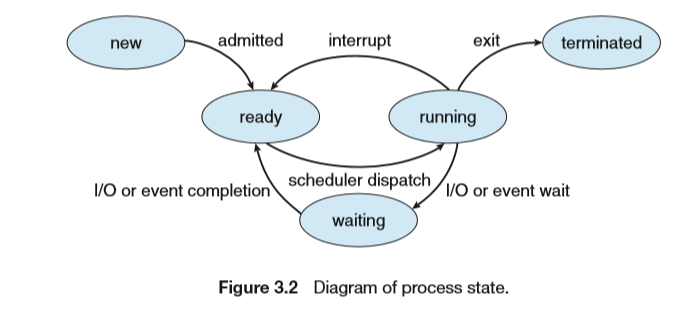
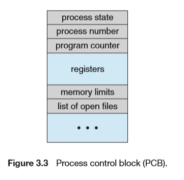

## Process Concept

### The Process

A process include：

- Text section

- Data section

- Heap section

- Stack section


### Process State

- New：The process is being created
- Running.Instructions are being executed
- Waiting. The process is waiting for some event to occur (such as an I/O completion or reception of a signal)
- Ready. The process is waiting to be assigned to a processor.
- Terminated. The process has finished execution



### Process Control Block(PCB)

Each process is represented in the operating system by a process control block (PCB)—also called a task control block.

It contains many pieces of information associated with a specific process, including these:



### Threads

一个进程内可有多个线程

## Process Scheduling

Linux的PCB采用`task_struct`表示，位于<linux/sched.h>

`task_struct`为一个双向链表，Linux内核使用current指针指向当前运行的进程

进程进入到系统时会被放入`ready queue`

等待特定事件发生的进程会被放入`wait queue`


### CPU Scheduling

### Context Switch


## Operations on Processes

### Process Creation

- tree of processes
- process identifie(pid)
- address space
  - child duplicate of parent
  - child has a program loaded into it
- code example

```c
#include <sys/types.h> 
#include <stdio.h> 
#include <unistd.h>
int main() 
{ 
	pid t pid;

	/* fork a child process */ 
	pid = fork();
	
	if (pid < 0) { /* error occurred */ 
		fprintf(stderr, "Fork Failed"); 
		return 1; 
	} 
	else if (pid == 0) { /* child process */ 
		execlp("/bin/ls","ls",NULL);
    } 
    else { /* parent process */ 
    	/* parent will wait for the child to complete */
    	wait(NULL);
    	printf("Child Complete")
    } 
    
    return 0;
}
```


## Interprocess Communication

- reasons
- Interprocess Communication(IPC)
- communications models

## IPC in Shared-Memory Systems

```c
#define BUFFER SIZE 10
typedef struct { 
...
} item; 

item buffer[BUFFER SIZE];
int in = 0;
int out = 0; 
item next produced;

while (true) {
    /* produce an item in next produced */
    while (((in + 1) % BUFFER SIZE) == out)
        ; /* do nothing */
    buffer[in] = next produced;
    in = (in + 1) % BUFFER SIZE;
}

```


## IPC in Message-Passing Systems

send(message) & receive(message)

### Naming

### Synchronization

阻塞和非阻塞也称为同步（synchronous）或异步（asynchronous）

- 阻塞发送（blocking send）
- 非阻塞发送（nonblocking send）
- 阻塞接收（blocking receive）
- 非阻塞接收（nonblocking receive）

### Buffer

- 零容量
- 有限容量
- 无限容量

## Examples  of IPC Systems

pipes

## Communication in Client-Server Systems

Socket

## Assignments

### 3-21

```c
#include <sys/types.h> 
#include <stdio.h> 
#include <unistd.h>
#include <sys/wait.h>
#include <stdlib.h>

int main(int argc,char *argv[]) 
{
    int number = atoi(argv[1]); 
	pid_t pid;

	/* fork a child process */ 
	pid = fork();
	
	if (pid < 0) { /* error occurred */ 
		fprintf(stderr, "Fork Failed"); 
		return 1; 
	} 
	else if (pid == 0) { /* child process */ 
		while(number != 1){
			printf("%d ",number);
			if(number % 2){
				number = 3 * number + 1;
			} // number is odd
			else{
				number = number / 2;
			} //number is even
		}
        if(number <= 0){
            printf("please enter a positive number.");
            return 1;
        }
		printf("1\n");
    } 
    else { /* parent process */ 
    	/* parent will wait for the child to complete */
    	wait(NULL);
    	printf("Complete\n");
    } 
    
    return 0;
}
```

### 3-22

```c
#include <sys/types.h> 
#include <stdio.h> 
#include <stdlib.h>
#include <fcntl.h>
#include <unistd.h>
#include <sys/shm.h>
#include <sys/stat.h>
#include <sys/mman.h>
#include <sys/wait.h>

int main(int argc,char *argv[]) 
{
    const int SIZE = 4096;
    const char *name = "3-22";
    int fd;
    int *ptr;

    int number = atoi(argv[1]); 
	pid_t pid;

	/* fork a child process */ 
	pid = fork();
	
	if (pid < 0) { /* error occurred */ 
		fprintf(stderr, "Fork Failed"); 
		return 1; 
	} 
	else if (pid == 0) { /* child process */ 
        fd = shm_open(name,O_CREAT|O_RDWR,0666);
        ftruncate(fd, SIZE);
        ptr = (int *)mmap(0, SIZE, PROT_READ | PROT_WRITE, MAP_SHARED, fd, 0);
		while(number != 1){
			*ptr = number;
            ptr++;
			if(number % 2){
				number = 3 * number + 1;
			} // number is odd
			else{
				number = number / 2;
			} //number is even
		}
		*ptr = 1;
		printf("Child Complete\n");
    } 
    else { /* parent process */ 
    	/* parent will wait for the child to complete */
    	wait(NULL);
        fd = shm_open(name, O_RDONLY , 0666);
        ptr = (int *) mmap(0, SIZE, PROT_READ, MAP_SHARED, fd, 0);
        while(*ptr != 1){
            printf("%d ",*ptr);
            ptr++;
        }
		printf("%d\n", *ptr);
         shm_unlink(name);
    	printf("Parent Complete\n");
    } 
    
    return 0;
}
```

### Project2

```c
/**
 * Kernel module that communicates with /proc file system.
 *
 * This provides the base logic for Project 2 - displaying task information
 */

#include <linux/init.h>
#include <linux/slab.h>
#include <linux/sched.h>
#include <linux/module.h>
#include <linux/kernel.h>
#include <linux/proc_fs.h>
#include <linux/vmalloc.h>
#include <asm/uaccess.h>

#define BUFFER_SIZE 128
#define PROC_NAME "pid"

/* the current pid */
static long l_pid;

/**
 * Function prototypes
 */
static ssize_t proc_read(struct file *file, char *buf, size_t count, loff_t *pos);
static ssize_t proc_write(struct file *file, const char __user *usr_buf, size_t count, loff_t *pos);

static struct file_operations proc_ops = {
        .owner = THIS_MODULE,
        .read = proc_read,
        .write = proc_write,
};

/* This function is called when the module is loaded. */
static int proc_init(void)
{
        // creates the /proc/procfs entry
        proc_create(PROC_NAME, 0666, NULL, &proc_ops);

        printk(KERN_INFO "/proc/%s created\n", PROC_NAME);

	return 0;
}

/* This function is called when the module is removed. */
static void proc_exit(void) 
{
        // removes the /proc/procfs entry
        remove_proc_entry(PROC_NAME, NULL);

        printk( KERN_INFO "/proc/%s removed\n", PROC_NAME);
}

/**
 * This function is called each time the /proc/pid is read.
 * 
 * This function is called repeatedly until it returns 0, so
 * there must be logic that ensures it ultimately returns 0
 * once it has collected the data that is to go into the 
 * corresponding /proc file.
 */
static ssize_t proc_read(struct file *file, char __user *usr_buf, size_t count, loff_t *pos)
{
        int rv = 0;
        char buffer[BUFFER_SIZE];
        static int completed = 0;
        struct task_struct *tsk = NULL;

        if (completed) {
                completed = 0;
                return 0;
        }

        tsk = pid_task(find_vpid(l_pid), PIDTYPE_PID);
        if(tsk)
                rv = sprintf(buffer,"command = [%s] pid = [%d] state = [%ld]",tsk->comm,tsk->pid,tsk->state);
        else
                rv = sprintf(buffer,"0")
        completed = 1;

        // copies the contents of kernel buffer to userspace usr_buf 
        if (copy_to_user(usr_buf, buffer, rv)) {
                rv = -1;
        }

        return rv;
}

/**
 * This function is called each time we write to the /proc file system.
 */
static ssize_t proc_write(struct file *file, const char __user *usr_buf, size_t count, loff_t *pos)
{
        char *k_mem;

        // allocate kernel memory
        k_mem = kmalloc(count, GFP_KERNEL);

        /* copies user space usr_buf to kernel buffer */
        if (copy_from_user(k_mem, usr_buf, count)) {
		printk( KERN_INFO "Error copying from user\n");
                return -1;
        }

        sscanf(k_mem, "%ld", &l_pid);

	/**
 	 * kstrol() will not work because the strings are not guaranteed
	 * to be null-terminated.
	 * 
	 * sscanf() must be used instead.
	 */

        kfree(k_mem);

        return count;
}

/* Macros for registering module entry and exit points. */
module_init( proc_init );
module_exit( proc_exit );

MODULE_LICENSE("GPL");
MODULE_DESCRIPTION("Linux Kernel Module for Task Information");
MODULE_AUTHOR("Clicker");
```

### Project3

#### Part1

```c
#include <linux/init.h>
#include <linux/module.h>
#include <linux/kernel.h>
#include <linux/sched.h>

struct task_struct *task;
struct list_head *list;

/* This function is called when the module is loaded. */
int proc_init(void)
{
    for_each_process(task){
        /* on each iteration task points to the next task */
        printk( KERN_INFO "command = [%s] pid = [%d] state = [%ld]",task->comm,task->pid,task->state);
    }
	return 0;
}

/* This function is called when the module is removed. */
void proc_exit(void) {
    printk( KERN_INFO "exit");
}

module_init( proc_init );
module_exit( proc_exit );

MODULE_LICENSE("GPL");
MODULE_DESCRIPTION("Linux Kernel Module for Listing Tasks");
MODULE_AUTHOR("Clicker");
```

#### Part2

```c
#include <linux/init.h>
#include <linux/module.h>
#include <linux/kernel.h>
#include <linux/sched.h>


void dfs(struct task_struct *task){
    struct task_struct *child;
    struct list_head *list;

    printk( KERN_INFO "command = [%s] pid = [%d] state = [%ld]",task->comm,task->pid,task->state);

    list_for_each(list, &task->children){
        child = list_entry(list, struct task_struct, sibling);
        dfs(child);
    }
}

/* This function is called when the module is loaded. */
int proc_init(void)
{
    printk( KERN_INFO "init");

    dfs(&init_task);
	return 0;
}

/* This function is called when the module is removed. */
void proc_exit(void) {
    printk( KERN_INFO "exit");
}

module_init( proc_init );
module_exit( proc_exit );

MODULE_LICENSE("GPL");
MODULE_DESCRIPTION("Linux Kernel Module for Listing Tasks");
MODULE_AUTHOR("Clicker");
```

