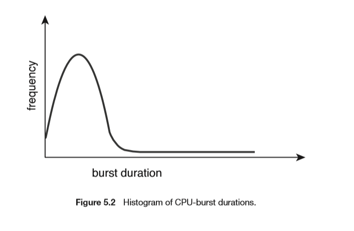
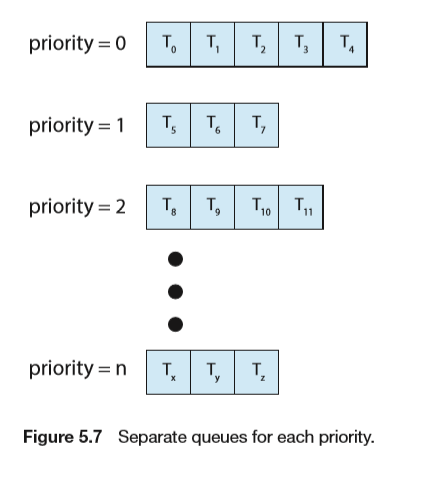
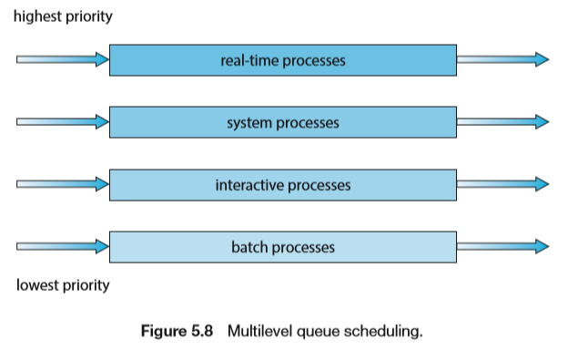
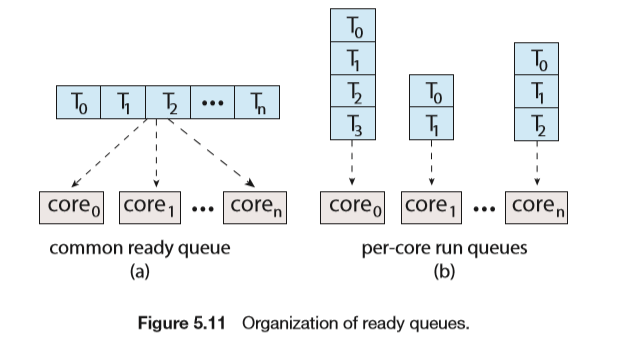
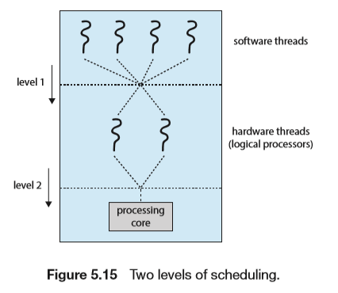

# CPU Scheduing

## Basic Concepts

- 大部分任务占用CPU的时间较短

### Preemptive and Nonpreemptive Scheduling

CPU-scheduing decisions may take place when a process：

- run->wait
- run->ready
- wait->ready
- Terminates

1，4是非抢占的（Nonpreemptive）

其他的是抢占的（Preemptive）

### Dispatcher

分派程序(dispatcher)将CPU的控制交给由短程调度选择的进程。功能有：

- 上下文切换 

- 切换到用户模式 

- 跳转到用户程序的合适位置来重启程序。

  

分派程序停止一个进程而启动另一个所需要花费的时间叫分派延迟(dispatcher latency)。

## Scheduling Cruteria

- CPU utlization
- Throughput
- Turnaround time
- Wating time
- Response time

## Scheduling Algorithms

### First-Come，First-Served Scheduling

- 根据就绪状态的先后分配CPU
- 非抢占

### Shortest-Job-First Scheduling（SJF）

- 对预计执行时间短的作业优先分配CPU
- 非抢占
- 对于时间的估计可以根据历史时间预测

### Shortest-Remaining-Time-First（SRTF）

- 如果新来的进程时间比当前短，则抢占

### Round-Robin Scheduling

- 设置一个较小的时间单元（10ms~100ms）为时间片，轮转调度
- 对于运行时间小于时间片的程序，CPU会直接释放
- 抢占
- 时间片过长------相当于FCFS算法
- 时间片过短------上下文交换（10us）频繁，效率低
- 一般设定时间片时间应大于80%的程序运行时间

### Priority Scheduling

- 根据任务优先级调度
- 有抢占和非抢占两种方式
- 问题：无穷堵塞，低优先级的任务可能永远不会执行，解决方法：优先级会随时间提升
- 可以与Round-Robin Scheduling算法相结合，但依旧是优先级高的在前

### Multilevel Queue Scheduling

- 将进程根据优先级分为不同的队列，每个队列采用的算法可能不同

### Multilevel Feedback Queue Scheduling

- RR与优先级的结合
- 

## Thread Scheduling

- 内核级线程才是操作系统调度的，而用户级线程由线程库管理
- PCS&SCS

### Pthread Scheduling

## Multi-Processor Scheduling

multiprocessor now applies to the following system architectures:

- Multicore CPUs 
- Multithreaded cores 
- NUMA systems 
- Heterogeneous multiprocessing

### Approaches to Multiple-Processor Scheduling

- 非对称多处理和对称多处理

### Mulicore Processors

- 单核双线程（硬件线程）

### Load Balancing

两种方法：

- Push migration（从超载处理器推任务到空闲处理器）
- Pull migration（空闲处理器从超载服务器上拉任务）

### Processor Affinity

- 缓存对任务有加速效果
- 当任务从一个核移动到另外一个核时，亲和性就会消失
- 软亲和性：尽可能保证在同一处理器，但仍可迁移
- 硬亲和性：不可迁移

## Real-Time CPU Scheduling

- 软实时：不保证实时调度，但优先级更高
- 硬实时：保证在截止期限之前完成

### Minimizing Latency

### Priority-Based Scheduling

### Rate-Monotonic Scheduling

- 周期越短，优先级越高
- 在调度N个线程时，CPU利用率为，需要高于该利用率的调度任务将无法成功调度

$$
N(2^{1/N}-1)
$$

- p1=50，t1=25，p2=80，t2=35

### Earliest-Deadline-First Scheduling

- 按照截止时间分配，抢占式

## Operating-System Examples

### Linux

- Completely Fair Scheduler（CFS）
- Scheduling classes
  - 每个类有特定优先级
  - 调度程序从最高优先级调度类取最高优先级任务
- 按比例分配时间，根据为友好度，较低的友好度对应较高的相对优先级
- 红黑树记录vruntime，vruntime低的会被先执行

## Assignment

- 5.4, 5.5
- Scheduling Algorithms