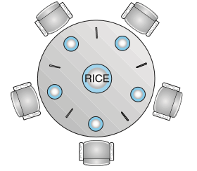

# Synchronization Examples

## Classic Problems of Synchronization

### Bounded-Buffer Problem

设置N个缓冲

信号量`mutex`初始化为1（满足互斥要求）

信号量`full`初始化为0（代表满的缓冲的个数）

信号量`empty`初始化为N（代表空的缓冲的个数）

**producer**

```c
while (true){
    /* ...
    produce an item in next_produced
    ... */
    wait(empty); 
    wait(mutex);
    /* ...
    add next produced to the buffer
    ... */
    signal(mutex);
    signal(full);
}
```

**cusumer**

```c
while (true){
    wait(full); 
    wait(mutex);
    /* ...
    remove an item from buffer to next_consumed 
    ... */
    signal(mutex);
    signal(empty);
    /* ...
    consume the item in next consumed 
    ... */
}
```

### The Readers-Writers Problem

- Reader：只能读数据，不更新数据
- Writer：可写可读

第一读写问题：允许多个读者同时读，但是只有一个写者，也就是没有读者会因为写者在等待而等待其他读者的完成，写者可能饿死

第二读写问题：写者就绪后，写者就立即开始写操作，也就是说写者等待时，不允许新读者进行操作，读者可能饿死

- Data
- 信号量`rw_mutex`初始化为1
- 信号量`mutex`初始化为1
- `read_count`初始化为0（代表当前的`Reader`数量）

#### Writer

```c
while (true) {
    wait(rw mutex);
    ... 
        /* writing is performed */ 
    ... 
    signal(rw mutex);
}

```

#### Reader

```c
while (true) { 
    wait(mutex);
    read_count++;
    if (read_count == 1) //第一个读者锁rw_mutex
        wait(rw_mutex);
    signal(mutex);
    ... 
        /* reading is performed */ 
    ... 
    wait(mutex);
    read_count--;
    if (read_count == 0) //最后一个读者释放锁rw_mutex
        signal(rw_mutex);
    signal(mutex); 
}
```

### Dining-Philosophers Problem

哲学家只会思考和吃饭

N个哲学家，N个筷子，每个哲学家和邻居共享一根筷子，吃饭需要两根筷子



```c
while (true) { 
    wait(chopstick[i]);
    wait(chopstick[(i+1) % 5]);
    ... 
    /* eat for a while */
    ... 
    signal(chopstick[i]);
    signal(chopstick[(i+1) % 5]);
    ...
        /* think for awhile */ 
    ... 
}
```

出现的问题：每个人拿起自己的筷子，造成死锁

#### Semaphore Solution

- 只允许有四个哲学家在桌子上
- 只允许哲学家在能同时拿到两个筷子的时候才拿
- 奇数先拿左手，偶数先拿右手

#### Monitor Solution

```c
monitor DiningPhilosophers {
    enum {THINKING, HUNGRY, EATING} state[5];
    condition self[5];
    
	void pickup(int i) {
        state[i] = HUNGRY; 
        test(i);
        if (state[i] != EATING) 
            self[i].wait(); //拿不到筷子，等待
    } 
    
    void putdown(int i) {
        state[i] = THINKING;
        // 查看左右两边需不需要筷子
        test((i + 4) % 5);
        test((i + 1) % 5);
    } 
    
    void test(int i) {
        if ((state[(i + 4) % 5] != EATING) && (state[i] == HUNGRY) && (state[(i + 1) % 5] != EATING))
        { 
            state[i] = EATING;
            self[i].signal(); //通知在等待筷子的哲学家
        }
    } 
    
    initialization code() {
        for (int i = 0; i < 5; i++) 
            state[i] = THINKING; 
    }
}
```

不会出现死锁，但有可能出现饥饿

- `signal()`通知的进程是随机的，有可能会有非洲来的哲学家

## Synchronization within the Kernel

### Linux

提供`atomic_t`数据类型保证对整数操作的原子性

`spinlocks`，忙等待锁

## POSIX Synchronzation

### Mutex Locks

```c
#include <pthread.h>

pthread_mutex_t mutex;

/* create and initialize the mutex lock */ 
pthread_mutex_init(&mutex,NULL);

/* acquire the mutex lock */ 
pthread_mutex_lock(&mutex);

/* critical section */

/* release the mutex lock */ 
pthread_mutex_unlock(&mutex);
```

### Semaphores

**two version**

- named
- unnamed

####  Named Semaphores 

```c
#include <semaphore.h> 
sem_t *sem;

/* Create the semaphore and initialize it to 1 */ 
sem = sem_open("SEM", O_CREAT, 0666, 1);

/* acquire the semaphore */ 
sem_wait(sem);

/* critical section */

/* release the semaphore */ 
sem_post(sem);
```

#### Unnamed Semaphores 

```c
#include <semaphore.h> 
sem_t sem;

/* Create the semaphore and initialize it to 1 */
sem_init(&sem, 0, 1);

/* acquire the semaphore */ 
sem_wait(&sem);

/* critical section */

/* release the semaphore */ 
sem_post(&sem);
```

### Condition Variables

```c
pthread_mutex_t mutex; 
pthread_cond_t cond_var;

pthread_mutex_init(&mutex,NULL);
pthread_cond_init(&cond_var,NULL);

pthread_mutex_lock(&mutex);
while (a != b)
	pthread_cond_wait(&cond_var, &mutex); //等待时释放mutex锁
pthread_mutex_unlock(&mutex);
```

另一进程

```c
pthread_mutex_lock(&mutex); 
a = b; 
pthread_cond_signal(&cond_var);
pthread_mutex_unlock(&mutex);
```

## Alternative Approaches

### Transaction Memory

完成所有事情后才提交修改，否则中止操作并回滚

## Assignmen

project1、3、4