## 桌子

1. 利用切角长方体创建桌腿
2. 利用长方体创建横梁
3. 利用对齐工具和移动工具将两个元件放到合适的位置

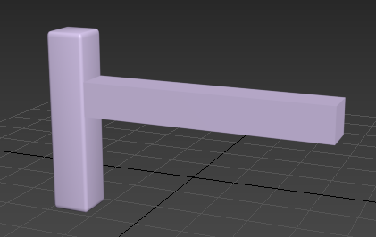

4. 通过复制，旋转等方法得到桌子的底部

5. 用切角长方体做出桌面，对齐并调整整体比例

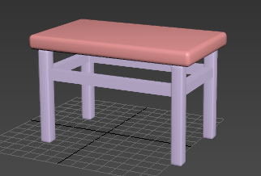

## 椅子

建模过程参考https://zhuanlan.zhihu.com/p/28014533 

1. 建立椅子腿

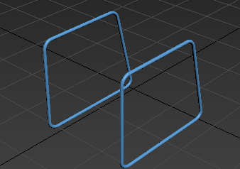

2. 利用平面建立椅子主体，并利用挤出和切角做出圆弧

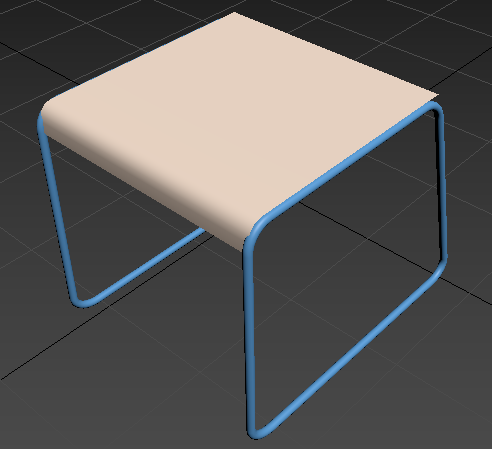

3. 椅背同理创建

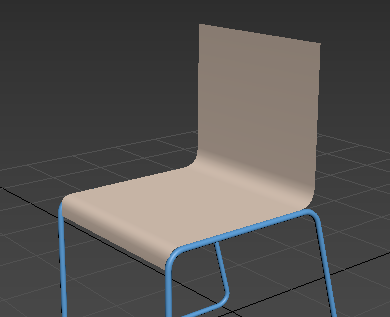

4. 将椅背往后拉，并将顶部的边缩短

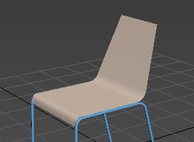

5.  "环形”选择曲面方向上的所有边，应用“连接”命令。 

6. 选择椅背上的点，应用"FFD 3x3x3"修改器，顶视图选中间的点往后拉，左视图选择中间上面的点往上拉，形成椅背的弧度

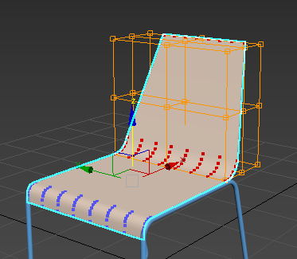

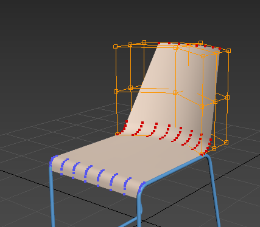

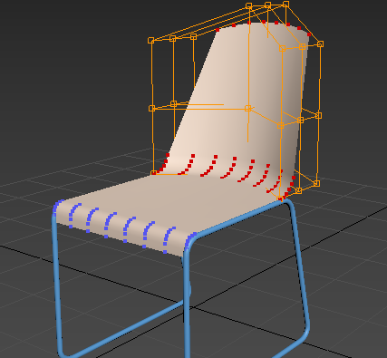

7. 同理选择坐位处的点，应用"FFD 3x3x3"修改器形成弧度

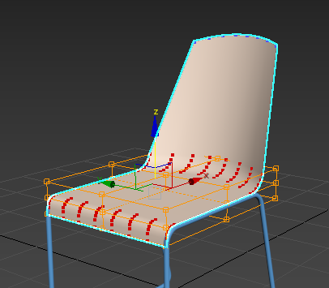

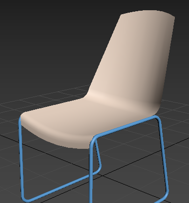

8. 通过连接和切角，选中椅背上一小部分进行删除

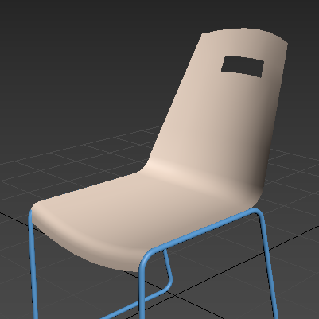

9. 使用壳修改器给椅子主体添加厚度

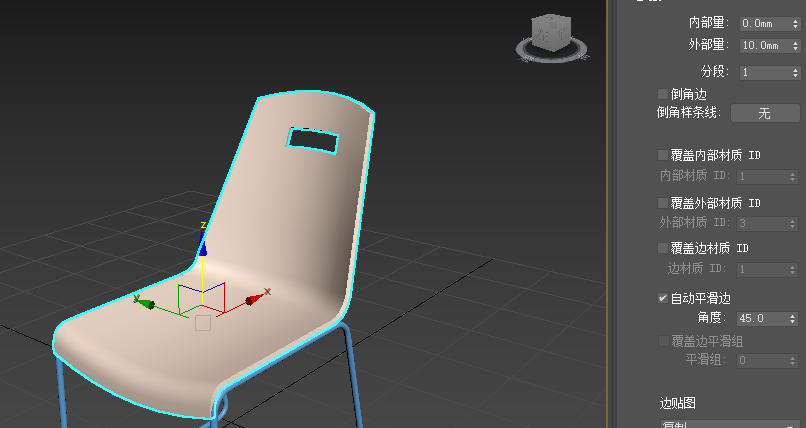

10. 环形选择侧面的边，应用连接

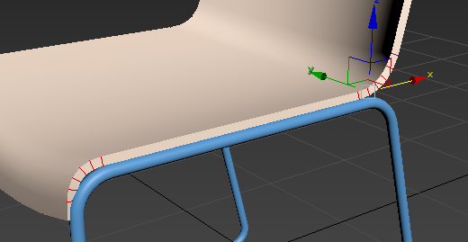

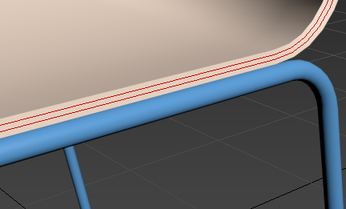

11. 使用网格平滑修改器

## 枕头

1. 创建一个长方体

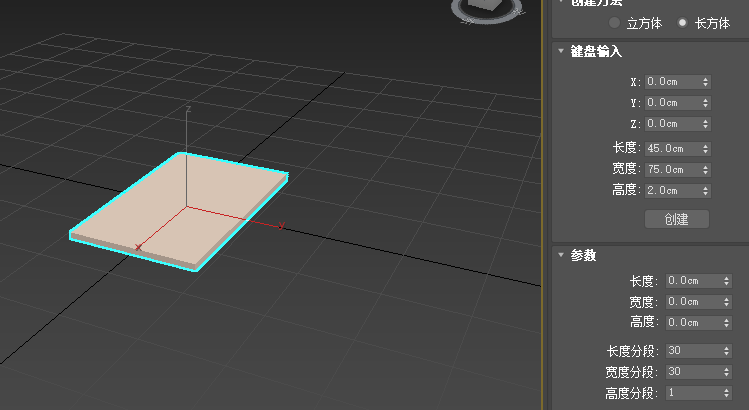

2. 添加mCloth修改器，参数如下，然后点击烘培，在下方选择合适的帧

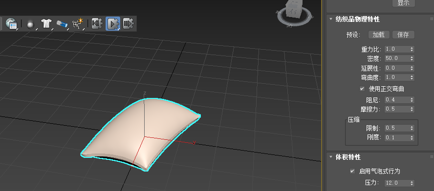

3. 将枕头转换为可编辑多边形，应用涡轮平滑修改器（默认参数）

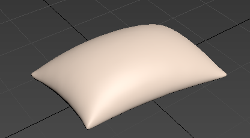

## 床

1. 利用长方体和切角长方体做出床头和床身

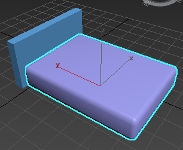

2. 在床上方建立一个平面（长宽度分段50），然后用壳工具添加厚度

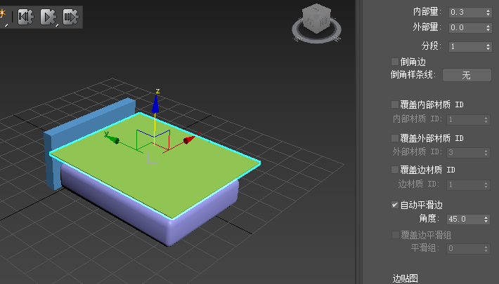

3. 添加Cloth修改器，点击对象属性，设置床单为布料，并通过添加对象，添加床身为冲突对象，然后进行模拟

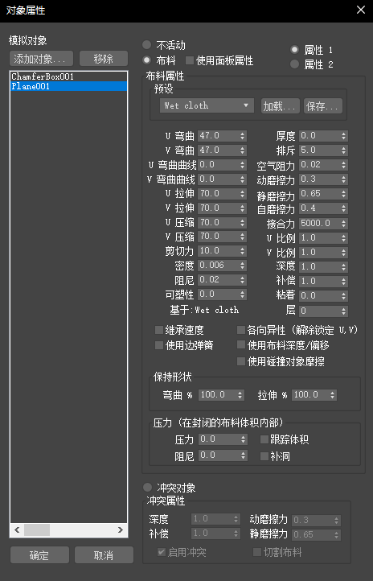

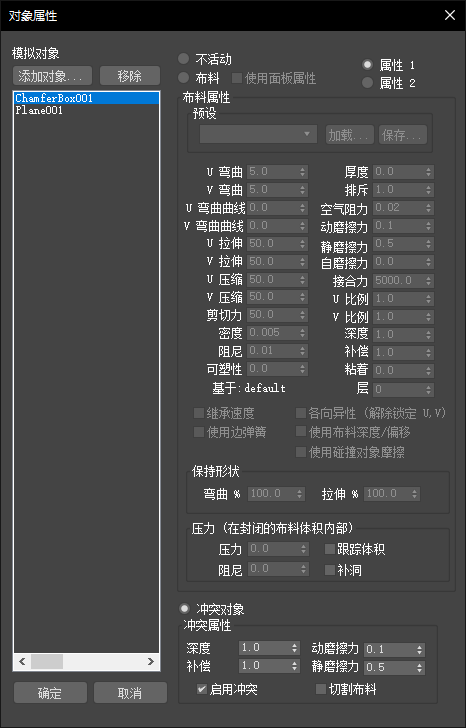

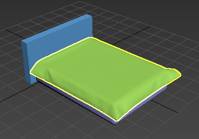

4. 在床上方再建一平面作为被子

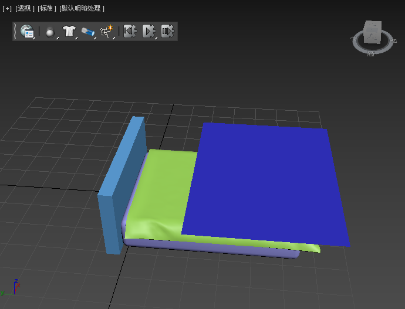

5. 给被子勾画出细节，然后环形选择边，连接

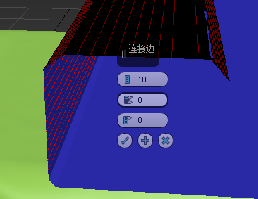

6. 类似上面的过程添加布料效果，然后进行涡轮平滑

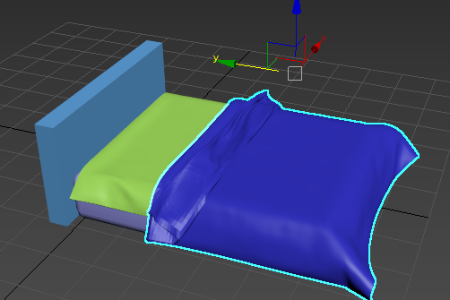

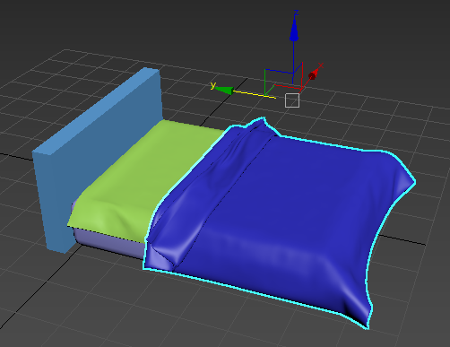

7. 添加枕头，通过MassFX Rigid Body修改器设置枕头为运动学刚体，其下面的床单和被子为静态学刚体，烘培然后选择合适的帧

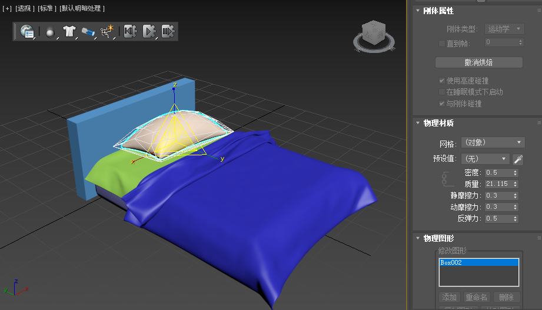

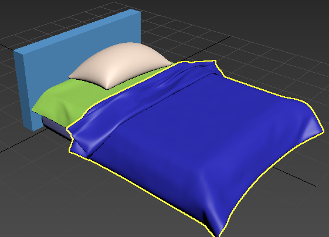

## 台灯

1. 用线作出灯柱的形状，添加圆角，在渲染中开启厚度

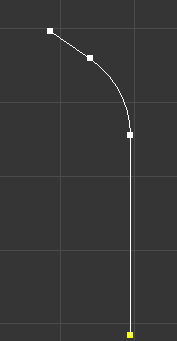

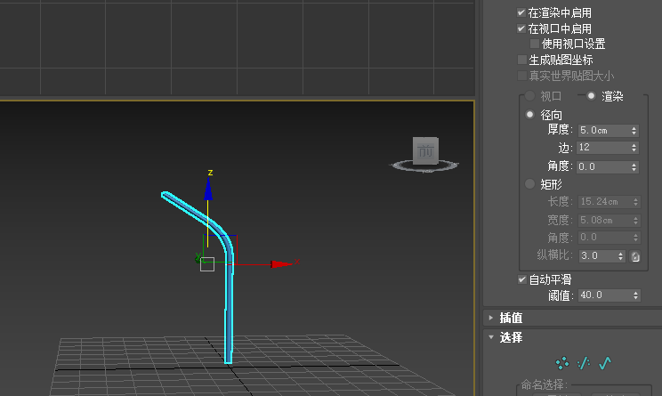

2. 用切角圆柱体做出底座，对齐工具对齐

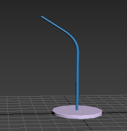

3. 作一个小圆柱体连接到灯柱上

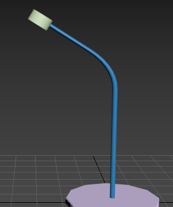

4. 再做一个大的圆锥连接到刚才的圆柱，将其切换成可编辑网格，选择底面删除

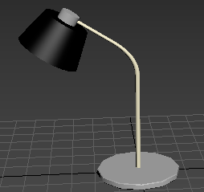

