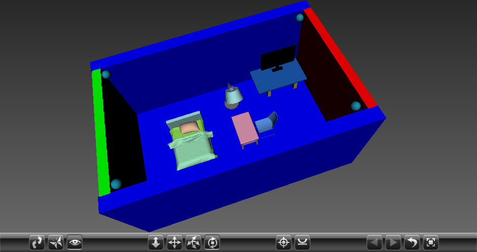
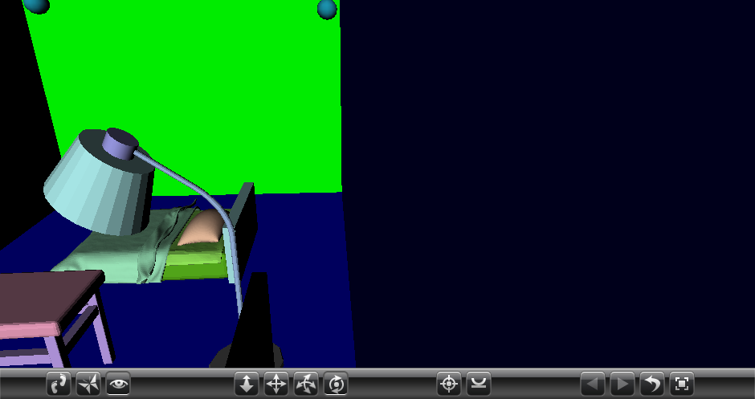
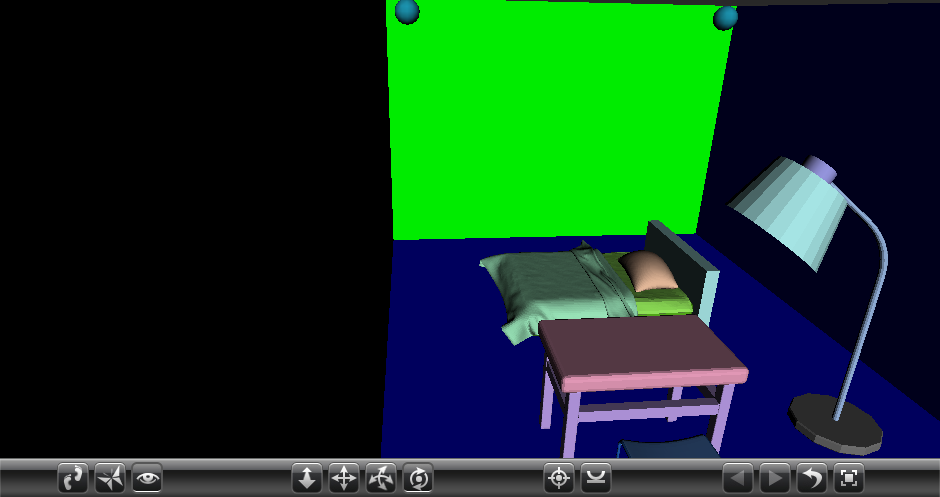
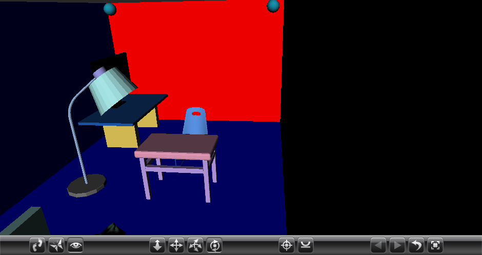
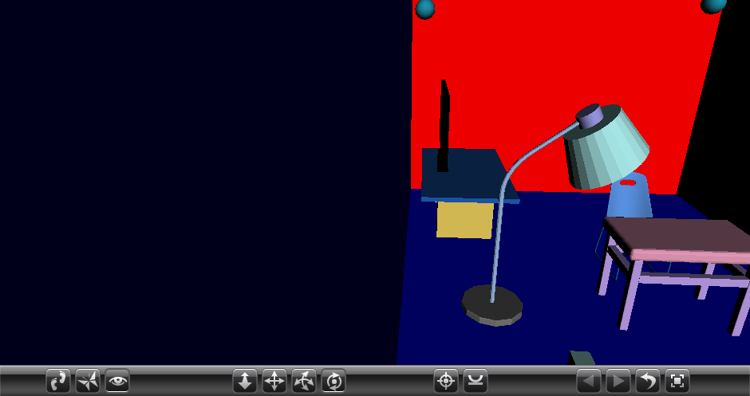

## 整体结果



## 建模四面墙壁 

```vrml
DEF Box006 Transform {
  translation 32 -15 80
  children [
      Transform {
        translation 0 60 0
        children [
          Shape {
            appearance Appearance {
              material Material {
                diffuseColor 0 0 1
              }
            }
            geometry Box { size 270 120 15 }
          }
    ] }
  ]
}
DEF Box007 Transform {
  translation 32 -15 -84
  children [
      Transform {
        translation 0 60 0
        children [
          Shape {
            appearance Appearance {
              material Material {
                diffuseColor 0 0 1
              }
            }
            geometry Box { size 270 120 15 }
          }
    ] }
  ]
}
DEF Box008 Transform {
  translation 162 -15 -2
  children [
      Transform {
        translation 0 60 0
        children [
          Shape {
            appearance Appearance {
              material Material {
                diffuseColor 1 0 0
              }
            }
            geometry Box { size 10 120 150 }
          }
    ] }
  ]
}
DEF Box009 Transform {
  translation -97 -15 -2
  children [
      Transform {
        translation 0 60 0
        children [
          Shape {
            appearance Appearance {
              material Material {
                diffuseColor 0 1 0
              }
            }
            geometry Box { size 10 120 150 }
          }
    ] }
  ]
}
```

## 建模地面 

```
DEF Box005 Transform {
  translation 32 0 -2
  children [
      Transform {
        translation 0 -7.5 0
        children [
          Shape {
            appearance Appearance {
              material Material {
                diffuseColor 0 0 1
              }
            }
            geometry Box { size 250 15 150 }
          }
    ] }
  ]
}
```

## 建模桌子 

```
# 桌腿
DEF Box010 Transform {
  translation 100 0 -50
  children [
      Transform {
        translation 0 12.5 0
        children [
          Shape {
            appearance Appearance {
              material Material {
                diffuseColor 0.8824 0.7765 0.3412
              }
            }
            geometry Box { size 5 25 25 }
          }
    ] }
  ]
}
DEF Box011 Transform {
  translation 140 0 -50
  children [
      Transform {
        translation 0 12.5 0
        children [
          Shape {
            appearance Appearance {
              material Material {
                diffuseColor 0.8824 0.7765 0.3412
              }
            }
            geometry Box { size 5 25 25 }
          }
    ] }
  ]
}
# 桌面
DEF Box012 Transform {
  translation 117 25 -50
  children [
      Transform {
        translation 0 1 0
        children [
          Shape {
            appearance Appearance {
              material Material {
                diffuseColor 0.1098 0.349 0.6941
              }
            }
            geometry Box { size 70 2 40 }
          }
    ] }
  ]
}
```

## 建模显示器 

```
DEF Box013 Transform {
  translation 120 27 -60
  children [
      Transform {
        translation 0 0.5 0
        children [
          Shape {
            appearance Appearance {
              material Material {
                diffuseColor 0 0 0
              }
            }
            geometry Box { size 15 1 5 }
          }
    ] }
  ]
}
DEF Cylinder002 Transform {
  translation 120 28 -60
  children [
      Transform {
        translation 0 4 0
        children [
          Shape {
            appearance Appearance {
              material Material {
                diffuseColor 0 0 0
              }
            }
            geometry Cylinder { radius 2.5 height 8 }
          }
    ] }
  ]
}
DEF Box014 Transform {
  translation 120 36 -60
  children [
      Transform {
        translation 0 15 0
        children [
          Shape {
            appearance Appearance {
              material Material {
                diffuseColor 0 0 0
              }
            }
            geometry Box { size 48 30 2 }
          }
    ] }
  ]
}
```

## 建模摄像头 

```
DEF Sphere001 Transform {
  translation 150 100 -70
  children [
    Shape {
      appearance Appearance {
        material Material {
          diffuseColor 0.1098 0.5843 0.6941
        }
      }
      geometry Sphere { radius 5 }
    }
	DEF sphere1TouchSensor TouchSensor {}
  ]
}
DEF Sphere002 Transform {
  translation 150 100 64
  children [
    Shape {
      appearance Appearance {
        material Material {
          diffuseColor 0.1098 0.5843 0.6941
        }
      }
      geometry Sphere { radius 5 }
    }
	DEF sphere2TouchSensor TouchSensor {}
  ]
}
DEF Sphere003 Transform {
  translation -88 100 64
  children [
    Shape {
      appearance Appearance {
        material Material {
          diffuseColor 0.1098 0.5843 0.6941
        }
      }
      geometry Sphere { radius 5 }
    }
	DEF sphere3TouchSensor TouchSensor {}
  ]
}
DEF Sphere004 Transform {
  translation -88 100 -70
  children [
    Shape {
      appearance Appearance {
        material Material {
          diffuseColor 0.1098 0.5843 0.6941
        }
      }
      geometry Sphere { radius 5 }
    }
	DEF sphere4TouchSensor TouchSensor {}
  ]
}
```

## 设置摄像头点击事件 


### **1号摄像头**



### **2号摄像头**



### **3号摄像头**



### **4号摄像头**



### **定义视角**

```
DEF	View1 Viewpoint	{
	position 150 100 -70
	orientation	-0.2 1 0.2 1.5
}

DEF	View2 Viewpoint	{
	position 150 100 64
	orientation	-0.2 1 0.2 1.5
}

DEF	View3 Viewpoint	{
	position -88 100 64
	orientation	-0.2 -1 -0.2 1.5
}

DEF	View4 Viewpoint	{
	position -88 100 -70
	orientation	-0.2 -1 -0.2 1.5
}
```

### **添加函数**

4个球体添加相应的代码

```
DEF Sphere001 Transform {
  translation 150 100 -70
  children [
    Shape {
      appearance Appearance {
        material Material {
          diffuseColor 0.1098 0.5843 0.6941
        }
      }
      geometry Sphere { radius 5 }
    }
	DEF sphere1TouchSensor TouchSensor {} # 设定按下时的函数
  ]
}
# 其余三个同理
```

### **绑定函数**

```
ROUTE sphere1TouchSensor.isActive TO View1.set_bind
ROUTE sphere2TouchSensor.isActive TO View2.set_bind
ROUTE sphere3TouchSensor.isActive TO View3.set_bind
ROUTE sphere4TouchSensor.isActive TO View4.set_bind
```

