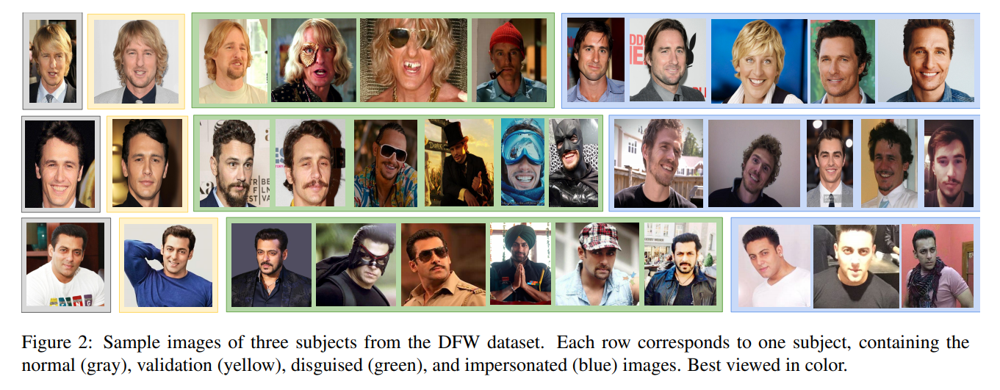
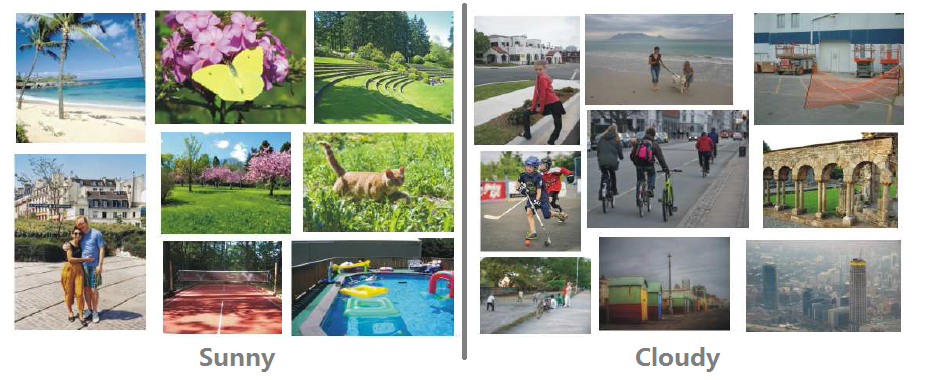
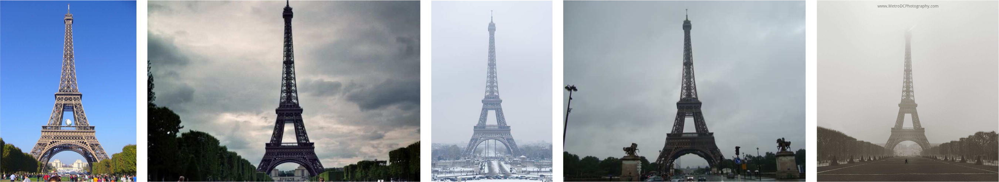
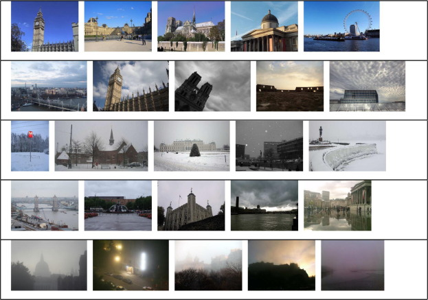

## 人脸识别、情绪识别、属性（年龄、性别）识别

### VT-AAST Bench-marking Dataset
原始彩色图像以及分割出皮肤部分的图像

数据集网站挂了= =，拿不到样例图片

http://abdoaast.wixsite.com/abdallahabdallah/the-vt-mena-benchmarking-datas

### Visible And Thermal Paired Face Database
#### 数据情况

分类情况：情绪、头部朝向、遮盖情况（眼睛、帽子、用手遮盖）、光照情况
需要申请使用

#### 预览图片

http://vis-th.eurecom.fr/presentation

### BAUM-1:  Bahcesehir University Multimodal Face Database of Spontaneous Affective and Mental States*

- 视频数据
- 情绪分类

18~66岁，男18，女13

#### 分类类别
Happiness
Sadness
Anger
Disgust
Fear
Surprise
Boredom
Contempt
Neutral
Interest (inc. curiosity)
Unsure (inc.confusion, undecidedness)
Bothered (inc. complaint)
Concentrating
Thinking

#### 预览图片

http://mimoza.marmara.edu.tr/~cigdem.erdem/BAUM1/

### Makeup Datasets

化妆数据集

数据集分四个部分：
- YMU (YouTube Makeup)：油管视频截取图像，每个样例化妆前后各两张

- VMU (Virtual Makeup)：使用软件模拟的化妆，每个样例四张（不化妆，口红，眼妆，全部化妆）

- MIW (Makeup in the "wild")：网上有和没有化妆打得图片

- MIFS (Makeup Induced Face Spoofing): 两张化妆前，两张使用app修改的，两张真实化妆后

http://www.antitza.com/makeup-datasets.html

### Disguised Faces in the Wild dataset
- 1000个人11157张照片
- 每个人都包含正常、验证、伪装、模仿的照片
- 需申请使用

#### 图片预览

http://iab-rubric.org/resources/dfw.html

### IST-EURECOM Light Field Face Database
- 利用光场相机拍摄的人脸数据
- 需要申请使用，网站没有给出样例
http://www.img.lx.it.pt/LFFD/

### Large Age-Gap Face Verification
1010个人的3828张图片
每个人至少有一张child/young 和一张 adult/old的照片

#### 图片预览

http://www.ivl.disco.unimib.it/activities/large-age-gap-face-verification/

### The CyberExtruder Ultimate Face Matching DataSet
1000人的10205张照片
600×600像素
没有限定环境，妆容，姿势等

#### 图片预览

https://cyberextruder.com/face-matching-data-set-download/

### The IIIT-CFW dataset
100个名人的卡通照片（8928张）及其真实照片（1000张）

#### 图片预览

http://cvit.iiit.ac.in/research/projects/cvit-projects/cartoonfaces

### The OMG-Emotion Behavior Dataset
总时长约10 hours . 共计420个videos。我们使用Amazon Mechanical Turk platform 对每个video创建 utterance-level 标注。我们对每个video的 Concordance Correlation Coefficient (CCC) （代表标注从-1 (total disagreement) 到 1 (total agreement)的正确度）进行计算。
https://arxiv.org/pdf/1803.05434.pdf

数据收集过程如上。
## 环境：烟雾检测、天气识别、路面积水识别、雾霾检测
### Fira-Smoke-Dataset
三类：正常、烟雾、火
约3000张图片

#### 图片预览

https://github.com/DeepQuestAI/Fire-Smoke-Dataset

### Multi-class Weather Dataset for Image Classification -- 2018
三类：多云、晴天、雨天 
共1125张图片
数据集组成较为丰富，从摄影作品、绘画作品到经过处理的图像（如加上水印，配上文字）都有所包含。

#### 图片预览

paper: https://arxiv.org/pdf/1808.00588.pdf
data: https://data.mendeley.com/datasets/4drtyfjtfy/1

### Two-class Weather Classification -- 2014
两类：晴天，多云
约10000张图片

#### 图片预览

项目主页：http://www.cse.cuhk.edu.hk/~leojia/projects/weatherclassify/index.htm?source=post_page-----46fe5549ae08----------------------

###  Image2Weather Dataset: A Large-Scale Image Dataset for Weather Property Estimation -- 2017

#### 图片预览

项目主页：https://www.cs.ccu.edu.tw/~wtchu/projects/Weather/index.html

### RSCM: Region Selection and Concurrency Model for Multi-class Weather Recognition -- 2017
65,000张图片
分类：sunny, cloudy, rainy, snowy, haze and thunder weather.

#### 图片预览

paper: http://jiaya.me/papers/rscm_pami17.pdf
项目主页: http://vcc.szu.edu.cn/research/2017/rscm

### Multi-class Weather Image Dataset -- 2015
约20,000张图
从网络相册（如Flicker, Picasa, MojiWeather）和电影中选出的图片
标签为天气状况，具体未在介绍中给出，需联系作者获取数据。

#### 图片预览

项目主页: https://mwidataset.weebly.com/

