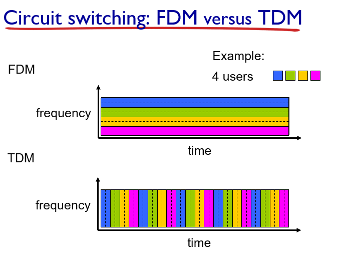

## What is the Internet

- Host
- Links
- Routers
- Protocols

## Network edge

- Client/Server Model
- Peer-to-Per Model

## Network core

### Circuit Switching

- FDM：切分频率
- TDM：切分时间

缺点：轻度用户和重度用户占据相同的资源，造成资源浪费

### Packet Switching

切分数据成若干个小包，分包发送

#### store and forward

大多数交换机使用`store and forward`的方式进行数据传输，也就是交换机必须接收完整个数据包才能开始传输

$$
d_{end-to-end}=N\frac{L}{R}\\
N---number\ of\ links(routers+1)
$$

#### queueing delay and loss

- if arrival rate (in bits) to link exceeds transmission rate of link for a period of time:
  - packets will queue, wait to be transmitted on link 
  - packets can be dropped (lost) if memory (buffer) fills up

### Network Strucure

IXP：Internet exchange point（用于ISP之间的连接）

## Delay,Loss,Throughput in network

### Delay

- Processing（检查包错误）
- Queuing（见Packet Switching处的笔记）
- Transmission（发送延迟）
- Propagation（物理距离造成的延迟，一般可以不考虑）

#### Processing delay

- check bit errors
- determine output link
- typically < msec

#### Queueing delay

- time waiting at output link for transmission
- depends on congestion level of router

- *R:* link bandwidth (bps)
- *L:* packet length (bits)
- a: average packet arrival rate

####  Transmission delay

#### Propagation delay

$$
d_{prop}=d/s\\
s≈2×10^8m/sec
$$

除非是卫星通信，一般不考虑这类延迟

### Throughput

- *throughput:* rate (bits/time unit) at which bits transferred between sender/receiver
  - *instantaneous:* rate at given point in time
  - *average:* rate over longer period of time
- bottleneck link

## Protocol layers,service models

- Why layering
  - modularization

### Internet protocol Stack

- Application
  - FTP,SMTP,HTTP
- Transport
  - TCP,UDP
- Network
  - IP,routing protocols
- Link
  - Ethernet,802.111 (WiFi), PPP
- Physical
  - Wire

### ISO/OSI reference model

- End-toEnd
  - Application
  - Presentation
  - Session
  - Transport
- Point-to-Point
  - Network
  - Link
  - Physical

## Networks under attack: security

