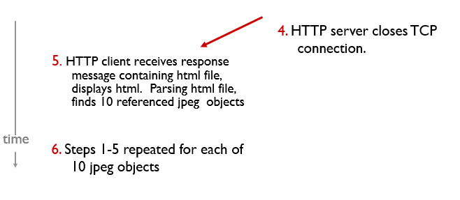
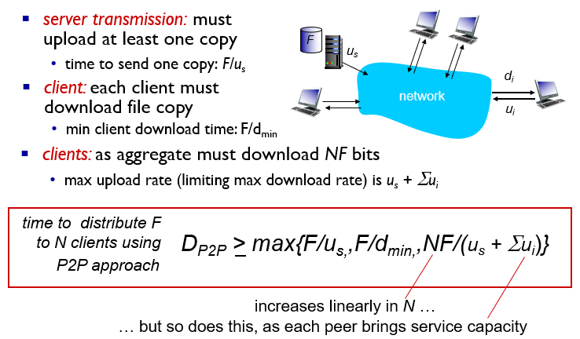

## Principles of network applications

### Application architectures

两种应用架构：

- client-server
- peer-to-peer (P2P)

### Processs Communicating

- *client process:* process that initiates communication
- *server process:* process that waits to be contacted

### Sockets

process sends/receives messages to/from its socket

### Addressing Processes

#### Identifier

- IP Address
- Port Number

### App-layer Protocol Defines

- Message Type
- Message Synax
- Message Semantics
- Message Rules

### Transport Services that the app need

- Data Loss
- Timing
- Throughput
- Security

#### TCP

- Reliable
- Flow conrol
- Congestion control
- Connection-Oriented

#### UDP

- Unrealiable
- No Flow conrol
- No Congestion control
- Connection-less

## Web abd HTTP

- Web page consists of objects
- each object is addressable by a URL

- uses TCP(port 80)

### HTTP Connection

#### Non-Persistent HTTP

一次连接只能发送一个object

RTT：time for a small packet to travel from client to server and back

#### Persistent HTTP

一次连接可以发送多个object

连接初始化需要一个RTT，之后object的发送不再需要重复建立连接

### HTTP request message

Two types of HTTP messages：

- request
- response

#### Method types

- HTTP/1.0
  - GET
  - POST
  - HEAD
- HTTP/1.1
  - GET,POST,HEAD
  - PUT
  - DELETE

#### HTTP response status codes

200,301,400,404,505

### Cookies

用于记录用户信息

- authorization
- shopping carts
- recommendations
- user session state

### Web caches(proxy server)

- reduce response time for client request
- reduce traffic on an institution’s access link
- Internet dense with caches: enables “poor” content providers to effectively deliver content (so too does P2P file sharing)
- ISP block:smile:

## Electronic mail

## DNS

DNS 服务负责将域名转换为IP地址，一个域名的层级如下：

>主机名.次级域名.顶级域名.根域名
>host.sld.tld.root

DNS 服务根据域名的层级进行分级查询，如下图

### Type

- A（Address）：返回域名指向的IP地址
- NS（Name Server）：返回保存下一级域名信息的服务器地址。该记录只能设置为域名，不能设置为IP地址
- CNAME（Canonical Name）：返回另一个域名，即当前查询的域名是另一个域名的跳转
- MX（Mail eXchange）：返回接收电子邮件的服务器地址

### TTL

附带在DNS信息中，在TTL时间内不需要重复查询

## P2P

### BitTorrent

- file divided into 256Kb chunks
- peers in torrent send/receive file chunks

---

## Video streaming and content distribution networks(CDNs)

- CBR
- VBR

### Dynamic Adaptive Streaming over HTTP(DASH)

根据网速决定压缩程度

Client can determines：

- when to request chunk
- what encoding rate to request
- where to request chunk

## Content Distribution Networks(CDNs)

CDN：stores copies of content at CDN nodes

## Socket Programming with UDP and TCP

