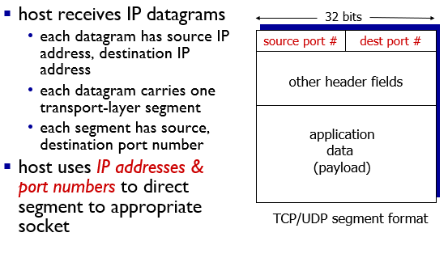
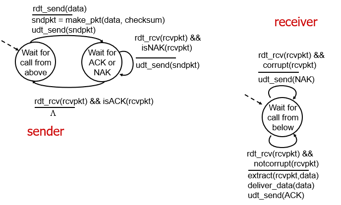
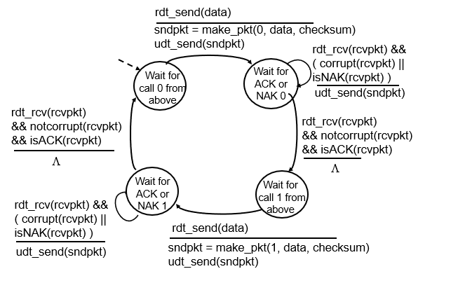
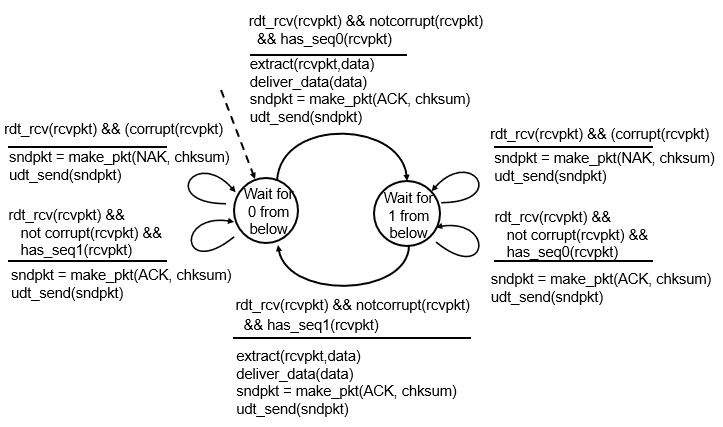
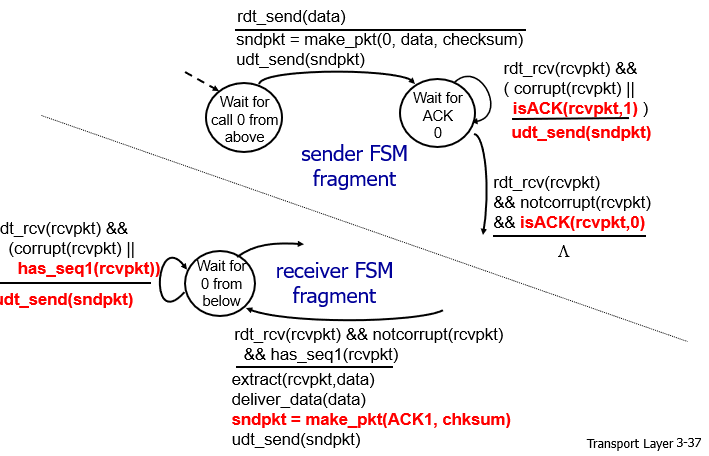

# Transport Layer

- Provides logical communication between app
- Transport layer protocols
  - TCP
  - UDP

## Multiplexing and Demultiplexing

### Multiplexing

handle data from multiple sockets, add transport header (later used for demultiplexing)

### Demultiplexing

use header info to deliver received segments to correct socket

#### UDP

只看目的地址和端口

#### TCP

socket identified by 4 tuple:

- source IP address
- source port number
- dest IP address
- dest port number

## Connectionless transport：UDP

### checksum

16位数据，用于检测包传输中是否有错

发送内容相加得到

## Principles of reliable data transfer

### rdt1.0

在可靠信道上的数据传输

### rdt2.0

信道传输有可能导致数据错误

修复方式：ARQ（Automatic Repeat reQuest）协议

- 检错
- 回应
  - ACK：肯定确认
  - NAK：否定确认
- 重发

存在的问题：ACK/NAK也有可能受损

### rdt2.1

给数据包添加序号，如果接受到不符合预期序号的数据包，说明上一个数据包有可能出错

**sender**

**receiver**

- 没有损坏，发送ACK，等待下一数据
- 损坏，发送NAK，等待重发

收到新的数据（不知道是重发还是新的）

- 没有损坏，编号为1，回送ACK，等待编号0数据
- 没有损坏，编号为1，回送ACK，等待编号1数据
- 损坏，回送NAK，等待编号0数据

### rdt2.2

只使用ACK

接收方：

- 如果没有损坏，发送ACK0，等待下一数据
- 如果损坏，发送ACK1，等待重发

接受到新的

- 没有损坏，编号为1，回送ACK1，等待编号0
- 没有损坏，编号为0，回送ACK0，等待编号1数据
- 损坏，回送ACK1，等待编号0数据

发送方：

- 没有损坏，接受到ACK0，等待上层协议
- 没有损坏，接收到ACK1，重发
- 损坏，重发

### rdt3.0

除了可能受损还可能丢包

加入倒数计时器，若超过时间未收到ACK或者收到不正确编号的ACK，则重发

- 数据包丢失导致超时重发

- ACK包丢失同上，重发

