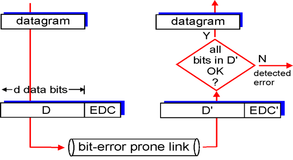
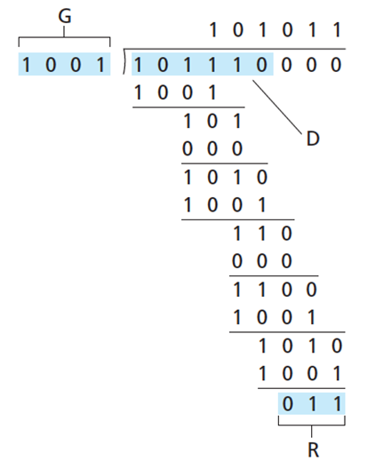
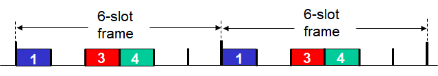
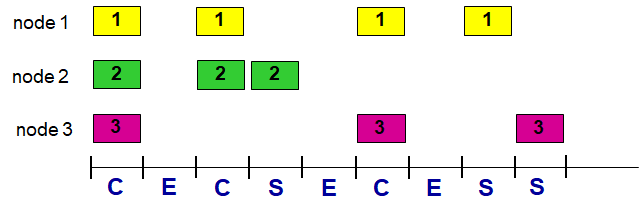

# The Link Layer and LANs

链路之间的协议，可靠程度不同，Link Layer负责两个结点之间的连接

## Introduction

`Link`之间的协议，可靠程度不同，`Link Layer`负责两个`node`之间的通信

`Link Layer`封装数据包为帧（Frame），并增加错误检测，流量控制等的信息

- nodes：hosts and roouters
- links
  - wired
  - wireless
  - LANs
- frame：encapsulates datagram

### Llnk Layer Services

- framinng, link access
- reliable delivery between adjacent nodes
- flow control
- error deection
- error correction
- half-duplex and full-duplex

## Error-Detection and Correction Techniques

**EDC** = **E**rror **D**etection and **C**orrection bits

**D** = Data(may include header)

### Parity checking

奇偶校验

1比特校验只能检测错误

通过增加奇偶校验位的维度可检测并修正单个bit errors

### Cyclic Redundancy Check

循环冗余校验

- 选定一个`r+l`bit 的除数

- 模2运算相当于异或运算
- 接收方将<D,R>数据除以G，若最后结果为0，则数据没有差错

## Multiple access protocols

- 两种链路
  - 点对点
  - 广播

### Ideal Multiple access protocols

### MAC protocols

#### Channel Paritioning（信道划分）

- TDMA：划分时间
  - 每个结点获得固定长度的使用时间

- FDMA：划分频率
  - 每个节点获得某个频率

#### Radom Access（随机接入）

##### Slotted ALOHA

- 没有碰撞：按满速传输
- 检测到碰撞：已某个概率在下一时间段重新传输直至传输成功

##### CSMA（Carrier Sense Multiple Access）

载波侦听多路访问

传输前检测链路状况，链路空闲时才发送

但由于延迟的存在，碰撞仍然有可能发生

###### CSMA/CD（Collision Dection）

如果在发送过程中检测到碰撞

- 发送阻塞信息并停止发送数据
- 在固定时间内等待随机的时间再次发送

###### 

#### Taking Turns（轮流接入）

