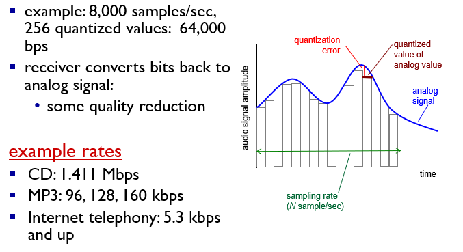
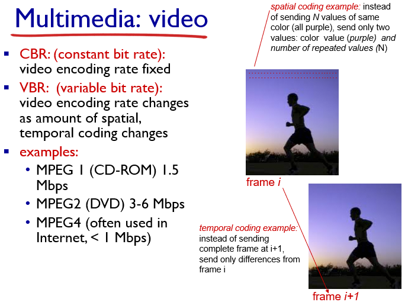

## multimedia networking applications

### 音频

音频信号的码率由采样率和比特数决定，采样率决定每秒采集的次数，比特数决定划分声音信号的精度

## 视频

通过只传输变化的像素点降低数据量

## Streaming Stored Video

### UDP

- 发送速率恒定为视频的码率
- 通常使用小的客户端缓存（2~5s）
- 缺点：
  - UDP无法控制带宽，播放可能不稳定
  - 需要RTSP服务器来处理客户的请求
  - 防火墙可能阻隔UDP流量

### HTTP

- 通过HTTP GET（TCP）获取视频
- 以尽可能大的速率发送  

## Network Support For Multimedia

### 区分服务

给流量标记，对某些类型的流量更高的优先级

- 标记分组使得路由器区分属于不同类型流量的分组。
- 希望在流量类型之间的提供流量隔离的度，以便一类流量不会收到另一类流量的负面影响。
- 当为流量类型或流之间提供隔离时，希望尽可能有效地使用资源。

三种评价准则

- 平均速率
- 峰值速率
- 突发长度

以 token bucket 为例，平均速率为 r，峰值速率为 rt+b ，突发长度为 b

通过将 WFQ 和 token bucket 结合实现区分服务

