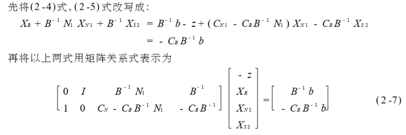

# 对偶理论和灵敏度分析

## 单纯形法的矩阵描述

- B：基变量对应的系数矩阵
- N：非基变量对应的系数矩阵
- S：松弛变量对应的系数矩阵

决策变量分为$X_B$和$X_N$，目标函数的系数分为$C_B$和$C_N$

- 2-5中非基变量的系数就是检验数
- θ规则的表达式为

- 单纯形表与矩阵表示的关系

## 改进单纯形法

- 确定初始基和初始基变量
- 计算非基变量的检验数，确定换入变量

$$
\sigma_N = C_N - C_BB^{-1}N
$$

- 确定换出变量
- 基变换
- 计算非基变量的系数矩阵

